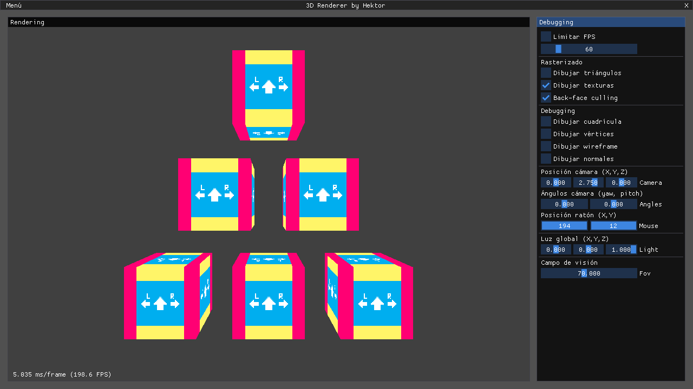

# CPU 3D Renderer

Renderizador de modelos 3D simples (triángulos) con texturas, programado en C++ desde cero para aprender el pipeline de renderizado clásico por CPU. 

Documentación del desarrollo: [https://docs.hektorprofe.net/graficos-3d/](https://docs.hektorprofe.net/graficos-3d/).

 

 

 
