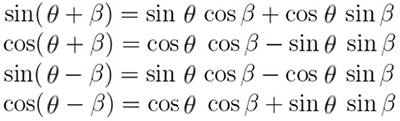

# CPU 3D Graphics en C++

La meta de este proyecto es entender el pipeline del renderizado 3D sin utilizar la GPU, implementando en C++ todo el sistema desde cero.

Se utiliza SDL2 como biblioteca multiplataforma para manejar el hardware del sistema.

## Índice

* [Configuración previa](#configuración-previa)
* [Buffer de color](#buffer-de-color)
    * [Dibujar FPS y caparlos](#dibujar-fps-y-caparlos)
    * [Refactorización 1](#refactorización-1)
* [Vectores y puntos](#vectores-y-puntos)
* [Proyección de puntos](#proyección-de-puntos)
    * [Proyección ortográfica](#proyección-ortográfica)
    * [Proyección perspectiva](#proyección-perspectiva)
    * [Regla de la mano](#regla-de-la-mano)
* [Transformaciones lineales](#transformaciones-lineales)
    * [Transformando vectores](#transformando-vectores)
    * [Razones trigonométricas](#razones-trigonométricas)
    * [Rotación de vectores](#rotación-de-vectores)
    * [Función de rotación](#función-de-rotación)
    * [Refactorización 2](#refactorización-2)
* [Triángulos, vértices y mallas](#triángulos-vértices-y-mallas)
    * [Programando los triángulos](#programando-los-triángulos)
* [Rasterización de líneas](#rasterización-de-líneas)
    * [Algoritmo DDA](#algoritmo-dda)
* [Mallas en memoria dinámica](#mallas-en-memoria-dinámica)
* [Ficheros con modelos OBJ](#ficheros-con-modelos-obj)
    * [Carga de OBJ en la memoria](#carga-de-obj-en-la-memoria)
* [Operaciones con vectores](#operaciones-con-vectores)
    * [Magnitud vectorial](#magnitud-vectorial)
    * [Adición y sustracción de vectores](#adición-y-sustracción-de-vectores)
    * [Multiplicación y división de vectores](#multiplicación-y-división-de-vectores)
    * [Producto vectorial](#producto-vectorial)
    * [Vector normal de una cara](#vector-normal-de-una-cara)
    * [Producto escalar](#producto-escalar)
* [Back-face Culling](#back-face-culling)
    * [Normalización de vectores](#normalización-de-vectores)
    * [Refactorización 3](#refactorización-3)

## Configuración previa

Este proyecto se desarrolla en Windows 11 con Visual Studio Code. La estructura principal es:

* `Makefile`
* `main.cpp`
* `src/include`
* `src/lib`
* `bin/SDL2.dll`

El fichero `main.cpp` inicialmente contiene un "Hola mundo" en SDL que intenta crear una ventana vacía:

```cpp
#include <iostream>
#include <SDL2/SDL.h>

const int WIDTH = 640, HEIGHT = 480;

int main(int argc, char *argv[])
{
    SDL_Init(SDL_INIT_EVERYTHING);

    SDL_Window *window = SDL_CreateWindow("Hello SDL WORLD", SDL_WINDOWPOS_UNDEFINED, SDL_WINDOWPOS_UNDEFINED, WIDTH, HEIGHT, SDL_WINDOW_ALLOW_HIGHDPI);

    if (NULL == window)
    {
        std::cout << "Could not create window: " << SDL_GetError() << std::endl;
        return 1;
    }

    SDL_Event windowEvent;

    while (true)
    {
        if (SDL_PollEvent(&windowEvent))
        {
            if (SDL_QUIT == windowEvent.type)
            {
                break;
            }
        }
    }

    SDL_DestroyWindow(window);
    SDL_Quit();

    return EXIT_SUCCESS;
}
```

Con el compiladir [GNU GCC Compiler](https://gcc.gnu.org/) instalado en el equipo y la biblioteca [SDL2 x86_64-w64-mingw32](http://libsdl.org/), con `include/SDL2` y `lib` en `src/` y `bin/SDL2.dll` donde el ejecutable `bin/main.exe` para su uso.

La compilación se realiza mediante la herramienta `make`, se puede instalar con [Chocolatey](https://chocolatey.org/):

```
choco install make
```

El `Makefile` contiene la vinculación necesaria de bibliotecas de SDL2:

```makefile
build:
	g++ -I src/include -L src/lib -o bin/main *.cpp -lmingw32 -lSDL2main -lSDL2
run:
	./bin/main.exe
clean:
	rm ./bin/main.exe
```

La compilación y ejecución es tan sencilla como ejecutar:

```
> make
> make run
```

Para facilitar la compilación y ejecución utilizo el complemento [Code Runner](https://marketplace.visualstudio.com/items?itemName=formulahendry.code-runner) de VSC y un comando personalizado definido en el `.vscode/settings.json`:

```json
{
    "code-runner.customCommand": "make && ./bin/main.exe"
}
```

Ejecutamos con `F1 > Run Custom Command` y *voilà*:


## Buffer de color

El buffer de color es un array de colores (en la práctica `uint32_t`) que maneja cada uno de los píxeles de la pantalla y su color. 

La variable que gestiona este buffer es el puntero `color_buffer`, donde se reserva memoria dinámicamente con `malloc`. El tamaño es el número de píxeles de la pantalla (ancho * alto):

```cpp
uint32_t *color_buffer;
color_buffer = static_cast<uint32_t *>(malloc(sizeof(uint32_t) * window_width * window_height));
```

Para dibujar ese `color_buffer` se tiene que copiar a una textura `color_buffer_texture`:

```cpp
SDL_Texture *color_buffer_texture;
color_buffer_texture = SDL_CreateTexture( renderer, SDL_PIXELFORMAT_ARGB8888, SDL_TEXTUREACCESS_STREAMING, window_width, window_height);
```

El proceso de copia del `color_buffer` a la textura y al renderer ocurrirá en cada fotograma:

```cpp
void render_color_buffer()
{
    SDL_UpdateTexture(color_buffer_texture, NULL, color_buffer, window_width * sizeof(uint32_t));
    SDL_RenderCopy(renderer, color_buffer_texture, NULL, NULL);
}
```

El proceso de renderizado empieza con un color de base para limpiar la pantalla, luego una limpieza y renderizado del `color_buffer` y finalmente la actualización de la pantalla:

```cpp
void render()
{
    SDL_SetRenderDrawColor(renderer, 255, 255, 255, 255);
    SDL_RenderClear(renderer);

    clear_color_buffer(0xFFF00FFFF);
    render_color_buffer();

    SDL_RenderPresent(renderer);
}
```

La limpieza del `color_buffer` se basa en recorrer todos los píxeles del array y establecer el color pasado a la función:

```cpp
void clear_color_buffer(uint32_t color)
{
    for (size_t y = 0; y < window_height; y++)
    {
        for (size_t x = 0; x < window_width; x++)
        {
            color_buffer[(window_width * y) + x] = color;
        }
    }
}
```

En este punto podemos crear diferentes funciones para cambiar dinámicamente los colores del `color_buffer`, por ejemplo para generar una cuadrícula `draw_grid()`:

```cpp
void draw_grid(uint32_t color)
{
    for (size_t y = 0; y < window_height; y += 10)
    {
        for (size_t x = 0; x < window_width; x += 10)
        {
            color_buffer[(window_width * y) + x] = color;
        }
    }
}
```


O una función para dibujar rectángulos rellenos de colores `draw_rectangle()`:

```cpp
void draw_rect(int sx, int sy, int width, int height, uint32_t color)
{
    for (size_t y = sy; (y < sy + height) && (y < window_height); y++)
    {
        for (size_t x = sx; (x < sx + width) && (x < window_width); x++)
        {
            color_buffer[(window_width * y) + x] = color;
        }
    }
}
```


### Dibujar FPS y caparlos

He decidido añadir una opción para dibujar la media de FPS. Para ello necesitaré dibujar un texto en pantalla con la biblioteca [SDL_ttf](https://github.com/libsdl-org/SDL_ttf). 

La versión utilizada en el proyecto es [SDL2_ttf-devel-2.0.18 x86_64-w64-mingw32](https://github.com/libsdl-org/SDL_ttf/releases/download/release-2.0.18/SDL2_ttf-devel-2.0.18-mingw.tar.gz), cuyos `include` y `lib` van al directorio `src` y la DLL `SDL2_ttf.dll` al directorio `bin`.

Una vez hecho se puede importar para utilizarlo:

```cpp
#include <SDL2/SDL.h>
#include <SDL2/SDL_ttf.h>
```

Para dibujar el texto hay que seguir varios pasos.

En primer lugar se necesita una superficie para renderizar el texto, un color y una fuente que deberemos cargar luego:

```cpp
SDL_Surface *text;
TTF_Font *font;
SDL_Color color = {255, 255, 255};
```

Deberemos inicializar el módulo TTF:

```cpp
if (TTF_Init() < 0)
{
    std::cout << "Error initializing SDL_ttf: " << TTF_GetError() << std::endl;
    return false;
}
```

También durante la inicialización si todo es correcto cargaremos la configuración de la fuente que debemos tener en algún directorio del proyecto:

```cpp
// font setup
font = TTF_OpenFont("assets/FreeSans.ttf", 16);
if (!font)
{
    std::cout << "Error loading font: " << TTF_GetError() << std::endl;
    return false;
}
```

Durante el renderizado la idea es renderizar el texto deseado en la superficie:

```cpp
text = TTF_RenderText_Solid(font, "Hola mundo!", color);
if (!text)
{
    std::cout << "Failed to render text: " << TTF_GetError() << std::endl;
}
```

Justo a continuación renderizaremos la superficie como una textura, configuraremos el tamaño de la recta ed destino y realizaremos la copia al `renderer`:

```cpp
SDL_Texture *text_texture = SDL_CreateTextureFromSurface(renderer, text);
SDL_Rect dest = {2, 459, text->w, text->h};
SDL_RenderCopy(renderer, text_texture, NULL, &dest);
```

Después de actualizar la pantalla podemos liberar de la memoria la textura y la superficie (es muy importante):

```cpp
// Liberación de memoria local
SDL_DestroyTexture(text_texture);
SDL_FreeSurface(textSurface);
```

También deberemos liberar la memoria de la fuente y el módulo TTF al destruir la ventana:

```cpp
TTF_CloseFont(font);
TTF_Quit();
```

Con esto ya tendremos nuestro texto en pantalla:


Ahora debemos idear una forma de limitar los FPS en caso de que no queramos tener la sincronización vertical activa:

```cpp
renderer = SDL_CreateRenderer(window, -1, SDL_RENDERER_ACCELERATED | SDL_RENDERER_PRESENTVSYNC);
```

Siguiendo la idea del tutorial de [LazyFoo](https://lazyfoo.net/tutorials/SDL/25_capping_frame_rate/index.php) he decidido crear mis propia clase `Timer` para tener unos objetos más sofisticados.

La cabecera `timer.h` contiene las definiciones:

```cpp
#ifndef TIMER_H
#define TIMER_H

#include <iostream>
#include <SDL2/SDL.h>

// The application time based timer
class Timer
{
public:
    // Initializes variables
    Timer();

    // The various clock actions
    void start();
    void stop();
    void pause();
    void unpause();

    // Gets the timer's time
    uint32_t getTicks();

    // Checks the status of the timer
    bool isStarted();
    bool isPaused();

private:
    // The clock time when the timer started
    uint32_t mStartTicks;

    // The ticks stored when the timer was paused
    uint32_t mPausedTicks;

    // The timer status
    bool mPaused;
    bool mStarted;
};

#endif
```

Y el fichero de fuentes `timer.cpp` la implementación de la clase:

```cpp
#include "timer.h"

Timer::Timer()
{
    // Initialize the variables
    mStartTicks = 0;
    mPausedTicks = 0;

    mPaused = false;
    mStarted = false;
}

void Timer::start()
{
    // Start the timer
    mStarted = true;

    // Unpause the timer
    mPaused = false;

    // Get the current clock time
    mStartTicks = SDL_GetTicks();
    mPausedTicks = 0;
}

void Timer::stop()
{
    // Stop the timer
    mStarted = false;

    // Unpause the timer
    mPaused = false;

    // Clear tick variables
    mStartTicks = 0;
    mPausedTicks = 0;
}

void Timer::pause()
{
    // If the timer is running and isn't already paused
    if (mStarted && !mPaused)
    {
        // Pause the timer
        mPaused = true;

        // Calculate the paused ticks
        mPausedTicks = SDL_GetTicks() - mStartTicks;
        mStartTicks = 0;
    }
}

void Timer::unpause()
{
    // If the timer is running and paused
    if (mStarted && mPaused)
    {
        // Unpause the timer
        mPaused = false;

        // Reset the starting ticks
        mStartTicks = SDL_GetTicks() - mPausedTicks;

        // Reset the paused ticks
        mPausedTicks = 0;
    }
}

uint32_t Timer::getTicks()
{
    // The actual timer time
    uint32_t time = 0;

    // If the timer is running
    if (mStarted)
    {
        // If the timer is paused
        if (mPaused)
        {
            // Return the number of ticks when the timer was paused
            time = mPausedTicks;
        }
        else
        {
            // Return the current time minus the start time
            time = SDL_GetTicks() - mStartTicks;
        }
    }

    return time;
}

bool Timer::isStarted()
{
    // Timer is running and paused or unpaused
    return mStarted;
}

bool Timer::isPaused()
{
    // Timer is running and paused
    return mPaused && mStarted;
}
```

Esta clase abastrae la función de SDL `SDL_GetTicks()` y la maneja internamente además de proveer de métodos para manejar el temporizador.

La idea para calcular los FPS es la siguiente, antes de empezar el bucle de juego creamos un temporizador y lo iniciamos:

```cpp
Timer fpsTimer;
fpsTimer.start();
```

También definiremos una variable para contar los fotogramas actuales:

```cpp
int countedFrames = 0;
```

En cada iteración calcularemos los fps de media a partir del valor actual del contador entre el temporizador entre 1000, luego incrementaremos los fotogramas. Estos fps de media `avgFPS` los tendremos como una variable global para renderizar ese valor en el texto de antes:

```cpp
float avgFPS = 0;  // <--- global
//...

avgFPS = countedFrames / (fpsTimer.getTicks() / 1000.f);
++countedFrames
```

Para dibujar los FPS modificaremos el renderizado de texto:

```cpp
text = TTF_RenderText_Solid(font, (std::to_string(avgFPS) + " fps").c_str(), color);
```

Por defecto al tener la sincronización activada los FPS se autoregulan a los hercios de mi pantalla, que son 144:


Ahora nos falta añadir la limitación de FPS como alternativa a desactivar la sincronización vertical, esto se denomina el *fps cap*. 

Para ello definiremos unas variables globales que manejarán si activamos o no el cap, la limitación de FPS deseada y el cálculo de ticks de pantalla por fotograma que utilizará nuestro futuro `capTimer`:

```cpp
bool enableCap = true;
int fpsCap = 60;
int screenTicksPerFrame = 1000 / fpsCap;
```

Procedemos a definir el `capTimer` antes del `while`:

```cpp
Timer capTimer;
```

Lo iniciaremos justo al comenzar la iteración del `while`:

```cpp
while (is_running){
    capTimer.start();
```

Finalmente, después de renderizar la pantalla al final del `while`, realizaremos un ajuste para retrasar la siguiente iteración (utilizando `SDL_Delay`) en función de los ticks de pantalla que resten para llegar a los `screenTicksPerFrame` calculados antes:

```cpp
// Si el fotograma finaliza demasiado pronto
int frameTicks = capTimer.getTicks();
if (enableCap && frameTicks < screenTicksPerFrame)
{
    // Esperamos el tiempo restante
    SDL_Delay(screenTicksPerFrame - frameTicks);
}
```

Con esto habremos logrado un límite de FPS manual en caso de no querer la sincronización vertical o podemos desactivarlo utilizando `enableCap`:

```cpp
bool enableCap = true;
```

Aquí se aprecia el cap manual a 60FPS:


### Refactorización 1

Antes de continuar con el siguiente tema sobre vectores y puntos voy a reorganizar los ficheros del proyecto en clases para que todo sea más cómodo de utilizar.

Esencialmente voy a abstraer todo el proceso de gestión de la ventana y renderizado en una clase `Window`.

Las cabeceras `window.h` por ahora quedarán de la siguiente forma, también después de cambiar la notación a **PascalCase** en los métodos y **camelCase** en las variables:

```cpp
#ifndef WINDOW_H
#define WINDOW_H

#include <iostream>
#include <SDL2/SDL.h>
#include <SDL2/SDL_ttf.h>
#include "timer.h"

class Window
{
public:
    bool running = false;
    int windowWidth;
    int windowHeight;

private:
    /* Window */
    bool isFullscreen = false;
    SDL_Window *window;
    SDL_Renderer *renderer;

    /* Color buffer  */
    uint32_t *colorBuffer;
    SDL_Texture *colorBufferTexture;

    /* Text */
    SDL_Surface *textSurface;
    SDL_Color textColor = {255, 255, 255};
    TTF_Font *textFont;

    /* Fps */
    float avgFPS = 0;
    bool enableCap = true;
    int fpsCap = 60;
    int screenTicksPerFrame = 1000 / fpsCap;
    long countedFrames = 0;

    /* Timers */
    Timer fpsTimer, capTimer;

public:
    Window(int w, int h) : windowWidth(w), windowHeight(h){};
    ~Window();

    void Init();
    void Setup();

    void ProcessInput();
    void Update();
    void Render();
    void PostRender();

    void ClearColorBuffer(uint32_t color);
    void RenderColorBuffer();

    void DrawGrid(unsigned int color);
    void DrawRect(int sx, int sy, int width, int height, uint32_t color);
};

#endif
```

En cuanto al código fuente `window.cpp` la implementción completa es:

```cpp
#include "window.h"

Window::~Window()
{
    std::cout << "Destroying Window";

    // Liberar la memoria dinámica
    free(colorBuffer);

    SDL_DestroyRenderer(renderer);
    SDL_DestroyWindow(window);

    TTF_CloseFont(textFont);
    TTF_Quit();

    SDL_Quit();
}

void Window::Init()
{
    running = true;

    // Inicializamos SDL
    if (SDL_Init(SDL_INIT_EVERYTHING) != 0)
    {
        std::cout << "Error initializing SDL." << std::endl;
        running = false;
    }

    // Inicialización TTF
    if (TTF_Init() < 0)
    {
        std::cout << "Error initializing SDL_ttf: " << TTF_GetError() << std::endl;
        running = false;
    }

    // Utilizar SDL para preguntar la resolucion maxima del monitor
    SDL_DisplayMode Window_mode;
    SDL_GetCurrentDisplayMode(0, &Window_mode);

    if (isFullscreen)
    {
        windowWidth = Window_mode.w;
        windowHeight = Window_mode.h;
    }

    // Creamos la ventana SDL
    window = SDL_CreateWindow(
        NULL, SDL_WINDOWPOS_CENTERED, SDL_WINDOWPOS_CENTERED,
        windowWidth, windowHeight, SDL_WINDOW_BORDERLESS);

    if (!window)
    {
        std::cout << "Error creating SDL Window." << std::endl;
        running = false;
    }

    // Creamos el renderizador SDL
    if (enableCap)
    {
        renderer = SDL_CreateRenderer(window, -1, 0);
    }
    else
    {
        renderer = SDL_CreateRenderer(window, -1, SDL_RENDERER_ACCELERATED | SDL_RENDERER_PRESENTVSYNC);
    }

    if (!renderer)
    {
        std::cout << "Error creating SDL renderer." << std::endl;
        running = false;
    }

    // font setup
    textFont = TTF_OpenFont("assets/FreeSans.ttf", 16);
    if (!textFont)
    {
        std::cout << "Error loading font: " << TTF_GetError() << std::endl;
        running = false;
    }

    if (isFullscreen)
    {
        SDL_SetWindowFullscreen(window, SDL_WINDOW_FULLSCREEN);
    }

    if (!running)
    {
        std::cout << "Window Init Fail";
    }
}

void Window::Setup()
{
    // Reservar la memoria requerida en bytes para mantener el color buffer
    colorBuffer = static_cast<uint32_t *>(malloc(sizeof(uint32_t) * windowWidth * windowHeight));

    // Crear la textura SDL utilizada para mostrar el color buffer
    colorBufferTexture = SDL_CreateTexture(
        renderer, SDL_PIXELFORMAT_ARGB8888, SDL_TEXTUREACCESS_STREAMING, windowWidth, windowHeight);

    // Start Timers
    fpsTimer.start();
    capTimer.start();
}

void Window::ProcessInput()
{
    SDL_Event event;
    SDL_PollEvent(&event);

    switch (event.type)
    {
    case SDL_QUIT:
        running = false;
        break;
    case SDL_KEYDOWN:
        if (event.key.keysym.sym == SDLK_ESCAPE)
            running = false;
        break;
    }
}

void Window::Update()
{
    if (enableCap)
    {
        // Iniciar el temporizador de cap
        capTimer.start();
    }

    // Calculate fps
    avgFPS = countedFrames / (fpsTimer.getTicks() / 1000.f);
    // Increment the frame counter
    ++countedFrames;
}

void Window::Render()
{
    // Limpiar el color buffer
    ClearColorBuffer(static_cast<uint32_t>(0xFF0000000));
}

void Window::PostRender()
{
    // Renderizar el color buffer
    RenderColorBuffer();

    // Render FPS
    textSurface = TTF_RenderText_Solid(textFont, (std::to_string(avgFPS) + " fps").c_str(), textColor);
    if (!textSurface)
    {
        std::cout << "Failed to render text: " << TTF_GetError() << std::endl;
    }

    SDL_Texture *textTexture = SDL_CreateTextureFromSurface(renderer, textSurface);
    SDL_Rect dest = {2, windowHeight - 21, textSurface->w, textSurface->h};
    SDL_RenderCopy(renderer, textTexture, NULL, &dest);

    // Liberación de memoria local
    SDL_FreeSurface(textSurface);
    SDL_DestroyTexture(textTexture);

    // Finalmente actualizar la pantalla
    SDL_RenderPresent(renderer);

    // Y por último capear los fotogramas si es necesario
    if (enableCap)
    {
        int frameTicks = capTimer.getTicks();
        if (frameTicks < screenTicksPerFrame)
        {
            // Esperamos el tiempo restante
            SDL_Delay(screenTicksPerFrame - frameTicks);
        }
    }
}

void Window::ClearColorBuffer(uint32_t color)
{
    for (size_t y = 0; y < windowHeight; y++)
    {
        for (size_t x = 0; x < windowWidth; x++)
        {
            colorBuffer[(windowWidth * y) + x] = color;
        }
    }
}

void Window::RenderColorBuffer()
{
    // Copiar el color buffer y su contenido a la textura
    // Así podremos dibujar la textura en el renderer
    SDL_UpdateTexture(colorBufferTexture, NULL, colorBuffer, windowWidth * sizeof(uint32_t));
    SDL_RenderCopy(renderer, colorBufferTexture, NULL, NULL);
}

void Window::DrawGrid(unsigned int color)
{
    for (size_t y = 0; y < windowHeight; y += 10)
    {
        for (size_t x = 0; x < windowWidth; x += 10)
        {
            colorBuffer[(windowWidth * y) + x] = static_cast<uint32_t>(color);
        }
    }
}

void Window::DrawRect(int sx, int sy, int width, int height, uint32_t color)
{
    for (size_t y = sy; (y < sy + height) && (y < windowHeight); y++)
    {
        for (size_t x = sx; (x < sx + width) && (x < windowWidth); x++)
        {
            colorBuffer[(windowWidth * y) + x] = static_cast<uint32_t>(color);
        }
    }
}
```

Inicializar y empezar a trabajar con la ventana es ahora muy sencillo, así quedará `main.cpp`:

```cpp
#include <iostream>
#include "window.h"

int main(int argc, char *argv[])
{
    Window window(640, 480);

    window.Init();
    window.Setup();

    while (window.running)
    {
        window.ProcessInput();

        window.Update();
        window.Render();

        window.DrawGrid(0xFF616161);
        window.DrawRect(50, 50, 100, 100, 0xFF1570E8);
        window.DrawRect(205, 125, 300, 200, 0xFFD93E23);
        window.DrawRect(375, 225, 300, 300, 0xFFE35FDA);

        window.PostRender();
    }

    return 0;
}
```

A comentar la variable pública `window.running` que permite saber en todo momento si la ventana está funcionando para seguir ejecutando el bucle. 

Luego los distintos métodos de mismo nombre `ProcessInput`, `Update`, `Render` y un nuevo `PostRender` que me permite separar el renderizado en dos partes y dibujar entre tanto diferentes elementos y por encima dibujar los FPS y presentar el `renderer`.

Por cierto, tampoco necesitamos limpiar la pantalla en el renderer, pues estamos dibujando directamente nuestro `colorBuffer`:

```cpp
void Window::Render()
{
    // Establecer el color del renderizador
    // SDL_SetRenderDrawColor(renderer, 255, 255, 255, 255);
    // Limpiar la pantalla con el color establecido
    // SDL_RenderClear(renderer);

    // Limpiar el color buffer
    ClearColorBuffer(static_cast<uint32_t>(0xFF0000000));
}
```

**BUG: Congelamiento de Timer al mover ventana**

Cuando se hace clic en una ventana SDL con los bordes activados:

```cpp
window = SDL_CreateWindow(
    NULL, SDL_WINDOWPOS_CENTERED, SDL_WINDOWPOS_CENTERED,
    windowWidth, windowHeight, 0); // SDL_WINDOW_BORDERLESS
```

La ejecución del código se bloqueará porque `SDL_PollEvent(&event)` queda parado a la espera del siguiente evento. Sin embargo los timers 'SDL_GetTicks()` siguen funcionando y eso ocasionará un retraso en al contabilidad de fotogramas.

Para evitar este problema simplemente debemos pausar y continuar el `fpsTimer` antes y después de recibir el siguiente evento:

```cpp
void Window::ProcessInput()
{
    // Pausar timer para prevenir congelamiento
    fpsTimer.pause(); 
    // Esperar y guardar el siguiente evento SDL
    SDL_PollEvent(&event);
    // Continuar al recibir cualquier evento
    fpsTimer.unpause(); 
```

## Vectores y puntos

Es hora de empezar a pensar en 3D, eso implica añadir una nueva dimensión: la **profundidad**, que se representa en lo que se conoce como el **eje Z**.

Empezaré creando un nuevo método para pintar un único píxel en pantalla:

```cpp
void Window::DrawPixel(int x, int y, unsigned int color)
{
    if (x >= 0 && x < windowWidth && y >= 0 && y < windowHeight)
    {
        colorBuffer[(windowWidth * y) + x] = static_cast<uint32_t>(color);
    }
}
```

Si queremos representar algo en el espacio tridimensional, debemos hacerlo a través de números que indican cantidades.

Las cantidades se dividen en dos tipos:

* **Cantidades escalares**: Representadas con único número: temperatura, área, longitud, presión...
* **Cantidades vectoriales**: Representadas con más de un número: velocidad, aceleración, fuerza, arrastre, desplazamiento, elevación...

Para representar una cantidad vectorial de dos números, por ejemplo **velocidad (m/s)**, se utiliza un eje de coordenadas 2D y un vector formado por los componentes `X`, `Y`.

De la misma forma podemos representar una cantidad vectorial formada por tres números **ancho**, **alto** y **profundidad** en un eje de coordenadas 3D mediante un vector formado por los componentes `X`, `Y`, `Z`. 

Un **vector** es un conjunto de componentes donde el orden importa para representar una cantidad formada por dos o más números, así que vamos a empezar por definir unas clases para manejar nuestros propios vectores 2D y 3D:

```cpp
#ifndef VECTOR_H
#define VECTOR_H

#include <iostream>

class Vector2
{
public:
    double x;
    double y;

    friend std::ostream &operator<<(std::ostream &os, const Vector2 &v);
};

class Vector3
{
public:
    double x;
    double y;
    double z;

    friend std::ostream &operator<<(std::ostream &os, const Vector3 &v);
};

#endif
```

Para la implementación por ahora solo la sobrecarga del `ostream` para imprimir un vector:

```cpp
#include "vector.h"

std::ostream &operator<<(std::ostream &os, const Vector2 &v)
{
    os << "(" << v.x << ", " << v.y << ")";
    return os;
}

std::ostream &operator<<(std::ostream &os, const Vector3 &v)
{
    os << "(" << v.x << ", " << v.y << ", " << v.z << ")";
    return os;
}
```

Vamos a suponer que deseamos representar un cubo 3D de 9 píxeles de ancho, alto y profundidad. Podemos entenderlo como un conjunto de 9*9*9 píxeles, donde cada punto es un vector tridimensional.

Lo que podemos hacer es suponer el centro del cubo como el origen del eje de coordenadas (0,0,0) y a partir de ahí uniformemente (en base de -1 a 1) representarlo a la izquierda, derecha, arriba, abajo, adelante y atrás.

Para ello lo podemos inicializar con tres bucles anidados:

```cpp
// Cubo de 9x9x9 píxeles
int counterPoints;
Vector3 cubePoints[9 * 9 * 9];

// Cargar el array de vectores de -1 a 1 en el cubo 9x9x9
for (double x = -1; x <= 1; x += 0.25)
{
    for (double y = -1; y <= 1; y += 0.25)
    {
        for (double z = -1; z <= 1; z += 0.25)
        {
            cubePoints[counterPoints++] = Vector3{x, y, z};
        }
    }
}
```

Este es el principio y final del arreglo 9*9*9 con 729 puntos:

```
(-1, -1, -1), 
(-1, -1, -0.75), 
..., 
(0, 0, -0.25), 
(0, 0, 0), 
(0, 0, 0.25), 
..., 
(1, 1, 0.75), 
(1, 1, 1)
```

El problema es que nuestro `ColorBuffer` se fundamenta en un eje 2D de ancho y alto. ¿Cómo podemos a representar un arreglo de vectores 3D en un buffer 2D?

## Proyección de puntos

Las técnicas de proyección nos permiten representar, mediante operaciones matemáticas una dimensión 3D en forma  2D.

Existen varios tipos de proyecciones dependiendo del resultado que nos interese.

### Proyección ortográfica

Esta proyección es una proyección paralela que consiste en ignorar la profundidad (eje `Z`).

Para implementar esta proyección en una función recibiremos un vector 3D y devolveremos un vector 2D con únicamente sus componentes X e Y:

```cpp
Vector2 OrtoraphicProjection(Vector3 p)
{
    return Vector2{p.x, p.y};
}
```

Para probar la función vamos a crear un cubo de puntos proyectos en 2D. Podemos definir el arreglo fuera del `while`:

```cpp
Vector2 cubeProjectedPoints[9 * 9 * 9];
```

Entre `Update` y `Render` proyectamos los puntos a 2D:

```cpp
window.Update();

// Vector 3D proyectado ortográficamente
for (int i = 0; i < 9 * 9 * 9; i++)
{
    // Proyeccion del punto
    cubeProjectedPoints[i] = OrtoraphicProjection(cubePoints[i]);
}

window.Render();
```

Ahora durante el renderizado, podemos hacer uso de nuestro método `DrawPixel` y establecer todos los píxeles del cubo proyectado en el `ColorBuffer`:

```cpp
window.Render();
window.DrawGrid(0xFF616161);

/* Dibujar proyección */
for (int i = 0; i < 9 * 9 * 9; i++)
{
    window.DrawPixel(
        cubeProjectedPoints[i].x,
        cubeProjectedPoints[i].y,
        0xFF00FFFF);
}

window.PostRender();
```

El resultado será el siguiente:


Un pequeño píxel en la parte superior izquierda. 

¿Por qué? Pues debido a que los valores de nuestro cubo se encuentran normalizados entre `-1` y `1` con el origen en `0`.

Esto nos lleva a la idea de que debemos escalar de alguna forma los valores del cubo.

Este escalar se denomina**FOV** (campo de visión) y podemos probar alguna cantidad hasta dar con la que nos guste y mulitiplicarla en nuestra función de proyección:

```cpp
float fovFactor = 100;

Vector2 OrtoraphicProjection(Vector3 p)
{
    return Vector2{
        fovFactor * p.x, 
        fovFactor * p.y};
}
```

El resultado por ahora será algo así:


Debemos tener en cuenta que como consecuencia de aplicar el `fovFactor`, el cubo crece en tamaño y para dibujarlo completamente necesitamos más espacio. Por eso deberemos reposicionarlo, idealmente hacia el centro de la pantalla, tomando su origen `(0, 0)` como el punto `(windowWidth/2, windowHeight/2)`.

Así que simplemente sumamos esa distancia en sus componentes durante el renderizado:

```cpp
/* Dibujar proyección reposicionada al centro */
for (int i = 0; i < 9 * 9 * 9; i++)
{
    window.DrawPixel(
        cubeProjectedPoints[i].x + window.windowWidth / 2,
        cubeProjectedPoints[i].y + window.windowHeight / 2,
        0xFF00FFFF);
}
```

Y ya está, ahora sí con su aspecto real en paralelo:


### Proyección perspectiva

La proyección en perspectiva consiste en simular la forma en cómo los humanos vemos el mundo, donde los objetos cerca nuestro se perciben mayores que los que están lejos.

Esto introduce la idea de que necesitamos una especie de espectador u ojo como origen de la vista tridimensional con un ángulo de visión que definirá el campo visible, llamado `AOV` (angle of view).

En un videojuego o simulación tridimensional, el origen de la vista es la cámara que nos permite percibir el mundo, abarcando el espacio entre el plano más cercano y el plano más alejado, denominado `View Frustrum`:


Mediante el uso de la geometría y la propiedad de los triángulos similares de compartir proporciones equivalentes, podemos calcular las fórmulas para los puntos proyectados `P'x` y `P'y`:


Ambas fórmulas se conocen como **brechas de perspectiva**, en inglés *perspective divide* y dictan que:

* Cuanto menor sea la profundidad `z`, mayor serán `x` e `y`, de manera que los objetos se percibirán más grandes.
* Cuanto mayor sea la profundidad `z`, menores serán `x` e `y`, de manera que  los objetos se percibirán más pequeños.

Nuestra nueva función de perspectiva simplemente dividirá `x` e `y` entre `z`:

```cpp
Vector2 PerspectiveProjection(Vector3 p)
{
    return Vector2{
        (fovFactor * p.x) / p.z, 
        (fovFactor * p.y) / p.z};
}

cubeProjectedPoints[i] = PerspectiveProjection(cubePoints[i]);
```

EL resultado se verá más o menos así:


No es exactamente lo que se espera pero se percibe una especie de profundidad. 

La razón por la que se ve de esta forma es que estamos suponiendo que el ojo, el origen de la vista, concuerda justo en la cara más profunda del cubo.

Para solucionarlo debemos alejar nuestra vista del cubo, esto lo conseguiremos restando una profundidad extra mediante un `Vector3` para simular la posición de una cámara alejada del fondo del cubo:

```cpp
Vector3 cameraPosition{0, 0, -5};
```

Esta distancia la vamos a restar del punto antes de realizar la proyección de perspectiva:

```cpp
window.Update();

for (int i = 0; i < 9 * 9 * 9; i++)
{
    // Restamos la distancia de la cámara
    Vector3 point = cubePoints[i];
    point.z -= cameraPosition.z;
    // Proyeccion del punto
    cubeProjectedPoints[i] = PerspectiveProjection(point);
}

window.Render();
```

Si visualizamos el cubo lo visualizaremos muy pequeño pero ya se podrá apreciar la perspectiva:


Podemos rectificar el tamaño mediante la profundidad de la cámara `cameraPosition.z` o con el factor de escalado del punto de vista `fovFactor`, probemos cambiando éste último:

```cpp
float fovFactor = 200;
```

Al aumentar el factor de escalado el cubo se percibe más grande:


Estos valores no son casuales, todo esto tiene una explicación matemática clara.

Dado que el lado del cubo mide 2 unidades uniformes (de -1 a 1), un factor de 200 ocasionará que el cubo tenga un tamaño de -200 a 200 píxeles al escalarlo, por lo que lado completo medirá 400px.

Ahora bien, como la cámara está a 5 unidades de distancia, podemos suponer que el tamaño que percibiremos será 400/5 = 80px... ¿O no? Pues no, el tamaño del costado es exactamente 100px:


¿Recordáis que al dibujar el cubo lo hacemos desde su cara más profunda?

Considerando eso debemos suponer que para dibujar su cara más cercana debemos alejarnos de la cara profunda exactamente lo que mide el costado del cubo, es decir 2 unidades (200 * 2 px):

```cpp
Vector3 cameraPosition{0, 0, -2};
```

Si nuestra suposición es correcta, desde esta posición de la cámara el costado tendrá un tamaño exacto de 400px:


### Regla de la mano

En nuestro entorno tridimensional hemos asumido algo importante sin darnos cuenta, me refiero a la dirección de crecimiento para la profundidad en el eje `Z`.

Hemos considerado que cuanto mayor sea la `Z` más profundidad y cuanto menor sea, menos profundidad. Precisamente por eso le restamos al eje `Z` de la cámara `(0,0,-5)`, para alejarla del cubo.

Sin embargo sistemas como **OpenGL** se basan en lo contrario, cuanto mayor sea la `Z` menos profundidad y cuanto menor sea, más profundidad. En ese sistema  para alejar la cámara deberíamos sumar `(0,0,5)` al eje `Z` :


La dirección de la profundidad es un tema importante en la programación gráfica, la forma de realizar algunos cálculos es distinta dependiendo del sistema elegido.

Si ponemos el pulgar de la mano derecha  mirando hacia la derecha simulando el eje `X` y el índice hacia arriba simulando el eje `Y`, el dedo corazón apuntará hacia nosotros, diremos que la profundidad `Z` crece hacia fuera de la pantalla. Pero si repetimos el proceso con la mano izquierda, el dedo corazón apuntará al lado inverso, la profundidad `Z` crece hacia la pantalla:


Esto se conoce como **regla de la mano** y nos permite determinar sentidos vectoriales. Nuestro sistema, al igual que **DirectX**, se basa en la mano izquierda (la profundidad crece hacia adentro de la pantalla), mientras que **OpenGL** se basa en la mano derecha, (la profundidad crece hacia afuera de la pantalla). 

Recordar esta sencilla regla nos servirá para más adelante.

## Transformaciones lineales

Hemos visto como dividiendo entre el eje `Z` hemos conseguido la **brecha de perspectiva** para la proyección en perspectiva. Sin embargo, esta función es solo uno de los diferentes pasos que necesitamos para conseguir la verdadera proyección en perspectiva.

A parte de dvidir entre `Z` necesitamos considerar por ejemplo, cuál es ángulo del `FOV` (el campo de visión) que estamos utilizando, o también el `AR` (la relación de aspecto) de la pantalla. Para conseguir esto necesitaremos acudir a la **proyección de matrices**, pero es un tema que trataremos más adelante.

Por ahora utilizaremos la **brecha de perspectiva** y nos centraremos en algo más interesante, añadir dinamismo a nuestro cubo mediante la aplicación de transformaciones en sus vectores.

### Transformando vectores

Para transformar los vectores necesitamos acudir al **álgebra lineal**, la rama de la matemática que estudia las ecuaciones y funciones lineales, así cómo su representación como vectores y matrices.

Las tres transformaciones esenciales son:

* **Escalado**: Para hacer más grande o más pequeño el vector.
* **Traslación**: Para mover el vector de sitio a otro.
* **Rotación**: Para rotar el vector una cierta cantidad.

Las transformaciones las llevaremos a cabo antes de la proyección, durante el evento de actualización y antes del renderizado:

1. `ProcessInput()`
2. `Update()`
    1. `TransformPoints()`
        1. `Rotate(x, y, z)`
        2. `Scale(amout)`
        3. `Translate(amout)`
    2. `ProjectPoints()`
3. `Render()`

### Razones trigonométricas

Para realizar las transformaciones de los vectores es necesario utilizar la trigonometría, así que vamos a repasar los conceptos básicos.

Trigonometría significa **estudio de los trígonos**, polígonos con tres lados y tres ángulos.

Las razones trigonométricas son las relaciones entre los lados de un triángulo rectángulo:


&space;=&space;\frac{opuesto}{hipotenusa}&space;\rightarrow&space;s&space;=&space;o&space;/&space;h)

&space;=&space;\frac{adyacente}{hipotenusa}&space;\rightarrow&space;c&space;=&space;a&space;/&space;h)

&space;=&space;\frac{opuesto}{adyacente}&space;\rightarrow&space;t&space;=&space;o&space;/&space;a)

Estas relaciones nos permitirán realizar distintos cálculos esenciales para las transformaciones lineales como por ejemplo la rotación. 

Una forma de recordarlas es mediante la palabra **sohcahtoa**.

### Rotación de vectores

Ahora que hemos repasado el tema de las razones trignométricas podemos aplicar esos conceptos para rotar los vectores de nuestro cubo.

Para rotar un vector (x,y) se debe aplicar la fórmula de la rotación de matrices:


Dado un vector `(x, y)` queremos aplicarle una rotación (ángulo) para conseguir el nuevo vector rotado `(x', y')`.


Tomando el triángulo que forma `(x, y)` con ángulo `β` y el triángulo que forma `(x', y')` con ángulo `θ` podemos establecer sus relaciones trigonométricas para encontrar los valores del vector rotado `(x', y')`:


Para determinar los valores rotados necesitamos asumimos el ángulo como la suma de `θ` y `β`: 


No sabemos el ángulo `β` pero en trigonometría existen las conocidas **fórmulas de adición** que explican como expandir el seno y el coseno de una suma o resta de dos ángulos:



Aplicando la fórmula de adición del ángulo para el coseno:


Aquí podemos substituir `rcosθ` por `x`y `rsinθ` por `y` para conseguir finalmente el valor de `x'`:


Lo mismo podemos formular para conseguir el valor de `y'`:


Substituimos `rsinθ` por `y` y `rcosθ` por `x` para conseguir el valor de `y'`:


Y ya tenemos las ecuaciones que podemos escribir en forma matricial para un ángulo `α`:


Ahora bien, esto es para rotar un vector 2D, ¿cómo se aplica con un vector 3D?

Pues si nos lo paramos a pensar, podemos rotar un elemento en base a cualquier de los dimensiones. No es lo mismo rotar algo horizontalmente, que verticalmente o en profundidad.

Al tener tres tipos de rotación el eje aldedor del que vamos a rotar quedará congelado, es decir, no se modificará y es precisamente gracias a eso que no necesitamos nada más para manejar las rotaciones.

Para rotar alrededor del eje `z`:


Para rotar alrededor del eje `y`:


Para rotar alrededor del eje `x`:


### Función de rotación

Después de tanta trigonometría es hora de programar un poco y llevar a código todo lo que hemos aprendido.

Empecemos creando unos métodos para rotar los vectores 3D:

```cpp
class Vector3
{
public:
    double x;
    double y;
    double z;

    friend std::ostream &operator<<(std::ostream &os, const Vector3 &v);

    void RotateX(float angle);
    void RotateY(float angle);
    void RotateZ(float angle);
};
```

La implementación siguiendo las fórmulas de la lección anterior:

```cpp
void Vector3::RotateX(float angle)
{
    double newY = y * cos(angle) - z * sin(angle);
    double newZ = y * sin(angle) + z * cos(angle);

    y = newY;
    z = newZ;
}
void Vector3::RotateY(float angle)
{
    double newX = x * cos(angle) - z * sin(angle);
    double newZ = x * sin(angle) + z * cos(angle);

    x = newX;
    z = newZ;
}
void Vector3::RotateZ(float angle)
{
    double newX = x * cos(angle) - y * sin(angle);
    double newY = x * sin(angle) + y * cos(angle);

    x = newX;
    y = newY;
}
```

Ahora, podemos aplicar la rotación a partir de un `Vector3 cubeRotation` declarado fuera del `while`:

```cpp
// Rotación cubo
Vector3 cubeRotation;
```

Justo antes de proyectar el cubo a 2D, le aplicaremos las transformaciones:

```cpp
window.Update();

// Rotation transformations per frame
cubeRotation.x += 0.01;
cubeRotation.y += 0.01;
cubeRotation.z += 0.01;

for (size_t i = 0; i < 9 * 9 * 9; i++)
{
    Vector3 point = cubePoints[i];
    // Rotation transformations
    point.RotateX(cubeRotation.x);
    point.RotateY(cubeRotation.y);
    point.RotateZ(cubeRotation.z);
    // Restamos la distancia de la cámara
    point.z -= cameraPosition.z;
    // Proyeccion del punto
    cubeProjectedPoints[i] = PerspectiveProjection(point);
}

window.Render();
```

Como resultado tendremos el cubo rotando:


### Refactorización 2

Tenemos mucho que refactorizar en la ventana y nuestros vectores, así que pongámonos manos a la obra.

Empezando por las variables del `fovFactor` y el `cameraPosition` dentro de la ventana como variables públicas, eso nos permitirá luego, a través de un puntero de `window`, acceder desde cualquier lugar a ellos.

```cpp
#include "vector.h"

class Window
{
public:
    float fovFactor = 400;
    Vector3 cameraPosition{0, 0, -5};
```

A continuación los métodos de proyección podemos incluirlos en nuestros vectores de manera que un `Vector3` devuelva ya su versión `Vector2` proyectada a partir de un `fovFactor`:

```cpp
class Vector3
{
public:
    Vector2 OrtoraphicProjection(float fovFactor);
    Vector2 PerspectiveProjection(float fovFactor);
};
```

La implementación quedaría así:

```cpp
Vector2 Vector3::OrtoraphicProjection(float fovFactor)
{
    return Vector2{fovFactor * x, fovFactor * y};
}

Vector2 Vector3::PerspectiveProjection(float fovFactor)
{
    return Vector2{(fovFactor * x) / z, (fovFactor * y) / z};
}
```

Para utilizarlos simplemente cambiaremos:

```cpp
// cubeProjectedPoints[i] = PerspectiveProjection(point);
cubeProjectedPoints[i] = point.PerspectiveProjection(fovFactor);
```

También refactorizaremos los tres métodos de rotar X, Y, Z en un único método que tome un `Vector3` para las cantidades y el ángulo:

```cpp
void Rotate(Vector3 angles);
```

La implementación se ejecutará en función de los valores del Vector de cantidades

```cpp
void Vector3::Rotate(Vector3 angles)
{
    if (angles.x != 0)
        RotateX(angles.x);
    if (angles.y != 0)
        RotateY(angles.y);
    if (angles.z != 0)
        RotateZ(angles.z);
}
```

Llamarlo será tan sencillo como:

```cpp
// Rotation transformations
point.Rotate(cubeRotation);
```

En este punto lo más interesante sería crear nuestra propia clase `cube` para crear y renderizar cubos de forma sencilla, además nos permitirá separar cómodamente la función principal de los objetos tridimensionales:

```cpp
#ifndef CUBE_H
#define CUBE_H

#include <iostream>
#include <memory>
#include "vector.h"

// Para prevenir dependencias cíclicas
class Window;

class Cube
{
public:
    size_t pointsCounter{0};
    std::unique_ptr<Vector2[]> projectedPoints;

private:
    Window *window;
    Vector3 rotation;
    Vector3 rotationAmount;
    std::unique_ptr<Vector3[]> points;

public:
    Cube() = default;
    Cube(Window *window, int length);
    void SetRotationAmount(float x, float y, float z);
    void Update();
    void Render();
};

#endif
```

La implementación factorizada con el puntero de ventana y algunas mejores quedará de esta forma:

```cpp
#include "cube.h"
#include "window.h" // Importamos la fuente de la ventana

Cube::Cube(Window *window, int pointsPerSide)
{
    this->window = window;

    // Si el numero de puntos por lado es par le sumamos 1
    // El centro del cuadrado es el punto intermedio 0,0,0
    // Por eso necesitamos asegurarnos de poder dividirlo
    if (pointsPerSide % 2 == 0)
        pointsPerSide++;

    points = std::make_unique<Vector3[]>(pointsPerSide * pointsPerSide * pointsPerSide);
    projectedPoints = std::make_unique<Vector2[]>(pointsPerSide * pointsPerSide * pointsPerSide);

    // Array de vectores de -1 a 1 (requiere longitud impar)
    float portion = 1.0f / (pointsPerSide / 2);

    for (float x = -1.0; x <= 1; x += portion)
    {
        for (float y = -1.0; y <= 1; y += portion)
        {
            for (float z = -1.0; z <= 1; z += portion)
            {
                // std::cout << x << "," << y << "," << z << std::endl;
                points[pointsCounter++] = Vector3{x, y, z};
            }
        }
    }
}

void Cube::Update()
{
    // Set new framr rotation amounts
    rotation.x += rotationAmount.x;
    rotation.y += rotationAmount.y;
    rotation.z += rotationAmount.x;

    for (size_t i = 0; i < pointsCounter; i++)
    {
        Vector3 point = points[i];
        // Rotation transformation
        point.Rotate(rotation);
        //  Restamos la distancia de la cámara
        point.z -= window->cameraPosition.z;
        // Proyeccion del punto
        projectedPoints[i] = point.PerspectiveProjection(window->fovFactor);
    }
}

void Cube::SetRotationAmount(float x, float y, float z)
{
    rotationAmount = {x, y, z};
}

void Cube::Render()
{
    /* Dibujar proyección reposicionada al centro */
    for (size_t i = 0; i < pointsCounter; i++)
    {
        window->DrawPixel(
            projectedPoints[i].x + window->windowWidth / 2,
            projectedPoints[i].y + window->windowHeight / 2,
            0xFF00FFFF);
    }
}
```

Podemos pasar la referencia de la ventana al cubo, que lo crearemos en una variable privada `cube`:

```cpp
class Window
{
private:
    /* Custom objects */
    Cube cube;
```

Lo inicializaremos en el método `window.Setup()`, así como su rotación:

```cpp
#include "cube.h"

void Window::Setup()
{
    // Custom objects
    cube = Cube(this, 7);
    cube.SetRotationAmount(0.01, 0.01, 0.01);
}
```

Realizamos los cálculos de transformación y proyección mediante en el `window.Update()`:

```cpp
void Window::Update()
{
    // Custom objects updating
    cube.Update();
}
```

Y lo renderizaremos en el `window.Render()`:

```cpp
// Custom objects rendering
cube.Render();
```

En este punto podemos eliminar `window.PostRender()` del bucle `while` y establecer la llamada al final del propio `Render` ya que a partir de ahora los elementos los manejaremos desde la ventana:

```cpp
void Window::Render()
{
    // Clear color buffer
    ClearColorBuffer(static_cast<uint32_t>(0xFF0000000));

    // Render the background grid
    DrawGrid(0xFF616161);

    // Custom objects renderring
    cube.Render();

    // Late rendering actions
    PostRender();
}
```

El resultado final será el mismo de antes:


Pero al refactorizar el código la función `main` quedará super limpia:

```cpp
#include <iostream>
#include "window.h"

int main(int argc, char *argv[])
{
    Window window(640, 480);

    window.Init();
    window.Setup();

    while (window.running)
    {
        window.ProcessInput();
        window.Update();
        window.Render();
    }

    return 0;
}
```

Además en el futuro, una vez implementemos la transformación de traslación, podremos dibujar múltiples cubos con sus propiedades independientes, tiempo al tiempo.

## Triángulos, vértices y mallas

EL renderizado de objetos tridimensionales se basa, generalmente, en **mallas** (*meshes*). 

Una malla es una colección de triángulos organizados en el espacio 3D para crear la impresión de un objeto sólido:


Cada uno de los triángulos, llamados caras o *faces* se define por tres coordenadas de esquinas llamadas comúnmente **vértices**, representables mediante vectores:


Para nuestra aplicación, un cubo está formado por una malla con 12 caras, pero como algunas comparten vértices, solo necesitamos 8 vértices para representar todas las caras:


Como nuestra idea es una representación de -1 a 1 uniforme, el arreglo de vértices para un cubo podría ser este:

```cpp
Vector3 vertices[8] = {
    {-1, -1, -1},  // 0
    { 1, -1, -1},  // 1
    {-1,  1, -1},  // 2
    { 1,  1, -1},  // 3
    {-1, -1,  1},  // 4
    { 1, -1,  1},  // 5
    {-1,  1,  1},  // 6
    { 1,  1,  1}   // 7
}
```

Ahora podemos crear un nuevo arreglo definiendo las caras del cubo haciendo referencia a los índices del arreglo de vértices:

```cpp
Vector3 faces[12] = {
    // front    ->
    {1, 0, 2},
    {1, 2, 3},
    // back     <-
    {4, 5, 7},
    {4, 7, 6},
    // right    ->
    {1, 7, 5},
    {1, 3, 7},
    // left     <-
    {4, 2, 0}, 
    {4, 6, 2},
    // top      ->
    {2, 7, 3}, 
    {2, 6, 7} 
    // bottom   <- 
    {1, 5, 4}, 
    {1, 4, 0} 
}
```

El orden de los vértices en las caras es muy importante porque determina la profundidad, la dirección hacia donde mira la cara.

Una cara establecida en sentido horario, como `(0, 3, 1)` apunta hacia **adelante**, acercándose a nosotros. Pero si se establece en sentido antihorario `(0, 1, 3)` apunta hacia **atrás**, alejándose de nosotros.

Las caras deben mirar acordemente hacia donde están siendo dibujadas. La cara delantera hacia adelante (sentido horario), la caras trasera hacia atrás (sentido antihorario). 

Esto se puede apreciar en la siguiente figura, donde de hecho las caras que no nos ven nunca se llegan a dibujar:


En el caso de nuestro cubo, la cara delantera, superior y derecha miran en sentido horario, mientras que la trasera, inferior e izquierda miran en sentido antiohorario. 

### Programando los triángulos

Así que vamos a ponernos manos a la obra, empezando por crear una nueva clase llama `Triangle` en `triangle.h` que almacenará los tres vertices del triángulo tanto en 3D como en 2D una vez estén ya proyectados, algo que haremos llamando la función `ProjectVertex` pasándole el `vertexIndex` y el `fovFactor`. También he abstraido implementaciones para las transformaciones de rotar un vértice `RotateVertex` y moverlo `TranslateVertex`:

```cpp
#ifndef TRIANGLE_H
#define TRIANGLE_H

#include "vector.h"

class Triangle
{
public:
    Vector3 vertices[3];
    Vector2 projectedVertices[3];

    void ProjectVertex(int vertexIndex, float fovFactor)
    {
        projectedVertices[vertexIndex] = vertices[vertexIndex].PerspectiveProjection(fovFactor);
    };

    void RotateVertex(int vertexIndex, Vector3 rotation)
    {
        vertices[vertexIndex].Rotate(rotation);
    }

    void TranslateVertex(int vertexIndex, Vector3 distance)
    {
        vertices[vertexIndex].x -= distance.x;
        vertices[vertexIndex].y -= distance.y;
        vertices[vertexIndex].z -= distance.z;
    }
};

#endif
```

Dentro de la cabecera `cube.h` vamos a definir tres arreglos privados para gestionar los vértices, las caras y los triángulos proyectados, justo como expliqué anteriormente.

Aprovecharé para refactorizar y borrar código que ya no nos interesa:

```cpp
#ifndef CUBE_H
#define CUBE_H

#include <iostream>
#include <memory>
#include "vector.h"
#include "triangle.h"

// Para prevenir dependencias cíclicas
class Window;

class Cube
{
private:
    Window *window;
    Vector3 rotation;
    Vector3 rotationAmount;
    Vector3 meshVertices[8] = {
        {-1, -1, -1}, // 0
        {1, -1, -1},  // 1
        {-1, 1, -1},  // 2
        {1, 1, -1},   // 3
        {-1, -1, 1},  // 4
        {1, -1, 1},   // 5
        {-1, 1, 1},   // 6
        {1, 1, 1}     // 7
    };
    Vector3 meshFaces[12] = {
        // front    ->
        {1, 0, 2},
        {1, 2, 3},
        // back     <-
        {4, 5, 7},
        {4, 7, 6},
        // right    ->
        {1, 7, 5},
        {1, 3, 7},
        // left     <-
        {4, 2, 0},
        {4, 6, 2},
        // top      ->
        {2, 7, 3},
        {2, 6, 7},
        // bottom   <-
        {1, 5, 4},
        {1, 4, 0} //
    };
    Triangle trianglesToRender[12];

public:
    Cube() = default;
    Cube(Window *window) : window(window){};

    void SetRotationAmount(float x, float y, float z);

    void Update();
    void Render();
};

#endif
```

Durante el evento `cube.Update()` vamos a iterar las caras de todos los triángulos, generando un nuevo `Triangle` a partir de `meshVertices` usando los índices de `meshFaces`. 

A los vértices de ese triángulo `Triangle.vertices` les aplicaremos las transformaciones, rotación, traslación de la cámara y luego proyección a 2D, que almacenaremos en `Triangle.projectedVertices` y rectificación de la posición en la pantalla:

```cpp
void Cube::Update()
{
    // Set new framr rotation amounts
    rotation.x += rotationAmount.x;
    rotation.y += rotationAmount.y;
    rotation.z += rotationAmount.x;

    // Loop all triangle faces of the mesh
    for (size_t i = 0; i < 12; i++)
    {
        // Create a new triangle to store data and render it later
        Triangle triangle;
        triangle.vertices[0] = meshVertices[static_cast<int>(meshFaces[i].x)];
        triangle.vertices[1] = meshVertices[static_cast<int>(meshFaces[i].y)];
        triangle.vertices[2] = meshVertices[static_cast<int>(meshFaces[i].z)];

        // Loop all vertice for the face and apply transformations
        for (size_t j = 0; j < 3; j++)
        {
            // rotate and translate vertex array form the camera
            triangle.RotateVertex(j, rotation);
            triangle.TranslateVertex(j, window->cameraPosition);
            // project the vertex and scale it from 3D to 2D
            triangle.ProjectVertex(j, window->fovFactor);
            // translate the projected point to the middle screen
            triangle.projectedVertices[j].x += (window->windowWidth / 2);
            triangle.projectedVertices[j].y += (window->windowHeight / 2);
        }

        // Save the projected triangle in triangles render array
        trianglesToRender[i] = triangle;
    }
}
```

El renderizado es lo más simple del mundo, recorremos los triángulos proyectados y dibujamos cada uno de sus 3 vértices:

```cpp
void Cube::Render()
{

    // Loop projected triangles array and render them
    for (size_t i = 0; i < 12; i++)
    {
        for (size_t j = 0; j < 3; j++)
        {
            window->DrawPixel(
                trianglesToRender[i].projectedVertices[j].x,
                trianglesToRender[i].projectedVertices[j].y,
                0xFF00FFFF);
        }
    }
}
```

El resultado es parecido a lo que teníamos hasta ahora, pero en lugar de tener muchos puntos solo tenemos los vectores de los vértices:


La parte divertida viene a partir de ahora, pues debemos conectar los puntos e incluso pintar las superficies o añadirles texturas.

## Rasterización de líneas

Una línea, o mejor dicho un segmente de una línea, es una colección infinita de puntos contínuos que conectas un punto `A` y un punto `B`.

Desde una perspectiva matemática, una línea se puede representar mediante una función, eso es una función lineal.

Dado un punto `A(x0,y0)` y un punto `B(x1,y1)` la **ecuación de una línea** es `y = mx + c`, donde `m` es el coheficiente para la pendiente del segmento y `c` es el valor interceptor de `y` que modifica la altura del segmento.


La pendiente `m` de una línea, es la relación entre la diferencia de la altura `y1-y0` y la diferencia de anchura `x1-x0`:


Si la dierencia de altura `Δy` es pequeña para el ancho recorrido `Δx`, la pendiente crecerá lentamente, si la diferencia es muy grande, la pendiente crecerá rápidamente.

La pendiente `m` es exactamente lo mismo que la tangente del ángulo agudo (`<90º`) si suponemos que `Δy` es su lado opuesto y `Δy` el lado adyacente:


La siguiente animación ilustra la línea de la tangente dependiendo de la pendiente, tendiendo ésta a `0` cuando no hay pendiente y a `infinito` cuando es completamente vertical:


A través del signo de la pendiente podemos hacer deducciones sobre `x` e `y`:

* Si `m > 1` la pendiente es muy pronunciada >45º (`y` > `x`).
* Si `m < 1` la pendiente es poco pronunciada <45º (`y` < `x`).
* Si `m = 1` la pendiente es equivalente a 45º (`y` = `x`).

### Algoritmo DDA 

La definición de una línea es por tanto algo perfecto, pero en realidad, como por ejemplo a la dibujarlas tenemos limitaciones.

Para dibujar líneas en la pantalla debemos hacer una aproximación mediante los píxeles y para ello existen distintos algoritmos de rasterización porque en lugar de contar con un número infinitos de puntos que forman el segmente de una línea tenemos una cantidad finita de píxeles, una **trama discreta**.

Los  algoritmos más conocidos para raterizar líneas son:

* **Digital differential analyzer (DDA)**
* **Bresenham line algorith** 
* **Xiaolin Wu line algorithm**

El algoritmo **DDA** es más sencillo de entender que el **Bresenham**, pero tambien más lento. Así que como estamos aprendidendo vamos a elegir el primero. 

Para trazar una línea sobre la trama con DDA, debemos calcular la aproximación de cada punto de rasterizado mediante el cálculo de la pendiente en cada punto `(Δy/Δx)` y redondear el resultado arriba o abajo:


Por ejemplo, para rasterizar la línea que va de `(0,0)` a `(4, 3)` calcularemos la pendiente, que es `3:4 = 0.75`. Como es menor de `1` sabemos que es poco pronunciada así que empezaremos iterando `x` uno a uno (puesto que hay más puntos de ancho que de alto) y calcularemos la `y` con la fórmula de la línea redoneando al alza o a la baja:

* `y1` = 0.75 * (0) = 0 ~ 0 -> `(0, 0)`
* `y2` = 0.75 * (1) = 0.75 ~ 1 -> `(1, 1)`
* `y3` = 0.75 * (2) = 1.50 ~ 2 -> `(2, 2)`
* `y4` = 0.75 * (3) = 2.25 ~ 2 -> `(3, 2)`
* `y5` = 0.75 * (4) = 3 ~ 3 -> `(4, 3)`


En caso de que la pendiente sea mayor que `1` sabemos que es muy pronunciada, por tanto habrá más puntos de alto que ancho y esta diferencia es importante a la hora de implementar el algoritmo:

```cpp
void Window::DrawLine(int x0, int y0, int x1, int y1, uint32_t color)
{
    // Calculamos la pendiente m = Δy/Δx
    float dX = x1 - x0;
    float dY = y1 - y0;

    // Definimos la longitud con el mayor lado
    // Si pendiente < 1 tomamos dX (más ancho que alto)
    // Si pendiente >= 1 tomamos dY (más alto que ancho)
    // Nota: Como (float / 0.0) es inf no dará error,
    // incluso siendo la línea completamente vertical
    int longestSideLength = abs(dY / dX) < 1 ? abs(dX) : abs(dY);

    // Buscamos cuanto debemos ir incrementando x e y
    // Uno de ellos siempre será 1 y el otro menor que 1
    float xInc = dX / longestSideLength;
    float yInc = dY / longestSideLength;

    // Dibujamos todos los puntos para el lado más largo
    for (size_t i = 0; i < longestSideLength; i++)
    {
        // Desde el inicio (x0, y0) dibujamos todos los píxeles
        // y vamos redondeando al alza o baja hasta el final
        DrawPixel(
            round(x0 + (xInc * i)),
            round(y0 + (yInc * i)),
            0xFF00FFFF);
    }
}
```

Podemos probar inicialmente el algoritmo dibujando algunas líneas en lugar de renderizar los puntos proyectados del cubo:

```cpp
void Cube::Render()
{
    // Render a line between all vertices
    window->DrawLine(
        0, 0, window->windowWidth / 2, window->windowHeight, 0xFF00FF00);
    window->DrawLine(
        window->windowWidth / 2, window->windowHeight, window->windowWidth / 2, 0, 0xFF0000FF);
    window->DrawLine(
        window->windowWidth / 2, 0, window->windowWidth, window->windowHeight, 0xFF00FFFF);
}
```


Dado que funciona sin aparentes problemas, vamo a crear un método para dibujar triángulos a partir de sus tres vértices.

```cpp
void Window::DrawTriangle(int x0, int y0, int x1, int y1, int x2, int y2, uint32_t color)
{
    DrawLine(x0, y0, x1, y1, color);
    DrawLine(x1, y1, x2, y2, color);
    DrawLine(x2, y2, x0, y0, color);
}
```

Y ahora en nuestro cubo dibujamos los triángulos en el `cube.Render()`:

```cpp
void Cube::Render()
{
    // Loop projected triangles array and render them
    for (size_t i = 0; i < 12; i++)
    {
        window->DrawTriangle(
            trianglesToRender[i].projectedVertices[0].x,
            trianglesToRender[i].projectedVertices[0].y,
            trianglesToRender[i].projectedVertices[1].x,
            trianglesToRender[i].projectedVertices[1].y,
            trianglesToRender[i].projectedVertices[2].x,
            trianglesToRender[i].projectedVertices[2].y,
            0xFF00FFFF);
    }
}
```

El resultado es simplemente maravilloso:


## Mallas en memoria dinámica

Hasta ahora todo lo que hemos hecho tenía como propósito dibujar triángulos para recrear un cubo.

En esta sección la idea es desarrollar una clase `Mesh` que nos permita almacenar de forma dinámica múltiples vértices y las caras de los triángulos:

```cpp
#ifndef MESH_H
#define MESH_H

#include <iostream>
#include <deque>
#include "vector.h"
#include "triangle.h"

// Para prevenir dependencias cíclicas
class Window;

class Mesh
{
private:
    Window *window;
    Vector3 rotation;
    Vector3 rotationAmount;
    std::deque<Vector3> faces;
    std::deque<Vector3> vertices;
    std::deque<Triangle> triangles;

public:
    Mesh() = default;
    Mesh(Window *window, Vector3 *vertices, int verticesLength, Vector3 *faces, int facesLength);
    void SetRotationAmount(float x, float y, float z);
    void Update();
    void Render();
};

#endif
```

La diferencia respecto al cubo es que ahora tenemos `faces`, `vertices` y `triangles` como contenedores dinámicos (colas), que permiten almacenar información dinámicamente.

En la implementación recorreremos los arreglos de vértices y caras para almacenarlos en la malla durante la inicialización, así como inicializamos el mismo número de triángulos que de caras. Por ello es necesario un contructor pode fecto en `Triangle`:

```cpp
class Triangle
{
public:
    Triangle() = default;
};
```

En cada fotograma generaremos los triángulos, los guardaremos en la cola `triangles` y los  transformarlos, para finalmente renderizadores una vez ya están proyectados:

```cpp
#include "mesh.h"
#include "window.h" // Importamos la fuente de la ventana

Mesh::Mesh(Window *window, Vector3 *vertices, int verticesLength, Vector3 *faces, int facesLength)
{
    this->window = window;
    // Initialize the dinamic vertices
    for (size_t i = 0; i < verticesLength; i++)
        this->vertices.push_back(vertices[i]);
    // Initialize the dinamic faces and empty triangles (same number)
    for (size_t i = 0; i < facesLength; i++)
    {
        this->faces.push_back(faces[i]);
        this->triangles.push_back(Triangle());
    }
};

void Mesh::SetRotationAmount(float x, float y, float z)
{
    rotationAmount = {x, y, z};
}

void Mesh::Update()
{
    // Set new framr rotation amounts
    rotation.x += rotationAmount.x;
    rotation.y += rotationAmount.y;
    rotation.z += rotationAmount.x;

    // Loop all triangle faces of the mesh
    for (size_t i = 0; i < triangles.size(); i++)
    {
        // Create a new triangle to store data and render it later
        triangles[i].vertices[0] = vertices[static_cast<int>(faces[i].x)];
        triangles[i].vertices[1] = vertices[static_cast<int>(faces[i].y)];
        triangles[i].vertices[2] = vertices[static_cast<int>(faces[i].z)];

        // Loop all vertice for the face and apply transformations
        for (size_t j = 0; j < 3; j++)
        {
            // Rotation
            triangles[i].RotateVertex(j, rotation);
            // Translation (away from camera)
            triangles[i].TranslateVertex(j, window->cameraPosition);
            // project the vertex and scale it from 3D to 2D
            triangles[i].ProjectVertex(j, window->fovFactor);
            // Translate the projected vertex to the middle screen
            triangles[i].projectedVertices[j].x += (window->windowWidth / 2);
            triangles[i].projectedVertices[j].y += (window->windowHeight / 2);
        }
    }
}

void Mesh::Render()
{
    // Loop projected triangles array and render them
    for (size_t i = 0; i < triangles.size(); i++)
    {
        window->DrawTriangle(
            triangles[i].projectedVertices[0].x,
            triangles[i].projectedVertices[0].y,
            triangles[i].projectedVertices[1].x,
            triangles[i].projectedVertices[1].y,
            triangles[i].projectedVertices[2].x,
            triangles[i].projectedVertices[2].y,
            0xFF00FFFF);
    }
}
```

La generación de la malla implica enviarle los vertices, caras y sus respectivas longitudes durante su creación:

```cpp
class Window
{
private:
    Mesh mesh;
};

void Window::Setup()
{
    // Custom objects
    Vector3 meshVertices[]{{-1, -1, -1}, {1, -1, -1}, {-1, 1, -1}, {1, 1, -1}, {-1, -1, 1}, {1, -1, 1}, {-1, 1, 1}, {1, 1, 1}};
    Vector3 meshFaces[]{{1, 0, 2}, {1, 2, 3}, {4, 5, 7}, {4, 7, 6}, {1, 7, 5}, {1, 3, 7}, {4, 2, 0}, {4, 6, 2}, {2, 7, 3}, {2, 6, 7}, {1, 5, 4}, {1, 4, 0}};
    mesh = Mesh(this, meshVertices, 8, meshFaces, 12);
    mesh.SetRotationAmount(0.01, 0.01, 0.01);
}

void Window::Update()
{
    // Custom objects update
    mesh.Update();
}

void Window::Render()
{
    // Custom objects render
    mesh.Render();
}
```

El resultado es el mismo que antes pero con este sistema, próximamente podremos cargar la información dinámicamente desde ficheros con modelos.

## Ficheros con modelos OBJ

Es el momento de ir un paso más allá y cargar la información de un modelo desde un fichero generado en algún modelador 3D como Blender.

El formato de fichero elegido para importar los modelos es [Wavefront OBJ](https://en.wikipedia.org/wiki/Wavefront_.obj_file). Es el más simple y contiene la información necesaria para que nuestro programa pueda dibujar los objetos.

Sinceramente no tengo ni idea de utilizat [Blender](https://www.blender.org/) pero quiero crear algunos modelos y guardarlos para poder trabajar con ellos, así que lo he descargado e instalado.

Este programa es complejo pero por suerte para mí un proyecto empieza con un cubo:


Así que simplemente voy a seleccionarlo y exportarlo como `obj` en `File > Export > Wavefront .obj`, lo llamaré `Cube.obj` y lo guardaré en el diretorio `assets` de mi proyecto, pero atención, debemos asegurarnos de que exporte el modelo con caras triangulares ya que por defecto lo hace en caras cuadradas y nuestro sistema no es compatible:


El contenido de este fichero es el siguiente:

```
# Blender v3.1.2 OBJ File: ''
# www.blender.org
mtllib cube.mtl
o Cube
v 1.000000 1.000000 -1.000000
v 1.000000 -1.000000 -1.000000
v 1.000000 1.000000 1.000000
v 1.000000 -1.000000 1.000000
v -1.000000 1.000000 -1.000000
v -1.000000 -1.000000 -1.000000
v -1.000000 1.000000 1.000000
v -1.000000 -1.000000 1.000000
vt 0.875000 0.500000
vt 0.625000 0.750000
vt 0.625000 0.500000
vt 0.375000 1.000000
vt 0.375000 0.750000
vt 0.625000 0.000000
vt 0.375000 0.250000
vt 0.375000 0.000000
vt 0.375000 0.500000
vt 0.125000 0.750000
vt 0.125000 0.500000
vt 0.625000 0.250000
vt 0.875000 0.750000
vt 0.625000 1.000000
vn 0.0000 1.0000 0.0000
vn 0.0000 0.0000 1.0000
vn -1.0000 0.0000 0.0000
vn 0.0000 -1.0000 0.0000
vn 1.0000 0.0000 0.0000
vn 0.0000 0.0000 -1.0000
usemtl Material
s off
f 5/1/1 3/2/1 1/3/1
f 3/2/2 8/4/2 4/5/2
f 7/6/3 6/7/3 8/8/3
f 2/9/4 8/10/4 6/11/4
f 1/3/5 4/5/5 2/9/5
f 5/12/6 2/9/6 6/7/6
f 5/1/1 7/13/1 3/2/1
f 3/2/2 7/14/2 8/4/2
f 7/6/3 5/12/3 6/7/3
f 2/9/4 4/5/4 8/10/4
f 1/3/5 3/2/5 4/5/5
f 5/12/6 1/3/6 2/9/6
```

En la [Wikipedia](https://en.wikipedia.org/wiki/Wavefront_.obj_file) podemos encontrar una explicación sobre los contenidos:

```
# List of geometric vertices, with (x, y, z, [w]) 
# coordinates w is optional and defaults to 1.0.
v 0.123 0.234 0.345 1.0

# List of texture coordinates, in (u, [v, w]) 
# coordinates, these will vary between 0 and 1. 
# v, w are optional and default to 0.
vt 0.500 1 [0]

# List of vertex normals in (x,y,z) form;  
# normals might not be unit vectors.
vn 0.707 0.000 0.707

# Parameter space vertices in (u, [v, w]) form; 
# free form geometry statement ( see below )
vp 0.310000 3.210000 2.100000

# Polygonal face element (see below)
f 6/4/1 3/5/3 7/6/5

# Line element (see below)
l 5 8 1 2 4 9
```

Por ahora lo que a nosotros nos interesa son las líneas que empiezan con `v` (*vertices*) y `f` (*faces*) donde se definen la lista de vértices y caras poligonales respectivamente, justamente lo que hemos estado codificando a mano hasta ahora.

Si nos fijamos en las caras veremos que no hay ningún `0`, deberemos tenerlo en cuenta ya que nuestro sistema toma los índices empezando por 0.

Los valores de los vértices y caras se encuentran separados por espacios:

```
v 1.000000 1.000000 -1.000000
f 5/1/1 3/2/1 1/3/1
```

Pero como según la documentación, una cara puede contener a parte de sus vértices, la información de la textura del vértice (*vertex texture coordinate index*) y el vértice normalizado (*vertex normal index*), estos valores se encuentran separados por barras:

```
f v1/vt1/vn3 v1/vt3/vn3 v3/vt3/vn3
```

A nosotros nos interesa esencialmente el primer valor que es el que contiene el **índice del vértice**, ya más adelante haremos uso de otros de estos valores.

Recapitulando, nuestra tarea será desarrollar una funcionalidad que lea todas las líneas del fichero, identifique el código de la línea (v, vn, f...) y en función de ello genere la estructura necesaria para crear la malla en la memoria.

### Carga de OBJ en la memoria

Mi idea es añadir otro constructor a nuestro `Mesh` de manera que puedas enviar manualmente los vectores o alternativamente una cadena de texto con un PATH a un fichero para tomar los datos de ahí:

```cpp
Mesh(Window *window, std::string fileName);
```

Así crear nuestro cubo debería ser tan fácil como hacer:

```cpp
mesh = Mesh(this, "assets/cube.obj");
```

Así que manos a la obra:

```cpp
#include <fstream>

Mesh::Mesh(Window *window, std::string fileName)
{
    this->window = window;

    // Open the file
    std::ifstream file(fileName);
    if (!file.is_open())
    {
        std::cerr << "Error reading the file " << fileName << std::endl;
        return;
    }
    // If file is loaded in memory read each line
    std::string line;
    while (std::getline(file, line))
    {
        // if starts with v it's a vertex
        if (line.rfind("v ", 0) == 0)
        {
            Vector3 vertex; // %lf -> double (large float)
            sscanf(line.c_str(), "v %lf %lf %lf", &vertex.x, &vertex.y, &vertex.z);
            this->vertices.push_back(vertex);
        }
        // if starts with f it's a face
        else if (line.rfind("f ", 0) == 0)
        {
            int vertexIndices[3];
            int textureIndices[3];
            int normalIndices[3];
            sscanf(line.c_str(), "f %d/%d/%d %d/%d/%d %d/%d/%d",
                   &vertexIndices[0], &textureIndices[0], &normalIndices[0],
                   &vertexIndices[1], &textureIndices[1], &normalIndices[1],
                   &vertexIndices[2], &textureIndices[2], &normalIndices[2]);
            Vector3 face;
            face.x = vertexIndices[0];
            face.y = vertexIndices[1];
            face.z = vertexIndices[2];
            this->faces.push_back(face);
            this->triangles.push_back(Triangle());
        }
    }
}
```

Si funciona, el resultado pues será el aburrido cubo de siempre...


Pero ahora podemos hacer algo más divertido, podemos crear alguna forma interesante en blender y exportarla.

Simplemente podemos crear un proyecto vacío, borrar el cubo y en `Add > Mesh` añadir alguna forma que nos guste, como un cono:


O el mono de blender:


Ahora si todo va bien, solo cambiando el nombre del fichero deberíamos ser capaces de cargar los distintos modelos.

Por ejemplo el cono de `cone.obj`:


Y el mono de `monkey.obj`:


En esta sección hemos dado un paso adelante enorme y ya no estamos limitados a trabajar simplemente con cubos.

## Operaciones con vectores

En los gráficos por computadora, saber cómo determinar si las  caras de un modelo se encuentran revertidas nos permitirá ahorrarnos su renderizado. Para conseguirlo deberemos aplicar algunas operaciones con vectores así que en esta sección vamos a repasar diferentes operaciones vectoriales.

### Magnitud vectorial

La longitud de un vector `v` es lo que se conoce como su magnitud `||v||`.

Podemos calcular la magnitud como la hipotenusa formada por los catetos `v.x` y `v.y`. Por tanto aplicando el teorema de Pitágoras: 


Podemos añadir esta fórmula como un método de nuestros vectores:

```cpp
float Vector2::Length()
{
    return sqrt(v.x * v.x + v.y * v.y);
}
```

```cpp
float Vector3::Length()
{
    return sqrt(v.x * v.x + v.y * v.y + v.z * v.z);
}
```

### Adición y sustracción de vectores

La adición es la suma entre dos vectores es el resultado de sumar los componentes de ambos vectores:


Podemos sobrecargar el método `operator+` de nuestros vectores para realizar esta operación cómodamente. Es posible que tengamos que crear unos constructores antes:

```cpp
Vector2() = default;
Vector2(double x, double y) : x(x), y(y){};

Vector2 Vector2::operator+(const Vector2 &v) const
{
    return Vector2(x + v.x, y + v.y);
}
```

```cpp
Vector3() = default;
Vector3(double x, double y, double z) : x(x), y(y), z(z){};

Vector3 Vector3::operator+(const Vector3 &v) const
{
    return Vector3(x + v.x, y + v.y, z + v.z);
}
```

La sustracción es el proceso contrario, dado como resultado de restar los componentes de ambos vectores:


Podemos sobrecargar el método `operator-` de nuestros vectores para realizar esta operación cómodamente:

```cpp
Vector2 Vector2::operator-(const Vector2 &v) const
{
    return Vector2(x - v.x, y - v.y);
}
```

```cpp
Vector3 Vector3::operator-(const Vector3 &v) const
{
    return Vector3(x - v.x, y - v.y, z - v.z);
}
```

### Multiplicación y división de vectores

La multiplicación y división a secas se toman como la idea de multiplicar o dividir tomando un factor. Esto resultará en un escalamiento del vector. Por ejemplo si el factor es 2 el vector resultante tendrá el doble o la mitad de longitud dependiendo de si se hace la multiplicación:


O la división:


Podemos sobrecargar los operadores de producto y división con un factor:

```cpp
Vector2 Vector2::operator*(float factor) const
{
    return Vector2(x * factor, y * factor);
}

Vector2 Vector2::operator/(float factor) const
{
    return Vector2(x / factor, y / factor);
}
```

```cpp
Vector3 Vector3::operator*(float factor) const
{
    return Vector3(x * factor, y * factor, z * factor);
}

Vector3 Vector3::operator/(float factor) const
{
    return Vector3(x / factor, y / factor, z / factor);
}
```

### Producto vectorial

El producto vectorial (*cross product*) `a×b` es el vector perpendicular resultante de `a` y `b`, también llamado vector normal `N`. 

Una manera de visualizarlo es como la dirección resultante del pulgar en la mano derecha tomando los dedos índice y  corazón como dos vectores `a` y `b`:


Para encontrar el resultado del producto vectorial `(Nx, Ny, Nz)` entre los vectores `a` y `b` aplicaremos la siguiente fórmula:


Debemos tener en cuenta que el resultado del producto vectorial no es el mismo si cambiamos el orden:


Esto tiene que ver con la dirección del sistema, pues si suponemos que la dirección es con sentido antihorario `a x b`, el vector normal resultante es perpendicular hacia arriba (se aleja), pero si es con sentido horario `b x a` es perpendicular hacia abajo (se acerca):


La siguiente figura muestra una animación del resultado del producto vectorial dependiendo de dos vectores:


En ella podemos ver como al final todo tiene que ver con el área del paralelogramo formado por ambos vectores. Cuanto más alineados menor es el producto vectorial, cuanto más alineados mayor es y si están completamente alineados (son la misma línea) el producto vectorial es cero.

### Vector normal de una cara

Así que pongamos en práctica lo aprendido para calcular el vector normal de una cara de nuestro modelo, la cuál nos permitirá saber hacia donde mira:


El producto vectorial entre dos vectores `(B-A)` y `(C-A)` da como resultado el vector **perpendicular** que forma un ángulo de 90º respecto a la cara del triángulo, pues es lo mismo que si trazamos el vector desde el centro de la cara:


El método para calcular el producto vectorial quedaría de la siguiente forma:

```cpp
Vector3 Vector3::CrossProduct(const Vector3 &v) const
{
    return Vector3(
        y * v.z - z * v.y,
        z * v.x - x * v.z,
        x * v.y - y * v.x);
}
```

Cabe mencionar que no hay algo así como un producto vectorial para dos dimensiones, en su lugar se utilizaría una operación matemática, pero como tampoco vamos a hacerla servir no lo voy a implementar.

### Producto escalar

La última operación que nos resta ver es el producto escalar (*dot product*) `a·b` y su peculiaridad es que si bien el producto vectorial tenía como resultado un nuevo vector (llamado **normal**), el resultado del producto escalar tiene como resultado un único número llamado **escalar**. 

Podemos visualizar este número como la proyección del vector `b` en `a`:


La siguiente animación muestra un ejemplo del producto escalar entre dos vectores: 


Podemos enumerar algunas propiedades del producto escalar:

* Cuando los vectores se encuentran completamente alineados y tienen la misma longitud, el producto escalar es `1`.
* Cuando los vectores forman un ángulo de 90º, el producto escalar es `0`.
* Cuando los vectores son completamente opuestos y tienen la misma longitud, el producto escalar es `-1`.

La fórmula para calcular el producto escalar es:


Podemos crear el método en nuestros vectores sin mucha complicación:

```cpp
float Vector2::DotProduct(const Vector2 &v) const
{
    return (x * v.x) + (y * v.y);
}
```

```cpp
float Vector3::DotProduct(const Vector3 &v) const
{
    return (x * v.x) + (y * v.y) + (z * v.z);
}
```

Con esto ya lo tenemos y en resumen podemos quedarnos con la idea de que:

* El **producto vectorial** nos permite conocer el vector perpendicular entre dos vectores.
* El **producto escalar** nos permite conocer la alineación entre dos vectores.

## Back-face Culling

Una vez repasadas las operaciones vectoriales ya podemos introducir la técnica del ***Back-face Culling*** basada en desechar las caras invisibles de un modelo para ahorrarnos muchos cálculos de renderizado y aumentar considerablemente la optimización del sistema:


Para determinar si una cara se debe renderizar o no utilizaremos el vector **normal** de cada cara:


Si el ángulo formado entre el rayo de la cámara y el vector normal es menor de 90º consideraremos que la cara es visible por la cámara y la renderizaremos, en caso contrario será invisible y la desecharemos (*culling*).

El algoritmo de *culling* enumera los pasos para determinar si dibujar o no una cara formada por los vértices `A, B, C`:


1. Buscar los vectores `(B-A)` y `(C-A)`.
2. Hacer su **producto vectorial** y buscar la perpendicular normal `N`.
3. Buscar el rayo de la cámara sustrayendo la posición de la cámara del punto `A`.
4. Hacer el **producto escalar** entre la normal `N` y el rayo de la cámara.
5. Si el producto escalar es menor que cero  no renderizar la cara.

Para aplicar este algoritmo en el código primero vamos a separar lo que son las transformaciones de las proyecciones en el `Mesh` para entre medio determinar si aplicar o no el `back-face culling`:

```cpp
// Loop all vertice for the face and apply transformations
for (size_t j = 0; j < 3; j++)
{
    // Rotation
    triangles[i].RotateVertex(j, rotation);
    // Translation (away from camera)
    triangles[i].TranslateVertex(j, Vector3(0, 0, -5));
}

// Before project the faces check backface culling bypass


// Loop all vertice for the face and apply projections
for (size_t j = 0; j < 3; j++)
{
    triangles[i].ProjectVertex(j, window->fovFactor);
    // Translate the projected vertex to the middle screen
    triangles[i].projectedVertices[j].x += (window->windowWidth / 2);
    triangles[i].projectedVertices[j].y += (window->windowHeight / 2);
}
```

La parte del `culling` quedará:

```cpp
/*** Back Face Culling Algorithm ***/
Vector3 vectorA = triangles[i].vertices[0]; /*    A    */
Vector3 vectorB = triangles[i].vertices[1]; /*  /   \  */
Vector3 vectorC = triangles[i].vertices[2]; /* C --- B */
// Get the vector substracion B-A and C - A
Vector3 vectorAB = vectorB - vectorA;
Vector3 vectorAC = vectorC - vectorA;
// Compute the face normal (corss product)
// Using our left-handed system (z grows inside the monitor)
// So we apply have to appky the order: AB x AC
Vector3 normal = vectorAB.CrossProduct(vectorAC);
// Find the vector betweenn a triangle point and camera origin
Vector3 cameraRay = window->cameraPosition - vectorA;
// Calculate how aligned the camera ray is with the face normal
float dotNormalCamera = normal.DotProduct(cameraRay);
// Test the dotNormalCamera and render the triangle if is >0
if (dotNormalCamera <= 0)
{
    // ByPass the current triangle
}
```

Podemos guardar en una variable booleana dentro del triángulo si renderizarlo o no:

```cpp
class Triangle
{
public:
    bool culling;
}
```

Si no debemos renderizarlo le establecemos a `false`, o `true` en caso contrario. También podemos utilizar `continue` para ahorrarnos la proyección:

```cpp
// Test the dotNormalCamera and render the triangle if is >0
triangles[i].culling = (dotNormalCamera < 0);
if (triangles[i].culling)
    continue;
```

Durante el renderizado comprobamos su `culling` está activado o no:

```cpp
void Mesh::Render()
{
    // Loop projected triangles array and render them
    for (size_t i = 0; i < triangles.size(); i++)
    {
        // If culling is true bypass the current triangle
        if (triangles[i].culling)
            continue;
        window->DrawTriangle(
            triangles[i].projectedVertices[0].x,
            triangles[i].projectedVertices[0].y,
            triangles[i].projectedVertices[1].x,
            triangles[i].projectedVertices[1].y,
            triangles[i].projectedVertices[2].x,
            triangles[i].projectedVertices[2].y,
            0xFF00FFFF);
    }
}
```

Si probamos el programa de nuevo deberíamos saltarnos correctamente el dibujado de las caras que no están mirando hacia la cámara:


### Normalización de vectores

Antes de continuar con el siguiente tema hablemos de lo que es y cómo implementar la normalización de vectores.

El vector normalizado `u` de un vector `v` con una magnitud y dirección, es el vector que únicamente indica su dirección:


Si no necesitamos representar la longitud (o magnitud) del vector, lo ideal es normalizarlo, transformándolo en un vector unitario de `longitud = 1`.

La fórmula es muy simple:


Esto significa dividir cada componente del vector `(v.x, v.y, v.z)` entre la longitud del propio vector `v`.

Es algo interesante porque el **vector normal** es el clásico ejemplo de un vector que se debe normalizar, pues lo único que nos interesa de él es su dirección. 

Así que vamos a implementar un método para normalizar el propio vector:

```cpp
void Vector2::Normalize()
{
    float length = Length();
    x = x / length;
    y = y / length;
}
```

```cpp
void Vector3::Normalize()
{
    float length = Length();
    x = x / length;
    y = y / length;
    z = z / length;
}
```

Aplicamos el método en el vector `normal` y también, ya que estamos, a los vectores `vectorAB` y `vectorAC`:

```cpp
// Get the vector substracion B-A and C - A and normalize 'em
Vector3 vectorAB = vectorB - vectorA;
Vector3 vectorAC = vectorC - vectorA;
vectorAB.Normalize();
vectorAC.Normalize();
// Compute the face normal (corss product) and normalize it
// Using our left-handed system (z grows inside the monitor)
// So we apply have to appky the order: AB x AC
Vector3 normal = vectorAB.CrossProduct(vectorAC);
normal.Normalize();
```

El resultado será el mismo pero estaremos aplicando las buenas prácticas de normalización.

### Refactorización 3

Creo que sería interesante trasladador todo nuestro código a un método `ApplyCulling()` propio de `Triangle` para abstraer todos los cálculos.

```cpp
void ApplyCulling(Vector3 cameraPosition)
{
    // Get the vector substracion B-A and C - A and normalize 'em
    Vector3 vectorAB = this->vertices[1] - this->vertices[0];
    Vector3 vectorAC = this->vertices[2] - this->vertices[0];
    vectorAB.Normalize();
    vectorAC.Normalize();
    // Compute the face normal (corss product) and normalize it
    // Using our left-handed system (z grows inside the monitor)
    // So we apply have to appky the order: AB x AC
    Vector3 normal = vectorAB.CrossProduct(vectorAC);
    normal.Normalize();
    // Find the vector betweenn a triangle point and camera origin
    Vector3 cameraRay = cameraPosition - this->vertices[0];
    // Calculate how aligned the camera ray is with the face normal
    float dotNormalCamera = normal.DotProduct(cameraRay);
    // Test the dotNormalCamera and render the triangle if is >0
    this->culling = (dotNormalCamera < 0);
}
```

Simplemente substituiremos esa parte por nuestro método:

```cpp
/*** Back Face Culling Algorithm ***/
triangles[i].ApplyCulling(window->cameraPosition);
// Bypass the projection if triangle is being culled
if (triangles[i].culling)
    continue;
```

## Rasterización de triángulos

En esta unidad vamos a ver cómo aplicar un algoritmo para rellenar de color nuestros triángulos en lugar de simplemente trazar las líneas entre sus vértices.

Esto lo conseguiremos recorriendo cada `scanline` (las líneas horizontales que conforman lo que sería la pantalla), determinando si forma parte de un triángulo y activando el color en ese lugar.

### Técnica Flat-Bottom Flat-Top

El método que vamos a utilizar para rellenar los triángulos consiste en dividir cada cara en dos triángulos, uno con el costado inferior plano y otro con el costado superior plano, de manera que coincidan en ese costado:


Primero deberemos aprender a dividir el triángulo y tan pronto lo tengamos dividido en dos triángulos, uno con inferior plano y otro con superior plano, podremos realizar un bucle de arriba hacia abajo rellenando cada línea de ambos triángulos color.

Para dividir nuestro triángulo, lo primero que tomaremos son los tres vértices del triángulo:


Ahora bien, ¿cómo determinamos cuál es el vértice superior? Tan pronto como empecemos a realizar transformaciones, escalar y rotar el triángulo, ese vértice dejará de ser el superior.

Pues lo que tenemos que hacer es ir reordenando los vértices en función de su altura, el componente `y`:

```
y0 < y1 < y2
```

Una vez ordenados los vértices debemos pensar cómo identificar los dos triángulos que comparten el lado plano y para ello deberemos identificar el segundo punto que cortará el triángulo desde `(x1,y1)` al que llamaremos `(Mx, My)`:


Cuando tengamos el **punto medio** `M`, podremos utilizar dos funciones para dibujar ambos triángulos rellenos:

```cpp
// Dibujar triángulo con lado inferior plano
void DrawFlatBottom(x0, y0, x1, y1, Mx, My);

// Dibujar triángulo con lado superior plano
void DrawFlatTop(x1, y1, Mx, My, x2, y2);
```

Determinar `My` es simple, está a la misma altura que `y1`, sin embargo `Mx` no es tan fácil a simple vista.

Para determinar `Mx` acudiremos a la propiedad de los triángulos similares donde se comparte la misma proporción en sus costados para las bases y las alturas:


La relación quedará:


Aplicando un poco de álgebra podemos aislar `Mx`:


Una vez encontrada `Mx` ya podemos implementar la primera parte de la solución.

Supongamos el siguiente triángulo:

```cpp
DrawTriangle(200, 50, 150, 300, 500, 450, 0xFF00FFFF);
```

Que se vería de esta forma:


Ahora queremos dibujar el triángulo con relleno, para lo cuál empezaremos por dividir el triángulo en dos partes en un nuevo método:

```cpp
DrawFilledTriangle(200, 50, 150, 300, 500, 450, 0xFF00FFFF);
```

Lo primero que necesitaremos es reordenar los vértices ascendientemente, quedando primero el de más arriba (`y` más pequeña) y así sucesivmente. 

Si esto cuesta de comprender imaginemos que las `y` de los tres vértices son las siguientes `{3, 2, 1}`. El objetivo es ordenadorlos ascendentemente de manera que quede `{1, 2, 3}`. Para ello deberemos realizar tres intercambios:

* El primer intercambio dejará como resultado {2, 3, 1}
* El segundo intercambio dejará como resultado {2, 1, 3}
* El tercer intercambio dejará como resultado {1, 2, 3}

Después de tres intercambios tendremos las `y` ordenadas.

La implementación requería crea un método `SwapIntegers` en la clase, luego podríamos refactorizarlo:

```cpp
void Window::SwapIntegers(int *a, int *b)
{
    int *tmp = a;
    a = b;
    b = tmp;
}

void Window::DrawFilledTriangle(int x0, int y0, int x1, int y1, int x2, int y2, uint32_t color)
{
    // Reordenamiento de los vértices y0 < y1 < y2
    if (y0 > y1) // Primer intercambio
    {
        SwapIntegers(&y0, &y1);
        SwapIntegers(&x0, &x1);
    }
    if (y1 > y2) // Segundo intercambio
    {
        SwapIntegers(&y1, &y2);
        SwapIntegers(&x1, &x2);
    }
    if (y0 > y1) // Tercer intercambio
    {
        SwapIntegers(&y0, &y1);
        SwapIntegers(&x0, &x1);
    }

    // TODO: Dibujar triángulo con lado inferior plano

    // TODO: Dibujar triángulo con lado superior plano
}
```

Una vez ordenados los vértices debemos calcular el punto medio `M` para poder dibujar los dos triángulos, los cuales voy a abstraer en dos nuevos métodos `FillFlatBottomTriangle` y `FillFlatTopTriangle`:

```cpp
void Window::DrawFilledTriangle(int x0, int y0, int x1, int y1, int x2, int y2, uint32_t color)
{
    // Reordenamiento de los vértices y0 < y1 < y2
    if (y0 > y1) // Primer intercambio
    {
        SwapIntegers(&y0, &y1);
        SwapIntegers(&x0, &x1);
    }
    if (y1 > y2) // Segundo intercambio
    {
        SwapIntegers(&y1, &y2);
        SwapIntegers(&x1, &x2);
    }
    if (y0 > y1) // Tercer intercambio
    {
        SwapIntegers(&y0, &y1);
        SwapIntegers(&x0, &x1);
    }

    // Calcular el vértice (Mx, My) usando similitudes
    int Mx = (((x2 - x0) * (y1 - y0)) / static_cast<float>((y2 - y0))) + x0;
    int My = y1;

    // Dibujar triángulo con lado inferior plano
    FillFlatBottomTriangle(x0, y0, x1, y1, Mx, My, color);
    // Dibujar triángulo con lado superior plano
    FillFlatTopTriangle(x1, y1, Mx, My, x2, y2, color);
}
```

Ahora nos toca implementar los algoritmos para dibujar ambos triángulos.

El algoritmo para dibujar el triángulo con lado inferior plano enumera los sigientes pasos:


1. Empezaremos desde arriba en el vértice `(x0, y0)`.
2. Calcularemos la `pendiente 1` y la `pendiente 2`.
3. Realizaremos un bucle para todos los *scanlines* desde `y0` a `y2`:
    1. En base a las pendientes, calcularemos cada píxel de inicio `x_start` y final `x_end`.
    2. Dibujaremos la **línea** que va desde `x_start` hasta `x_end`.
    3. En base a los valores de la pendiente, incrementar `x_start` y `x_end` para el siguiente *scanline*.

Para calcular las pendientes solo debemos encontrar la relación entre el alto y ancho de los triángulos que se forman:


```
m1 = b/a = (y2 - y0) / (x2 - x0) 
m2 = b/c = (y1 - y0) / (x0 - x1)
```

Con la pendiente podemos aplicar lo que hicimos con el algoritmo DDA y determinarl os puntos de inicio y fin de `x` para cada `y`.

El código quedará:

```cpp
void Window::FillFlatBottomTriangle(int x0, int y0, int x1, int y1, int x2, int y2, uint32_t color)
{
    // Algoritmo propio
    float m1 = -((y1 - y0) / static_cast<float>((x0 - x1))); // m1 izquierda -
    float m2 = (y2 - y0) / static_cast<float>((x2 - x0));    // m2 derecha +

    for (int i = 0; i < (y1 - y0); i++)
    {
        DrawLine(x0 + (i / m1), y0 + i, x0 + (i / m2), y0 + i, color);
    }
}
```

El resultado en este punto será el triángulo superior:

```cpp
DrawTriangle(200, 50, 150, 300, 500, 450, 0xFFFF00FF);
DrawFilledTriangle(200, 50, 150, 300, 500, 450, 0xFF00FF00);
```


El algoritmo para dibujar el triángulo con lado superior plano enumera los sigientes pasos:

1. Empezaremos desde abajo en el vértice `(x2, y2)`.
2. Calcularemos la `pendiente 1` y la `pendiente 2`.
3. Realizaremos un bucle para todos los *scanlines* desde `y2` a `y0`:
    1. En base a las pendientes, calcularemos cada píxel de inicio `x_start` y final `x_end`.
    2. Dibujaremos la **línea** que va desde `x_start` hasta `x_end`.
    3. En base a los valores de la pendiente, decrementar `x_start` y `x_end` para el siguiente *scanline*.


Quizá en este triángulo no queda muy claro cómo calcular las pendientes, la siguiente figura muestra esas pendientes en base a la altura y anchura marcadas en azul:


Y el código quedará:

```cpp
void Window::FillFlatTopTriangle(int x0, int y0, int x1, int y1, int x2, int y2, uint32_t color)
{
    // Algoritmo propio
    float m1 = -((y2 - y0) / static_cast<float>((x2 - x0))); // m1 izquierda -
    float m2 = -((y2 - y1) / static_cast<float>((x2 - x1))); // m2 izquierda -

    for (int i = 0; i <= (y2 - y1); i++)
    {
        DrawLine(x2 + (i / m1), y2 - i, x2 + (i / m2), y2 - i, color);
    }
}
```

El resultado en este punto será el triángulo inferior:

```cpp
void Window::FillFlatTopTriangle(int x0, int y0, int x1, int y1, int x2, int y2, uint32_t color)
{
    // Algoritmo propio
    float m1 = -((y2 - y0) / static_cast<float>((x2 - x0))); // m1 izquierda (-)
    float m2 = -((y2 - y1) / static_cast<float>((x2 - x1))); // m2 izquierda (-)

    for (int i = 0; i <= (y2 - y1); i++)
    {
        DrawLine(x2 + (i / m1), y2 - i, x2 + (i / m2), y2 - i, color);
    }
}
```


Con ambos triángulos activos tendremos la cara completa rasterizada:


Así que vamos a probar como queda nuestro nuevo método para pintar las caras del cubo, dibujando los triángulos rasterizados en blanco y por encima los vértices en negro:


### Funciones de rasterizado

### Colorear caras en triángulos

### Refactorización 4