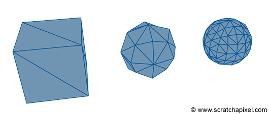
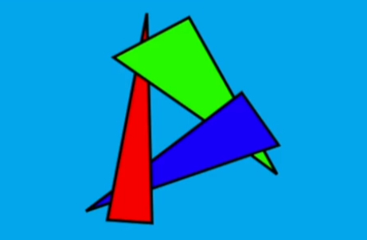

# CPU 3D Renderer

La meta de este proyecto es dejar un registro del desarrollo de un *pipeline* de renderizado 3D sin utilizar la GPU, implementando todo el sistema desde cero en C++.

Se utilizará `SDL2` como biblioteca multiplataforma para el hardware del sistema y `Dear ImGui` para implementar la interfaz.

## Índice

* [Configuración previa](#configuración-previa)
* [Buffer de color](#buffer-de-color)
    * [Dibujar FPS y caparlos](#dibujar-fps-y-caparlos)
    * [Refactorización 1](#refactorización-1)
* [Vectores y puntos](#vectores-y-puntos)
* [Proyección de puntos](#proyección-de-puntos)
    * [Proyección ortográfica](#proyección-ortográfica)
    * [Proyección perspectiva](#proyección-perspectiva)
    * [Regla de la mano](#regla-de-la-mano)
* [Transformaciones lineales](#transformaciones-lineales)
    * [Transformando vectores](#transformando-vectores)
    * [Razones trigonométricas](#razones-trigonométricas)
    * [Rotación de vectores](#rotación-de-vectores)
    * [Función de rotación](#función-de-rotación)
    * [Refactorización 2](#refactorización-2)
* [Triángulos, vértices y mallas](#triángulos-vértices-y-mallas)
    * [Programando los triángulos](#programando-los-triángulos)
* [Rasterización de líneas](#rasterización-de-líneas)
    * [Algoritmo DDA](#algoritmo-dda)
* [Mallas en memoria dinámica](#mallas-en-memoria-dinámica)
* [Ficheros con modelos OBJ](#ficheros-con-modelos-obj)
    * [Carga de OBJ en la memoria](#carga-de-obj-en-la-memoria)
* [Operaciones con vectores](#operaciones-con-vectores)
    * [Magnitud vectorial](#magnitud-vectorial)
    * [Adición y sustracción de vectores](#adición-y-sustracción-de-vectores)
    * [Multiplicación y división de vectores](#multiplicación-y-división-de-vectores)
    * [Producto vectorial](#producto-vectorial)
    * [Vector normal de una cara](#vector-normal-de-una-cara)
    * [Producto escalar](#producto-escalar)
* [Back-face Culling](#back-face-culling)
    * [Normalización de vectores](#normalización-de-vectores)
    * [Refactorización 3](#refactorización-3)
* [Rasterización de triángulos](#rasterización-de-triángulos)
    * [Técnica Flat-Bottom Flat-Top](#técnica-flat-bottom-flat-top)
    * [Evitar división entre cero](#evitar-división-entre-cero)
* [Interfaz Dear ImGui](#interfaz-dear-imgui)
    * [Opciones de rasterizado](#opciones-de-rasterizado)
* [Ordenar caras por profundidad](#ordenar-caras-por-profundidad)
    * [Algoritmo del pintor](#algoritmo-del-pintor)
* [Operaciones con matrices](#operaciones-con-matrices)
    * [Adición de matrices](#adición-de-matrices)
    * [Sustracción de matrices](#sustracción-de-matrices)
    * [Multiplicación de matrices](#multiplicación-de-matrices)
    * [Matriz de identidad](#matriz-de-identidad)
* [Matrices de transformación 3D](#matrices-de-transformación-3d)
    * [Matriz de escalado 3D](#matriz-de-escalado-3d)
    * [Matriz de traslación 3D](#matriz-de-traslación-3d)
    * [Matriz de rotación 3D](#matriz-de-rotación-3d)
    * [Matriz de mundo 3D](#matriz-de-mundo-3d)
    * [Reflexión sobre la traslación](#reflexión-sobre-la-traslación)
* [Matriz de proyección](#matriz-de-proyección)
    * [Proyección de valores negativos](#proyección-de-valores-negativos)
    * [Orden mayor de fila-columna](#orden-mayor-de-fila-columna)
* [Luz y sombreado](#luz-y-sombreado)    
    * [Sombreado plano](#sombreado-plano)
    * [Sombreado suavizado](#sombreado-suavizado)
    * [Valores verticales invertidos](#valores-verticales-invertidos)
* [Migrando a Visual Studio](#migrando-a-visual-studio)
* [Mapeado de texturas](#mapeado-de-texturas)
    * [Texturas en la memoria](#texturas-en-la-memoria)
    * [Triángulos texturizados](#triángulos-texturizados)
    * [Coordenadas baricéntricas](#coordenadas-baricéntricas-y-pesos)
    * [Pesos baricéntricos](#pesos-baricéntricos)
* [Interpolación de perspectiva corregida](#interpolación-de-perspectiva-corregida)
    * [Optimizar divisiones comunes](#optimizar-divisiones-comunes)
    * [Coordenadas UV incorrectas](#coordenadas-uv-incorrectas)
* [Decodificación de ficheros PNG](#decodificación-de-ficheros-png)
* [Profundidad con Z-Buffer](#profundidad-con-z-buffer)
    * [Rasterizado de líneas 3D](#rasterizado-de-líneas-3d)
    * [Rasterizado de las normales](#rasterizado-de-las-normales)
* [Matriz de vista y cámaras](#matriz-de-vista-y-cámaras)
    * [Cámara Look-at](#cámara-look-at)
    * [Variable Delta-time](#variable-delta-time)
    * [Cámara FPS](#cámara-fps)
* [Renderizado y debug por separado](#renderizado-y-debug-por-separado)
* [Clipping](#clipping)
    * [Planos del frustum](#planos-del-frustum)
    * [Punto respecto a un plano](#punto-respecto-a-un-plano)
    * [Punto de intersección](#punto-de-intersección)
    * [Algoritmo de clipping](#algoritmo-de-clipping)
    * [De polígonos a triángulos](#de-polígonos-a-triángulos)
    * [Ajustando el ángulo FOV](#ajustando-el-ángulo-fov)
    * [Clipping en las texturas](#clipping-en-las-texturas)
    * [Frustum clipping y space clipping](#frustum-clipping-y-space-clipping)
* [Múltiples mallas](#múltiples-mallas)


## Configuración previa

Este proyecto se desarrolla en Windows 11 con Visual Studio Code. La estructura principal es:

* `Makefile`
* `main.cpp`
* `src/include`
* `src/lib`
* `bin/SDL2.dll`

El fichero `main.cpp` inicialmente contiene un "Hola mundo" en SDL que intenta crear una ventana vacía:

```cpp
#include <iostream>
#include <SDL2/SDL.h>

const int WIDTH = 640, HEIGHT = 480;

int main(int argc, char *argv[])
{
    SDL_Init(SDL_INIT_EVERYTHING);

    SDL_Window *window = SDL_CreateWindow("Hello SDL WORLD", SDL_WINDOWPOS_UNDEFINED, SDL_WINDOWPOS_UNDEFINED, WIDTH, HEIGHT, SDL_WINDOW_ALLOW_HIGHDPI);

    if (NULL == window)
    {
        std::cout << "Could not create window: " << SDL_GetError() << std::endl;
        return 1;
    }

    SDL_Event windowEvent;

    while (true)
    {
        if (SDL_PollEvent(&windowEvent))
        {
            if (SDL_QUIT == windowEvent.type)
            {
                break;
            }
        }
    }

    SDL_DestroyWindow(window);
    SDL_Quit();

    return EXIT_SUCCESS;
}
```

Con el compiladir [GNU GCC Compiler](https://gcc.gnu.org/) instalado en el equipo y la biblioteca [SDL2 x86_64-w64-mingw32](http://libsdl.org/), con `include/SDL2` y `lib` en `src/` y `bin/SDL2.dll` donde el ejecutable `bin/main.exe` para su uso.

La compilación se realiza mediante la herramienta `make`, se puede instalar con [Chocolatey](https://chocolatey.org/):

```
choco install make
```

El `Makefile` contiene la vinculación necesaria de bibliotecas de SDL2:

```makefile
build:
	g++ -I src/include -L src/lib -o bin/main *.cpp -lmingw32 -lSDL2main -lSDL2
run:
	./bin/main.exe
clean:
	rm ./bin/main.exe
```

La compilación y ejecución es tan sencilla como ejecutar:

```
> make
> make run
```

Para facilitar la compilación y ejecución utilizo el complemento [Code Runner](https://marketplace.visualstudio.com/items?itemName=formulahendry.code-runner) de VSC y un comando personalizado definido en el `.vscode/settings.json`:

```json
{
    "code-runner.customCommand": "make && ./bin/main.exe"
}
```

Ejecutamos con `F1 > Run Custom Command` y *voilà*:


## Buffer de color

El buffer de color es un array de colores (en la práctica `uint32_t`) que maneja cada uno de los píxeles de la pantalla y su color. 

La variable que gestiona este buffer es el puntero `color_buffer`, donde se reserva memoria dinámicamente con `malloc`. El tamaño es el número de píxeles de la pantalla (ancho * alto):

```cpp
uint32_t *color_buffer;
color_buffer = static_cast<uint32_t *>(malloc(sizeof(uint32_t) * window_width * window_height));
```

Para dibujar ese `color_buffer` se tiene que copiar a una textura `color_buffer_texture`:

```cpp
SDL_Texture *color_buffer_texture;
color_buffer_texture = SDL_CreateTexture( renderer, SDL_PIXELFORMAT_ARGB8888, SDL_TEXTUREACCESS_STREAMING, window_width, window_height);
```

El proceso de copia del `color_buffer` a la textura y al renderer ocurrirá en cada fotograma:

```cpp
void render_color_buffer()
{
    SDL_UpdateTexture(color_buffer_texture, NULL, color_buffer, window_width * sizeof(uint32_t));
    SDL_RenderCopy(renderer, color_buffer_texture, NULL, NULL);
}
```

El proceso de renderizado empieza con un color de base para limpiar la pantalla, luego una limpieza y renderizado del `color_buffer` y finalmente la actualización de la pantalla:

```cpp
void render()
{
    SDL_SetRenderDrawColor(renderer, 255, 255, 255, 255);
    SDL_RenderClear(renderer);

    clear_color_buffer(0xFFF00FFFF);
    render_color_buffer();

    SDL_RenderPresent(renderer);
}
```

La limpieza del `color_buffer` se basa en recorrer todos los píxeles del array y establecer el color pasado a la función:

```cpp
void clear_color_buffer(uint32_t color)
{
    for (size_t y = 0; y < window_height; y++)
    {
        for (size_t x = 0; x < window_width; x++)
        {
            color_buffer[(window_width * y) + x] = color;
        }
    }
}
```

En este punto podemos crear diferentes funciones para cambiar dinámicamente los colores del `color_buffer`, por ejemplo para generar una cuadrícula `draw_grid()`:

```cpp
void draw_grid(uint32_t color)
{
    for (size_t y = 0; y < window_height; y += 10)
    {
        for (size_t x = 0; x < window_width; x += 10)
        {
            color_buffer[(window_width * y) + x] = color;
        }
    }
}
```


O una función para dibujar rectángulos rellenos de colores `draw_rectangle()`:

```cpp
void draw_rect(int sx, int sy, int width, int height, uint32_t color)
{
    for (size_t y = sy; (y < sy + height) && (y < window_height); y++)
    {
        for (size_t x = sx; (x < sx + width) && (x < window_width); x++)
        {
            color_buffer[(window_width * y) + x] = color;
        }
    }
}
```


### Dibujar FPS y caparlos

He decidido añadir una opción para dibujar la media de FPS. Para ello necesitaré dibujar un texto en pantalla con la biblioteca [SDL_ttf](https://github.com/libsdl-org/SDL_ttf). 

La versión utilizada en el proyecto es [SDL2_ttf-devel-2.0.18 x86_64-w64-mingw32](https://github.com/libsdl-org/SDL_ttf/releases/download/release-2.0.18/SDL2_ttf-devel-2.0.18-mingw.tar.gz), cuyos `include` y `lib` van al directorio `src` y la DLL `SDL2_ttf.dll` al directorio `bin`.

Una vez hecho se puede importar para utilizarlo:

```cpp
#include <SDL2/SDL.h>
#include <SDL2/SDL_ttf.h>
```

Para dibujar el texto hay que seguir varios pasos.

En primer lugar se necesita una superficie para renderizar el texto, un color y una fuente que deberemos cargar luego:

```cpp
SDL_Surface *text;
TTF_Font *font;
SDL_Color color = {255, 255, 255};
```

Deberemos inicializar el módulo TTF:

```cpp
if (TTF_Init() < 0)
{
    std::cout << "Error initializing SDL_ttf: " << TTF_GetError() << std::endl;
    return false;
}
```

También durante la inicialización si todo es correcto cargaremos la configuración de la fuente que debemos tener en algún directorio del proyecto:

```cpp
// font setup
font = TTF_OpenFont("assets/FreeSans.ttf", 16);
if (!font)
{
    std::cout << "Error loading font: " << TTF_GetError() << std::endl;
    return false;
}
```

Durante el renderizado la idea es renderizar el texto deseado en la superficie:

```cpp
text = TTF_RenderText_Solid(font, "Hola mundo!", color);
if (!text)
{
    std::cout << "Failed to render text: " << TTF_GetError() << std::endl;
}
```

Justo a continuación renderizaremos la superficie como una textura, configuraremos el tamaño de la recta ed destino y realizaremos la copia al `renderer`:

```cpp
SDL_Texture *text_texture = SDL_CreateTextureFromSurface(renderer, text);
SDL_Rect dest = {2, 459, text->w, text->h};
SDL_RenderCopy(renderer, text_texture, NULL, &dest);
```

Después de actualizar la pantalla podemos liberar de la memoria la textura y la superficie (es muy importante):

```cpp
// Liberación de memoria local
SDL_DestroyTexture(text_texture);
SDL_FreeSurface(textSurface);
```

También deberemos liberar la memoria de la fuente y el módulo TTF al destruir la ventana:

```cpp
TTF_CloseFont(font);
TTF_Quit();
```

Con esto ya tendremos nuestro texto en pantalla:


Ahora debemos idear una forma de limitar los FPS en caso de que no queramos tener la sincronización vertical activa:

```cpp
renderer = SDL_CreateRenderer(window, -1, SDL_RENDERER_ACCELERATED | SDL_RENDERER_PRESENTVSYNC);
```

Siguiendo la idea del tutorial de [LazyFoo](https://lazyfoo.net/tutorials/SDL/25_capping_frame_rate/index.php) he decidido crear mis propia clase `Timer` para tener unos objetos más sofisticados.

La cabecera `timer.h` contiene las definiciones:

```cpp
#ifndef TIMER_H
#define TIMER_H

#include <iostream>
#include <SDL2/SDL.h>

// The application time based timer
class Timer
{
public:
    // Initializes variables
    Timer();

    // The various clock actions
    void start();
    void stop();
    void pause();
    void unpause();

    // Gets the timer's time
    uint32_t getTicks();

    // Checks the status of the timer
    bool isStarted();
    bool isPaused();

private:
    // The clock time when the timer started
    uint32_t mStartTicks;

    // The ticks stored when the timer was paused
    uint32_t mPausedTicks;

    // The timer status
    bool mPaused;
    bool mStarted;
};

#endif
```

Y el fichero de fuentes `timer.cpp` la implementación de la clase:

```cpp
#include "timer.h"

Timer::Timer()
{
    // Initialize the variables
    mStartTicks = 0;
    mPausedTicks = 0;

    mPaused = false;
    mStarted = false;
}

void Timer::start()
{
    // Start the timer
    mStarted = true;

    // Unpause the timer
    mPaused = false;

    // Get the current clock time
    mStartTicks = SDL_GetTicks();
    mPausedTicks = 0;
}

void Timer::stop()
{
    // Stop the timer
    mStarted = false;

    // Unpause the timer
    mPaused = false;

    // Clear tick variables
    mStartTicks = 0;
    mPausedTicks = 0;
}

void Timer::pause()
{
    // If the timer is running and isn't already paused
    if (mStarted && !mPaused)
    {
        // Pause the timer
        mPaused = true;

        // Calculate the paused ticks
        mPausedTicks = SDL_GetTicks() - mStartTicks;
        mStartTicks = 0;
    }
}

void Timer::unpause()
{
    // If the timer is running and paused
    if (mStarted && mPaused)
    {
        // Unpause the timer
        mPaused = false;

        // Reset the starting ticks
        mStartTicks = SDL_GetTicks() - mPausedTicks;

        // Reset the paused ticks
        mPausedTicks = 0;
    }
}

uint32_t Timer::getTicks()
{
    // The actual timer time
    uint32_t time = 0;

    // If the timer is running
    if (mStarted)
    {
        // If the timer is paused
        if (mPaused)
        {
            // Return the number of ticks when the timer was paused
            time = mPausedTicks;
        }
        else
        {
            // Return the current time minus the start time
            time = SDL_GetTicks() - mStartTicks;
        }
    }

    return time;
}

bool Timer::isStarted()
{
    // Timer is running and paused or unpaused
    return mStarted;
}

bool Timer::isPaused()
{
    // Timer is running and paused
    return mPaused && mStarted;
}
```

Esta clase abastrae la función de SDL `SDL_GetTicks()` y la maneja internamente además de proveer de métodos para manejar el temporizador.

La idea para calcular los FPS es la siguiente, antes de empezar el bucle de juego creamos un temporizador y lo iniciamos:

```cpp
Timer fpsTimer;
fpsTimer.start();
```

También definiremos una variable para contar los fotogramas actuales:

```cpp
int countedFrames = 0;
```

En cada iteración calcularemos los fps de media a partir del valor actual del contador entre el temporizador entre 1000, luego incrementaremos los fotogramas. Estos fps de media `avgFPS` los tendremos como una variable global para renderizar ese valor en el texto de antes:

```cpp
float avgFPS = 0;  // <--- global
//...

avgFPS = countedFrames / (fpsTimer.getTicks() / 1000.f);
++countedFrames
```

Para dibujar los FPS modificaremos el renderizado de texto:

```cpp
text = TTF_RenderText_Solid(font, (std::to_string(avgFPS) + " fps").c_str(), color);
```

Por defecto al tener la sincronización activada los FPS se autoregulan a los hercios de mi pantalla, que son 144:


Ahora nos falta añadir la limitación de FPS como alternativa a desactivar la sincronización vertical, esto se denomina el *fps cap*. 

Para ello definiremos unas variables globales que manejarán si activamos o no el cap, la limitación de FPS deseada y el cálculo de ticks de pantalla por fotograma que utilizará nuestro futuro `capTimer`:

```cpp
bool enableCap = true;
int fpsCap = 60;
int screenTicksPerFrame = 1000 / fpsCap;
```

Procedemos a definir el `capTimer` antes del `while`:

```cpp
Timer capTimer;
```

Lo iniciaremos justo al comenzar la iteración del `while`:

```cpp
while (is_running){
    capTimer.start();
```

Finalmente, después de renderizar la pantalla al final del `while`, realizaremos un ajuste para retrasar la siguiente iteración (utilizando `SDL_Delay`) en función de los ticks de pantalla que resten para llegar a los `screenTicksPerFrame` calculados antes:

```cpp
// Si el fotograma finaliza demasiado pronto
int frameTicks = capTimer.getTicks();
if (enableCap && frameTicks < screenTicksPerFrame)
{
    // Esperamos el tiempo restante
    SDL_Delay(screenTicksPerFrame - frameTicks);
}
```

Con esto habremos logrado un límite de FPS manual en caso de no querer la sincronización vertical o podemos desactivarlo utilizando `enableCap`:

```cpp
bool enableCap = true;
```

Aquí se aprecia el cap manual a 60FPS:


### Refactorización 1

Antes de continuar con el siguiente tema sobre vectores y puntos voy a reorganizar los ficheros del proyecto en clases para que todo sea más cómodo de utilizar.

Esencialmente voy a abstraer todo el proceso de gestión de la ventana y renderizado en una clase `Window`.

Las cabeceras `window.h` por ahora quedarán de la siguiente forma, también después de cambiar la notación a **PascalCase** en los métodos y **camelCase** en las variables:

```cpp
#ifndef WINDOW_H
#define WINDOW_H

#include <iostream>
#include <SDL2/SDL.h>
#include <SDL2/SDL_ttf.h>
#include "timer.h"

class Window
{
public:
    bool running = false;
    int windowWidth;
    int windowHeight;

private:
    /* Window */
    bool isFullscreen = false;
    SDL_Window *window;
    SDL_Renderer *renderer;

    /* Color buffer  */
    uint32_t *colorBuffer;
    SDL_Texture *colorBufferTexture;

    /* Text */
    SDL_Surface *textSurface;
    SDL_Color textColor = {255, 255, 255};
    TTF_Font *textFont;

    /* Fps */
    float avgFPS = 0;
    bool enableCap = true;
    int fpsCap = 60;
    int screenTicksPerFrame = 1000 / fpsCap;
    long countedFrames = 0;

    /* Timers */
    Timer fpsTimer, capTimer;

public:
    Window(int w, int h) : windowWidth(w), windowHeight(h){};
    ~Window();

    void Init();
    void Setup();

    void ProcessInput();
    void Update();
    void Render();
    void PostRender();

    void ClearColorBuffer(uint32_t color);
    void RenderColorBuffer();

    void DrawGrid(unsigned int color);
    void DrawRect(int sx, int sy, int width, int height, uint32_t color);
};

#endif
```

En cuanto al código fuente `window.cpp` la implementción completa es:

```cpp
#include "window.h"

Window::~Window()
{
    std::cout << "Destroying Window";

    // Liberar la memoria dinámica
    free(colorBuffer);

    SDL_DestroyRenderer(renderer);
    SDL_DestroyWindow(window);

    TTF_CloseFont(textFont);
    TTF_Quit();

    SDL_Quit();
}

void Window::Init()
{
    running = true;

    // Inicializamos SDL
    if (SDL_Init(SDL_INIT_EVERYTHING) != 0)
    {
        std::cout << "Error initializing SDL." << std::endl;
        running = false;
    }

    // Inicialización TTF
    if (TTF_Init() < 0)
    {
        std::cout << "Error initializing SDL_ttf: " << TTF_GetError() << std::endl;
        running = false;
    }

    // Utilizar SDL para preguntar la resolucion maxima del monitor
    SDL_DisplayMode Window_mode;
    SDL_GetCurrentDisplayMode(0, &Window_mode);

    if (isFullscreen)
    {
        windowWidth = Window_mode.w;
        windowHeight = Window_mode.h;
    }

    // Creamos la ventana SDL
    window = SDL_CreateWindow(
        NULL, SDL_WINDOWPOS_CENTERED, SDL_WINDOWPOS_CENTERED,
        windowWidth, windowHeight, SDL_WINDOW_BORDERLESS);

    if (!window)
    {
        std::cout << "Error creating SDL Window." << std::endl;
        running = false;
    }

    // Creamos el renderizador SDL
    if (enableCap)
    {
        renderer = SDL_CreateRenderer(window, -1, 0);
    }
    else
    {
        renderer = SDL_CreateRenderer(window, -1, SDL_RENDERER_ACCELERATED | SDL_RENDERER_PRESENTVSYNC);
    }

    if (!renderer)
    {
        std::cout << "Error creating SDL renderer." << std::endl;
        running = false;
    }

    // font setup
    textFont = TTF_OpenFont("assets/FreeSans.ttf", 16);
    if (!textFont)
    {
        std::cout << "Error loading font: " << TTF_GetError() << std::endl;
        running = false;
    }

    if (isFullscreen)
    {
        SDL_SetWindowFullscreen(window, SDL_WINDOW_FULLSCREEN);
    }

    if (!running)
    {
        std::cout << "Window Init Fail";
    }
}

void Window::Setup()
{
    // Reservar la memoria requerida en bytes para mantener el color buffer
    colorBuffer = static_cast<uint32_t *>(malloc(sizeof(uint32_t) * windowWidth * windowHeight));

    // Crear la textura SDL utilizada para mostrar el color buffer
    colorBufferTexture = SDL_CreateTexture(
        renderer, SDL_PIXELFORMAT_ARGB8888, SDL_TEXTUREACCESS_STREAMING, windowWidth, windowHeight);

    // Start Timers
    fpsTimer.start();
    capTimer.start();
}

void Window::ProcessInput()
{
    SDL_Event event;
    SDL_PollEvent(&event);

    switch (event.type)
    {
    case SDL_QUIT:
        running = false;
        break;
    case SDL_KEYDOWN:
        if (event.key.keysym.sym == SDLK_ESCAPE)
            running = false;
        break;
    }
}

void Window::Update()
{
    if (enableCap)
    {
        // Iniciar el temporizador de cap
        capTimer.start();
    }

    // Calculate fps
    avgFPS = countedFrames / (fpsTimer.getTicks() / 1000.f);
    // Increment the frame counter
    ++countedFrames;
}

void Window::Render()
{
    // Limpiar el color buffer
    ClearColorBuffer(static_cast<uint32_t>(0xFF0000000));
}

void Window::PostRender()
{
    // Renderizar el color buffer
    RenderColorBuffer();

    // Render FPS
    textSurface = TTF_RenderText_Solid(textFont, (std::to_string(avgFPS) + " fps").c_str(), textColor);
    if (!textSurface)
    {
        std::cout << "Failed to render text: " << TTF_GetError() << std::endl;
    }

    SDL_Texture *textTexture = SDL_CreateTextureFromSurface(renderer, textSurface);
    SDL_Rect dest = {2, windowHeight - 21, textSurface->w, textSurface->h};
    SDL_RenderCopy(renderer, textTexture, NULL, &dest);

    // Liberación de memoria local
    SDL_FreeSurface(textSurface);
    SDL_DestroyTexture(textTexture);

    // Finalmente actualizar la pantalla
    SDL_RenderPresent(renderer);

    // Y por último capear los fotogramas si es necesario
    if (enableCap)
    {
        int frameTicks = capTimer.getTicks();
        if (frameTicks < screenTicksPerFrame)
        {
            // Esperamos el tiempo restante
            SDL_Delay(screenTicksPerFrame - frameTicks);
        }
    }
}

void Window::ClearColorBuffer(uint32_t color)
{
    for (size_t y = 0; y < windowHeight; y++)
    {
        for (size_t x = 0; x < windowWidth; x++)
        {
            colorBuffer[(windowWidth * y) + x] = color;
        }
    }
}

void Window::RenderColorBuffer()
{
    // Copiar el color buffer y su contenido a la textura
    // Así podremos dibujar la textura en el renderer
    SDL_UpdateTexture(colorBufferTexture, NULL, colorBuffer, windowWidth * sizeof(uint32_t));
    SDL_RenderCopy(renderer, colorBufferTexture, NULL, NULL);
}

void Window::DrawGrid(unsigned int color)
{
    for (size_t y = 0; y < windowHeight; y += 10)
    {
        for (size_t x = 0; x < windowWidth; x += 10)
        {
            colorBuffer[(windowWidth * y) + x] = static_cast<uint32_t>(color);
        }
    }
}

void Window::DrawRect(int sx, int sy, int width, int height, uint32_t color)
{
    for (size_t y = sy; (y < sy + height) && (y < windowHeight); y++)
    {
        for (size_t x = sx; (x < sx + width) && (x < windowWidth); x++)
        {
            colorBuffer[(windowWidth * y) + x] = static_cast<uint32_t>(color);
        }
    }
}
```

Inicializar y empezar a trabajar con la ventana es ahora muy sencillo, así quedará `main.cpp`:

```cpp
#include <iostream>
#include "window.h"

int main(int argc, char *argv[])
{
    Window window(640, 480);

    window.Init();
    window.Setup();

    while (window.running)
    {
        window.ProcessInput();

        window.Update();
        window.Render();

        window.DrawGrid(0xFF616161);
        window.DrawRect(50, 50, 100, 100, 0xFF1570E8);
        window.DrawRect(205, 125, 300, 200, 0xFFD93E23);
        window.DrawRect(375, 225, 300, 300, 0xFFE35FDA);

        window.PostRender();
    }

    return 0;
}
```

A comentar la variable pública `window.running` que permite saber en todo momento si la ventana está funcionando para seguir ejecutando el bucle. 

Luego los distintos métodos de mismo nombre `ProcessInput`, `Update`, `Render` y un nuevo `PostRender` que me permite separar el renderizado en dos partes y dibujar entre tanto diferentes elementos y por encima dibujar los FPS y presentar el `renderer`.

Por cierto, tampoco necesitamos limpiar la pantalla en el renderer, pues estamos dibujando directamente nuestro `colorBuffer`:

```cpp
void Window::Render()
{
    // Establecer el color del renderizador
    // SDL_SetRenderDrawColor(renderer, 255, 255, 255, 255);
    // Limpiar la pantalla con el color establecido
    // SDL_RenderClear(renderer);

    // Limpiar el color buffer
    ClearColorBuffer(static_cast<uint32_t>(0xFF0000000));
}
```

**BUG: Congelamiento de Timer al mover ventana**

Cuando se hace clic en una ventana SDL con los bordes activados:

```cpp
window = SDL_CreateWindow(
    NULL, SDL_WINDOWPOS_CENTERED, SDL_WINDOWPOS_CENTERED,
    windowWidth, windowHeight, 0); // SDL_WINDOW_BORDERLESS
```

La ejecución del código se bloqueará porque `SDL_PollEvent(&event)` queda parado a la espera del siguiente evento. Sin embargo los timers 'SDL_GetTicks()` siguen funcionando y eso ocasionará un retraso en al contabilidad de fotogramas.

Para evitar este problema simplemente debemos pausar y continuar el `fpsTimer` antes y después de recibir el siguiente evento:

```cpp
void Window::ProcessInput()
{
    // Pausar timer para prevenir congelamiento
    fpsTimer.pause(); 
    // Esperar y guardar el siguiente evento SDL
    SDL_PollEvent(&event);
    // Continuar al recibir cualquier evento
    fpsTimer.unpause(); 
```

## Vectores y puntos

Es hora de empezar a pensar en 3D, eso implica añadir una nueva dimensión: la **profundidad**, que se representa en lo que se conoce como el **eje Z**.

Empezaré creando un nuevo método para pintar un único píxel en pantalla:

```cpp
void Window::DrawPixel(int x, int y, unsigned int color)
{
    if (x >= 0 && x < windowWidth && y >= 0 && y < windowHeight)
    {
        colorBuffer[(windowWidth * y) + x] = static_cast<uint32_t>(color);
    }
}
```

Si queremos representar algo en el espacio tridimensional, debemos hacerlo a través de números que indican cantidades.

Las cantidades se dividen en dos tipos:

* **Cantidades escalares**: Representadas con único número: temperatura, área, longitud, presión...
* **Cantidades vectoriales**: Representadas con más de un número: velocidad, aceleración, fuerza, arrastre, desplazamiento, elevación...

Para representar una cantidad vectorial de dos números, por ejemplo **velocidad (m/s)**, se utiliza un eje de coordenadas 2D y un vector formado por los componentes `X`, `Y`.

De la misma forma podemos representar una cantidad vectorial formada por tres números **ancho**, **alto** y **profundidad** en un eje de coordenadas 3D mediante un vector formado por los componentes `X`, `Y`, `Z`. 

Un **vector** es un conjunto de componentes donde el orden importa para representar una cantidad formada por dos o más números, así que vamos a empezar por definir unas clases para manejar nuestros propios vectores 2D y 3D:

```cpp
#ifndef VECTOR_H
#define VECTOR_H

#include <iostream>

class Vector2
{
public:
    double x;
    double y;

    friend std::ostream &operator<<(std::ostream &os, const Vector2 &v);
};

class Vector3
{
public:
    double x;
    double y;
    double z;

    friend std::ostream &operator<<(std::ostream &os, const Vector3 &v);
};

#endif
```

Para la implementación por ahora solo la sobrecarga del `ostream` para imprimir un vector:

```cpp
#include "vector.h"

std::ostream &operator<<(std::ostream &os, const Vector2 &v)
{
    os << "(" << v.x << ", " << v.y << ")";
    return os;
}

std::ostream &operator<<(std::ostream &os, const Vector3 &v)
{
    os << "(" << v.x << ", " << v.y << ", " << v.z << ")";
    return os;
}
```

Vamos a suponer que deseamos representar un cubo 3D de 9 píxeles de ancho, alto y profundidad. Podemos entenderlo como un conjunto de 9*9*9 píxeles, donde cada punto es un vector tridimensional.

Lo que podemos hacer es suponer el centro del cubo como el origen del eje de coordenadas (0,0,0) y a partir de ahí uniformemente (en base de -1 a 1) representarlo a la izquierda, derecha, arriba, abajo, adelante y atrás.

Para ello lo podemos inicializar con tres bucles anidados:

```cpp
// Cubo de 9x9x9 píxeles
int counterPoints;
Vector3 cubePoints[9 * 9 * 9];

// Cargar el array de vectores de -1 a 1 en el cubo 9x9x9
for (double x = -1; x <= 1; x += 0.25)
{
    for (double y = -1; y <= 1; y += 0.25)
    {
        for (double z = -1; z <= 1; z += 0.25)
        {
            cubePoints[counterPoints++] = Vector3{x, y, z};
        }
    }
}
```

Este es el principio y final del arreglo 9*9*9 con 729 puntos:

```
(-1, -1, -1), 
(-1, -1, -0.75), 
..., 
(0, 0, -0.25), 
(0, 0, 0), 
(0, 0, 0.25), 
..., 
(1, 1, 0.75), 
(1, 1, 1)
```

El problema es que nuestro `ColorBuffer` se fundamenta en un eje 2D de ancho y alto. ¿Cómo podemos a representar un arreglo de vectores 3D en un buffer 2D?

## Proyección de puntos

Las técnicas de proyección nos permiten representar, mediante operaciones matemáticas una dimensión 3D en forma  2D.

Existen varios tipos de proyecciones dependiendo del resultado que nos interese.

### Proyección ortográfica

Esta proyección es una proyección paralela que consiste en ignorar la profundidad (eje `Z`).

Para implementar esta proyección en una función recibiremos un vector 3D y devolveremos un vector 2D con únicamente sus componentes X e Y:

```cpp
Vector2 OrtoraphicProjection(Vector3 p)
{
    return Vector2{p.x, p.y};
}
```

Para probar la función vamos a crear un cubo de puntos proyectos en 2D. Podemos definir el arreglo fuera del `while`:

```cpp
Vector2 cubeProjectedPoints[9 * 9 * 9];
```

Entre `Update` y `Render` proyectamos los puntos a 2D:

```cpp
window.Update();

// Vector 3D proyectado ortográficamente
for (int i = 0; i < 9 * 9 * 9; i++)
{
    // Proyeccion del punto
    cubeProjectedPoints[i] = OrtoraphicProjection(cubePoints[i]);
}

window.Render();
```

Ahora durante el renderizado, podemos hacer uso de nuestro método `DrawPixel` y establecer todos los píxeles del cubo proyectado en el `ColorBuffer`:

```cpp
window.Render();
window.DrawGrid(0xFF616161);

/* Dibujar proyección */
for (int i = 0; i < 9 * 9 * 9; i++)
{
    window.DrawPixel(
        cubeProjectedPoints[i].x,
        cubeProjectedPoints[i].y,
        0xFF00FFFF);
}

window.PostRender();
```

El resultado será el siguiente:


Un pequeño píxel en la parte superior izquierda. 

¿Por qué? Pues debido a que los valores de nuestro cubo se encuentran normalizados entre `-1` y `1` con el origen en `0`.

Esto nos lleva a la idea de que debemos escalar de alguna forma los valores del cubo.

Este escalar se denomina**FOV** (campo de visión) y podemos probar alguna cantidad hasta dar con la que nos guste y mulitiplicarla en nuestra función de proyección:

```cpp
float fovFactor = 100;

Vector2 OrtoraphicProjection(Vector3 p)
{
    return Vector2{
        fovFactor * p.x, 
        fovFactor * p.y};
}
```

El resultado por ahora será algo así:


Debemos tener en cuenta que como consecuencia de aplicar el `fovFactor`, el cubo crece en tamaño y para dibujarlo completamente necesitamos más espacio. Por eso deberemos reposicionarlo, idealmente hacia el centro de la pantalla, tomando su origen `(0, 0)` como el punto `(windowWidth/2, windowHeight/2)`.

Así que simplemente sumamos esa distancia en sus componentes durante el renderizado:

```cpp
/* Dibujar proyección reposicionada al centro */
for (int i = 0; i < 9 * 9 * 9; i++)
{
    window.DrawPixel(
        cubeProjectedPoints[i].x + window.windowWidth / 2,
        cubeProjectedPoints[i].y + window.windowHeight / 2,
        0xFF00FFFF);
}
```

Y ya está, ahora sí con su aspecto real en paralelo:


### Proyección perspectiva

La proyección en perspectiva consiste en simular la forma en cómo los humanos vemos el mundo, donde los objetos cerca nuestro se perciben mayores que los que están lejos.

Esto introduce la idea de que necesitamos una especie de espectador u ojo como origen de la vista tridimensional con un ángulo de visión que definirá el campo visible, llamado `AOV` (angle of view).

En un videojuego o simulación tridimensional, el origen de la vista es la cámara que nos permite percibir el mundo, abarcando el espacio entre el plano más cercano y el plano más alejado, denominado `View Frustum`:


Mediante el uso de la geometría y la propiedad de los triángulos similares de compartir proporciones equivalentes, podemos calcular las fórmulas para los puntos proyectados `P'x` y `P'y`:


Ambas fórmulas se conocen como **brechas de perspectiva**, en inglés *perspective divide* y dictan que:

* Cuanto menor sea la profundidad `z`, mayor serán `x` e `y`, de manera que los objetos se percibirán más grandes.
* Cuanto mayor sea la profundidad `z`, menores serán `x` e `y`, de manera que  los objetos se percibirán más pequeños.

Nuestra nueva función de perspectiva simplemente dividirá `x` e `y` entre `z`:

```cpp
Vector2 PerspectiveProjection(Vector3 p)
{
    return Vector2{
        (fovFactor * p.x) / p.z, 
        (fovFactor * p.y) / p.z};
}

cubeProjectedPoints[i] = PerspectiveProjection(cubePoints[i]);
```

EL resultado se verá más o menos así:


No es exactamente lo que se espera pero se percibe una especie de profundidad. 

La razón por la que se ve de esta forma es que estamos suponiendo que el ojo, el origen de la vista, concuerda justo en la cara más profunda del cubo.

Para solucionarlo debemos alejar nuestra vista del cubo, esto lo conseguiremos restando una profundidad extra mediante un `Vector3` para simular la posición de una cámara alejada del fondo del cubo:

```cpp
Vector3 cameraPosition{0, 0, -5};
```

Esta distancia la vamos a restar del punto antes de realizar la proyección de perspectiva:

```cpp
window.Update();

for (int i = 0; i < 9 * 9 * 9; i++)
{
    // Restamos la distancia de la cámara
    Vector3 point = cubePoints[i];
    point.z -= cameraPosition.z;
    // Proyeccion del punto
    cubeProjectedPoints[i] = PerspectiveProjection(point);
}

window.Render();
```

Si visualizamos el cubo lo visualizaremos muy pequeño pero ya se podrá apreciar la perspectiva:


Podemos rectificar el tamaño mediante la profundidad de la cámara `cameraPosition.z` o con el factor de escalado del punto de vista `fovFactor`, probemos cambiando éste último:

```cpp
float fovFactor = 200;
```

Al aumentar el factor de escalado el cubo se percibe más grande:


Estos valores no son casuales, todo esto tiene una explicación matemática clara.

Dado que el lado del cubo mide 2 unidades uniformes (de -1 a 1), un factor de 200 ocasionará que el cubo tenga un tamaño de -200 a 200 píxeles al escalarlo, por lo que lado completo medirá 400px.

Ahora bien, como la cámara está a 5 unidades de distancia, podemos suponer que el tamaño que percibiremos será 400/5 = 80px... ¿O no? Pues no, el tamaño del costado es exactamente 100px:


¿Recordáis que al dibujar el cubo lo hacemos desde su cara más profunda?

Considerando eso debemos suponer que para dibujar su cara más cercana debemos alejarnos de la cara profunda exactamente lo que mide el costado del cubo, es decir 2 unidades (200 * 2 px):

```cpp
Vector3 cameraPosition{0, 0, -2};
```

Si nuestra suposición es correcta, desde esta posición de la cámara el costado tendrá un tamaño exacto de 400px:


### Regla de la mano

En nuestro entorno tridimensional hemos asumido algo importante sin darnos cuenta, me refiero a la dirección de crecimiento para la profundidad en el eje `Z`.

Hemos considerado que cuanto mayor sea la `Z` más profundidad y cuanto menor sea, menos profundidad. Precisamente por eso le restamos al eje `Z` de la cámara `(0,0,-5)`, para alejarla del cubo.

Sin embargo sistemas como **OpenGL** se basan en lo contrario, cuanto mayor sea la `Z` menos profundidad y cuanto menor sea, más profundidad. En ese sistema  para alejar la cámara deberíamos sumar `(0,0,5)` al eje `Z` :


La dirección de la profundidad es un tema importante en la programación gráfica, la forma de realizar algunos cálculos es distinta dependiendo del sistema elegido.

Si ponemos el pulgar de la mano derecha  mirando hacia la derecha simulando el eje `X` y el índice hacia arriba simulando el eje `Y`, el dedo corazón apuntará hacia nosotros, diremos que la profundidad `Z` crece hacia fuera de la pantalla. Pero si repetimos el proceso con la mano izquierda, el dedo corazón apuntará al lado inverso, la profundidad `Z` crece hacia la pantalla:


Esto se conoce como **regla de la mano** y nos permite determinar sentidos vectoriales. Nuestro sistema, al igual que **DirectX**, se basa en la mano izquierda (la profundidad crece hacia adentro de la pantalla), mientras que **OpenGL** se basa en la mano derecha, (la profundidad crece hacia afuera de la pantalla). 

Recordar esta sencilla regla nos servirá para más adelante.

## Transformaciones lineales

Hemos visto como dividiendo entre el eje `Z` hemos conseguido la **brecha de perspectiva** para la proyección en perspectiva. Sin embargo, esta función es solo uno de los diferentes pasos que necesitamos para conseguir la verdadera proyección en perspectiva.

A parte de dvidir entre `Z` necesitamos considerar por ejemplo, cuál es ángulo del `FOV` (el campo de visión) que estamos utilizando, o también el `AR` (la relación de aspecto) de la pantalla. Para conseguir esto necesitaremos acudir a la **proyección de matrices**, pero es un tema que trataremos más adelante.

Por ahora utilizaremos la **brecha de perspectiva** y nos centraremos en algo más interesante, añadir dinamismo a nuestro cubo mediante la aplicación de transformaciones en sus vectores.

### Transformando vectores

Para transformar los vectores necesitamos acudir al **álgebra lineal**, la rama de la matemática que estudia las ecuaciones y funciones lineales, así cómo su representación como vectores y matrices.

Las tres transformaciones esenciales son:

* **Escalado**: Para hacer más grande o más pequeño el vector.
* **Traslación**: Para mover el vector de sitio a otro.
* **Rotación**: Para rotar el vector una cierta cantidad.

Las transformaciones las llevaremos a cabo antes de la proyección, durante el evento de actualización y antes del renderizado:

1. `ProcessInput()`
2. `Update()`
    1. `TransformPoints()`
        1. `Rotate(x, y, z)`
        2. `Scale(amout)`
        3. `Translate(amout)`
    2. `ProjectPoints()`
3. `Render()`

### Razones trigonométricas

Para realizar las transformaciones de los vectores es necesario utilizar la trigonometría, así que vamos a repasar los conceptos básicos.

Trigonometría significa **estudio de los trígonos**, polígonos con tres lados y tres ángulos.

Las razones trigonométricas son las relaciones entre los lados de un triángulo rectángulo:


&space;=&space;\frac{opuesto}{hipotenusa}&space;\rightarrow&space;s&space;=&space;o&space;/&space;h)

&space;=&space;\frac{adyacente}{hipotenusa}&space;\rightarrow&space;c&space;=&space;a&space;/&space;h)

&space;=&space;\frac{opuesto}{adyacente}&space;\rightarrow&space;t&space;=&space;o&space;/&space;a)

Estas relaciones nos permitirán realizar distintos cálculos esenciales para las transformaciones lineales como por ejemplo la rotación. 

Una forma de recordarlas es mediante la palabra **sohcahtoa**.

### Rotación de vectores

Ahora que hemos repasado el tema de las razones trignométricas podemos aplicar esos conceptos para rotar los vectores de nuestro cubo.

Para rotar un vector (x,y) se debe aplicar la fórmula de la rotación de matrices:


Dado un vector `(x, y)` queremos aplicarle una rotación (ángulo) para conseguir el nuevo vector rotado `(x', y')`.


Tomando el triángulo que forma `(x, y)` con ángulo `β` y el triángulo que forma `(x', y')` con ángulo `θ` podemos establecer sus relaciones trigonométricas para encontrar los valores del vector rotado `(x', y')`:


Para determinar los valores rotados necesitamos asumirlos como la suma de `θ` y `β`: 


No sabemos el ángulo `β` pero en trigonometría existen las conocidas **fórmulas de adición** que explican como expandir el seno y el coseno de una suma o resta de dos ángulos:


Aplicando la fórmula de adición del ángulo para el coseno:


Aquí podemos substituir `rcosθ` por `x`y `rsinθ` por `y` para conseguir finalmente el valor de `x'`:


Lo mismo podemos formular para conseguir el valor de `y'`:


Substituimos `rsinθ` por `y` y `rcosθ` por `x` para conseguir el valor de `y'`:


Y ya tenemos las ecuaciones que podemos escribir en forma matricial para un ángulo `α`:


Ahora bien, esto es para rotar un vector 2D, ¿cómo se aplica con un vector 3D?

Pues si nos lo paramos a pensar, podemos rotar un elemento en base a cualquier de los dimensiones. No es lo mismo rotar algo horizontalmente, que verticalmente o en profundidad.

Al tener tres tipos de rotación el eje aldedor del que vamos a rotar quedará congelado, es decir, no se modificará y es precisamente gracias a eso que no necesitamos nada más para manejar las rotaciones.

Para rotar alrededor del eje `z`:


Para rotar alrededor del eje `y`:


Para rotar alrededor del eje `x`:


### Función de rotación

Después de tanta trigonometría es hora de programar un poco y llevar a código todo lo que hemos aprendido.

Empecemos creando unos métodos para rotar los vectores 3D:

```cpp
class Vector3
{
public:
    double x;
    double y;
    double z;

    friend std::ostream &operator<<(std::ostream &os, const Vector3 &v);

    void RotateX(float angle);
    void RotateY(float angle);
    void RotateZ(float angle);
};
```

La implementación siguiendo las fórmulas de la lección anterior:

```cpp
void Vector3::RotateX(float angle)
{
    double newY = y * cos(angle) - z * sin(angle);
    double newZ = y * sin(angle) + z * cos(angle);

    y = newY;
    z = newZ;
}
void Vector3::RotateY(float angle)
{
    double newX = x * cos(angle) - z * sin(angle);
    double newZ = x * sin(angle) + z * cos(angle);

    x = newX;
    z = newZ;
}
void Vector3::RotateZ(float angle)
{
    double newX = x * cos(angle) - y * sin(angle);
    double newY = x * sin(angle) + y * cos(angle);

    x = newX;
    y = newY;
}
```

Ahora, podemos aplicar la rotación a partir de un `Vector3 cubeRotation` declarado fuera del `while`:

```cpp
// Rotación cubo
Vector3 cubeRotation;
```

Justo antes de proyectar el cubo a 2D, le aplicaremos las transformaciones:

```cpp
window.Update();

// Rotation transformations per frame
cubeRotation.x += 0.01;
cubeRotation.y += 0.01;
cubeRotation.z += 0.01;

for (size_t i = 0; i < 9 * 9 * 9; i++)
{
    Vector3 point = cubePoints[i];
    // Rotation transformations
    point.RotateX(cubeRotation.x);
    point.RotateY(cubeRotation.y);
    point.RotateZ(cubeRotation.z);
    // Restamos la distancia de la cámara
    point.z -= cameraPosition.z;
    // Proyeccion del punto
    cubeProjectedPoints[i] = PerspectiveProjection(point);
}

window.Render();
```

Como resultado tendremos el cubo rotando:


### Refactorización 2

Tenemos mucho que refactorizar en la ventana y nuestros vectores, así que pongámonos manos a la obra.

Empezando por las variables del `fovFactor` y el `cameraPosition` dentro de la ventana como variables públicas, eso nos permitirá luego, a través de un puntero de `window`, acceder desde cualquier lugar a ellos.

```cpp
#include "vector.h"

class Window
{
public:
    float fovFactor = 400;
    Vector3 cameraPosition{0, 0, -5};
```

A continuación los métodos de proyección podemos incluirlos en nuestros vectores de manera que un `Vector3` devuelva ya su versión `Vector2` proyectada a partir de un `fovFactor`:

```cpp
class Vector3
{
public:
    Vector2 OrtoraphicProjection(float fovFactor);
    Vector2 PerspectiveProjection(float fovFactor);
};
```

La implementación quedaría así:

```cpp
Vector2 Vector3::OrtoraphicProjection(float fovFactor)
{
    return Vector2{fovFactor * x, fovFactor * y};
}

Vector2 Vector3::PerspectiveProjection(float fovFactor)
{
    return Vector2{(fovFactor * x) / z, (fovFactor * y) / z};
}
```

Para utilizarlos simplemente cambiaremos:

```cpp
// cubeProjectedPoints[i] = PerspectiveProjection(point);
cubeProjectedPoints[i] = point.PerspectiveProjection(fovFactor);
```

También refactorizaremos los tres métodos de rotar X, Y, Z en un único método que tome un `Vector3` para las cantidades y el ángulo:

```cpp
void Rotate(Vector3 angles);
```

La implementación se ejecutará en función de los valores del Vector de cantidades

```cpp
void Vector3::Rotate(Vector3 angles)
{
    if (angles.x != 0)
        RotateX(angles.x);
    if (angles.y != 0)
        RotateY(angles.y);
    if (angles.z != 0)
        RotateZ(angles.z);
}
```

Llamarlo será tan sencillo como:

```cpp
// Rotation transformations
point.Rotate(cubeRotation);
```

En este punto lo más interesante sería crear nuestra propia clase `cube` para crear y renderizar cubos de forma sencilla, además nos permitirá separar cómodamente la función principal de los objetos tridimensionales:

```cpp
#ifndef CUBE_H
#define CUBE_H

#include <iostream>
#include <memory>
#include "vector.h"

// Para prevenir dependencias cíclicas
class Window;

class Cube
{
public:
    size_t pointsCounter{0};
    std::unique_ptr<Vector2[]> projectedPoints;

private:
    Window *window;
    Vector3 rotation;
    Vector3 rotationAmount;
    std::unique_ptr<Vector3[]> points;

public:
    Cube() = default;
    Cube(Window *window, int length);
    void SetRotationAmount(float x, float y, float z);
    void Update();
    void Render();
};

#endif
```

La implementación factorizada con el puntero de ventana y algunas mejores quedará de esta forma:

```cpp
#include "cube.h"
#include "window.h" // Importamos la fuente de la ventana

Cube::Cube(Window *window, int pointsPerSide)
{
    this->window = window;

    // Si el numero de puntos por lado es par le sumamos 1
    // El centro del cuadrado es el punto intermedio 0,0,0
    // Por eso necesitamos asegurarnos de poder dividirlo
    if (pointsPerSide % 2 == 0)
        pointsPerSide++;

    points = std::make_unique<Vector3[]>(pointsPerSide * pointsPerSide * pointsPerSide);
    projectedPoints = std::make_unique<Vector2[]>(pointsPerSide * pointsPerSide * pointsPerSide);

    // Array de vectores de -1 a 1 (requiere longitud impar)
    float portion = 1.0f / (pointsPerSide / 2);

    for (float x = -1.0; x <= 1; x += portion)
    {
        for (float y = -1.0; y <= 1; y += portion)
        {
            for (float z = -1.0; z <= 1; z += portion)
            {
                // std::cout << x << "," << y << "," << z << std::endl;
                points[pointsCounter++] = Vector3{x, y, z};
            }
        }
    }
}

void Cube::Update()
{
    // Set new framr rotation amounts
    rotation.x += rotationAmount.x;
    rotation.y += rotationAmount.y;
    rotation.z += rotationAmount.x;

    for (size_t i = 0; i < pointsCounter; i++)
    {
        Vector3 point = points[i];
        // Rotation transformation
        point.Rotate(rotation);
        //  Restamos la distancia de la cámara
        point.z -= window->cameraPosition.z;
        // Proyeccion del punto
        projectedPoints[i] = point.PerspectiveProjection(window->fovFactor);
    }
}

void Cube::SetRotationAmount(float x, float y, float z)
{
    rotationAmount = {x, y, z};
}

void Cube::Render()
{
    /* Dibujar proyección reposicionada al centro */
    for (size_t i = 0; i < pointsCounter; i++)
    {
        window->DrawPixel(
            projectedPoints[i].x + window->windowWidth / 2,
            projectedPoints[i].y + window->windowHeight / 2,
            0xFF00FFFF);
    }
}
```

Podemos pasar la referencia de la ventana al cubo, que lo crearemos en una variable privada `cube`:

```cpp
class Window
{
private:
    /* Custom objects */
    Cube cube;
```

Lo inicializaremos en el método `window.Setup()`, así como su rotación:

```cpp
#include "cube.h"

void Window::Setup()
{
    // Custom objects
    cube = Cube(this, 7);
    cube.SetRotationAmount(0.01, 0.01, 0.01);
}
```

Realizamos los cálculos de transformación y proyección mediante en el `window.Update()`:

```cpp
void Window::Update()
{
    // Custom objects updating
    cube.Update();
}
```

Y lo renderizaremos en el `window.Render()`:

```cpp
// Custom objects rendering
cube.Render();
```

En este punto podemos eliminar `window.PostRender()` del bucle `while` y establecer la llamada al final del propio `Render` ya que a partir de ahora los elementos los manejaremos desde la ventana:

```cpp
void Window::Render()
{
    // Clear color buffer
    ClearColorBuffer(static_cast<uint32_t>(0xFF0000000));

    // Render the background grid
    DrawGrid(0xFF616161);

    // Custom objects renderring
    cube.Render();

    // Late rendering actions
    PostRender();
}
```

El resultado final será el mismo de antes:


Pero al refactorizar el código la función `main` quedará super limpia:

```cpp
#include <iostream>
#include "window.h"

int main(int argc, char *argv[])
{
    Window window(640, 480);

    window.Init();
    window.Setup();

    while (window.running)
    {
        window.ProcessInput();
        window.Update();
        window.Render();
    }

    return 0;
}
```

Además en el futuro, una vez implementemos la transformación de traslación, podremos dibujar múltiples cubos con sus propiedades independientes, tiempo al tiempo.

## Triángulos, vértices y mallas

EL renderizado de objetos tridimensionales se basa, generalmente, en **mallas** (*meshes*). 

Una malla es una colección de triángulos organizados en el espacio 3D para crear la impresión de un objeto sólido:


Cada uno de los triángulos, llamados caras o *faces* se define por tres coordenadas de esquinas llamadas comúnmente **vértices**, representables mediante vectores:



Para nuestra aplicación, un cubo está formado por una malla con 12 caras, pero como algunas comparten vértices, solo necesitamos 8 vértices para representar todas las caras:


Como nuestra idea es una representación de -1 a 1 uniforme, el arreglo de vértices para un cubo podría ser este:

```cpp
Vector3 vertices[8] = {
    {-1, -1, -1},  // 0
    { 1, -1, -1},  // 1
    {-1,  1, -1},  // 2
    { 1,  1, -1},  // 3
    {-1, -1,  1},  // 4
    { 1, -1,  1},  // 5
    {-1,  1,  1},  // 6
    { 1,  1,  1}   // 7
}
```

Ahora podemos crear un nuevo arreglo definiendo las caras del cubo haciendo referencia a los índices del arreglo de vértices:

```cpp
Vector3 faces[12] = {
    // front    ->
    {1, 0, 2},
    {1, 2, 3},
    // back     <-
    {4, 5, 7},
    {4, 7, 6},
    // right    ->
    {1, 7, 5},
    {1, 3, 7},
    // left     <-
    {4, 2, 0}, 
    {4, 6, 2},
    // top      ->
    {2, 7, 3}, 
    {2, 6, 7} 
    // bottom   <- 
    {1, 5, 4}, 
    {1, 4, 0} 
}
```

El orden de los vértices en las caras es muy importante porque determina la profundidad, la dirección hacia donde mira la cara.

Una cara establecida en sentido horario, como `(0, 3, 1)` apunta hacia **adelante**, acercándose a nosotros. Pero si se establece en sentido antihorario `(0, 1, 3)` apunta hacia **atrás**, alejándose de nosotros.

Las caras deben mirar acordemente hacia donde están siendo dibujadas. La cara delantera hacia adelante (sentido horario), la caras trasera hacia atrás (sentido antihorario). 

Esto se puede apreciar en la siguiente figura, donde de hecho las caras que no nos ven nunca se llegan a dibujar:


En el caso de nuestro cubo, la cara delantera, superior y derecha miran en sentido horario, mientras que la trasera, inferior e izquierda miran en sentido antiohorario. 

### Programando los triángulos

Así que vamos a ponernos manos a la obra, empezando por crear una nueva clase llama `Triangle` en `triangle.h` que almacenará los tres vertices del triángulo tanto en 3D como en 2D una vez estén ya proyectados, algo que haremos llamando la función `ProjectVertex` pasándole el `vertexIndex` y el `fovFactor`. También he abstraido implementaciones para las transformaciones de rotar un vértice `RotateVertex` y moverlo `TranslateVertex`:

```cpp
#ifndef TRIANGLE_H
#define TRIANGLE_H

#include "vector.h"

class Triangle
{
public:
    Vector3 vertices[3];
    Vector2 projectedVertices[3];

    void ProjectVertex(int vertexIndex, float fovFactor)
    {
        projectedVertices[vertexIndex] = vertices[vertexIndex].PerspectiveProjection(fovFactor);
    };

    void RotateVertex(int vertexIndex, Vector3 rotation)
    {
        vertices[vertexIndex].Rotate(rotation);
    }

    void TranslateVertex(int vertexIndex, Vector3 distance)
    {
        vertices[vertexIndex].x -= distance.x;
        vertices[vertexIndex].y -= distance.y;
        vertices[vertexIndex].z -= distance.z;
    }
};

#endif
```

Dentro de la cabecera `cube.h` vamos a definir tres arreglos privados para gestionar los vértices, las caras y los triángulos proyectados, justo como expliqué anteriormente.

Aprovecharé para refactorizar y borrar código que ya no nos interesa:

```cpp
#ifndef CUBE_H
#define CUBE_H

#include <iostream>
#include <memory>
#include "vector.h"
#include "triangle.h"

// Para prevenir dependencias cíclicas
class Window;

class Cube
{
private:
    Window *window;
    Vector3 rotation;
    Vector3 rotationAmount;
    Vector3 meshVertices[8] = {
        {-1, -1, -1}, // 0
        {1, -1, -1},  // 1
        {-1, 1, -1},  // 2
        {1, 1, -1},   // 3
        {-1, -1, 1},  // 4
        {1, -1, 1},   // 5
        {-1, 1, 1},   // 6
        {1, 1, 1}     // 7
    };
    Vector3 meshFaces[12] = {
        // front    ->
        {1, 0, 2},
        {1, 2, 3},
        // back     <-
        {4, 5, 7},
        {4, 7, 6},
        // right    ->
        {1, 7, 5},
        {1, 3, 7},
        // left     <-
        {4, 2, 0},
        {4, 6, 2},
        // top      ->
        {2, 7, 3},
        {2, 6, 7},
        // bottom   <-
        {1, 5, 4},
        {1, 4, 0} //
    };
    Triangle trianglesToRender[12];

public:
    Cube() = default;
    Cube(Window *window) : window(window){};

    void SetRotationAmount(float x, float y, float z);

    void Update();
    void Render();
};

#endif
```

Durante el evento `cube.Update()` vamos a iterar las caras de todos los triángulos, generando un nuevo `Triangle` a partir de `meshVertices` usando los índices de `meshFaces`. 

A los vértices de ese triángulo `Triangle.vertices` les aplicaremos las transformaciones, rotación, traslación de la cámara y luego proyección a 2D, que almacenaremos en `Triangle.projectedVertices` y rectificación de la posición en la pantalla:

```cpp
void Cube::Update()
{
    // Set new framr rotation amounts
    rotation.x += rotationAmount.x;
    rotation.y += rotationAmount.y;
    rotation.z += rotationAmount.x;

    // Loop all triangle faces of the mesh
    for (size_t i = 0; i < 12; i++)
    {
        // Create a new triangle to store data and render it later
        Triangle triangle;
        triangle.vertices[0] = meshVertices[static_cast<int>(meshFaces[i].x)];
        triangle.vertices[1] = meshVertices[static_cast<int>(meshFaces[i].y)];
        triangle.vertices[2] = meshVertices[static_cast<int>(meshFaces[i].z)];

        // Loop all vertice for the face and apply transformations
        for (size_t j = 0; j < 3; j++)
        {
            // rotate and translate vertex array form the camera
            triangle.RotateVertex(j, rotation);
            triangle.TranslateVertex(j, window->cameraPosition);
            // project the vertex and scale it from 3D to 2D
            triangle.ProjectVertex(j, window->fovFactor);
            // translate the projected point to the middle screen
            triangle.projectedVertices[j].x += (window->windowWidth / 2);
            triangle.projectedVertices[j].y += (window->windowHeight / 2);
        }

        // Save the projected triangle in triangles render array
        trianglesToRender[i] = triangle;
    }
}
```

El renderizado es lo más simple del mundo, recorremos los triángulos proyectados y dibujamos cada uno de sus 3 vértices:

```cpp
void Cube::Render()
{

    // Loop projected triangles array and render them
    for (size_t i = 0; i < 12; i++)
    {
        for (size_t j = 0; j < 3; j++)
        {
            window->DrawPixel(
                trianglesToRender[i].projectedVertices[j].x,
                trianglesToRender[i].projectedVertices[j].y,
                0xFF00FFFF);
        }
    }
}
```

El resultado es parecido a lo que teníamos hasta ahora, pero en lugar de tener muchos puntos solo tenemos los vectores de los vértices:


La parte divertida viene a partir de ahora, pues debemos conectar los puntos e incluso pintar las superficies o añadirles texturas.

## Rasterización de líneas

Una línea, o mejor dicho un segmente de una línea, es una colección infinita de puntos contínuos que conectas un punto `A` y un punto `B`.

Desde una perspectiva matemática, una línea se puede representar mediante una función, eso es una función lineal.

Dado un punto `A(x0,y0)` y un punto `B(x1,y1)` la **ecuación de una línea** es `y = mx + c`, donde `m` es el coheficiente para la pendiente del segmento y `c` es el valor interceptor de `y` que modifica la altura del segmento.


La pendiente `m` de una línea, es la relación entre la diferencia de la altura `y1-y0` y la diferencia de anchura `x1-x0`:


Si la dierencia de altura `Δy` es pequeña para el ancho recorrido `Δx`, la pendiente crecerá lentamente, si la diferencia es muy grande, la pendiente crecerá rápidamente.

La pendiente `m` es exactamente lo mismo que la tangente del ángulo agudo (`<90º`) si suponemos que `Δy` es su lado opuesto y `Δy` el lado adyacente:


La siguiente animación ilustra la línea de la tangente dependiendo de la pendiente, tendiendo ésta a `0` cuando no hay pendiente y a `infinito` cuando es completamente vertical:


A través del signo de la pendiente podemos hacer deducciones sobre `x` e `y`:

* Si `m > 1` la pendiente es muy pronunciada >45º (`y` > `x`).
* Si `m < 1` la pendiente es poco pronunciada <45º (`y` < `x`).
* Si `m = 1` la pendiente es equivalente a 45º (`y` = `x`).

### Algoritmo DDA 

La definición de una línea es por tanto algo perfecto, pero en realidad, como por ejemplo a la dibujarlas tenemos limitaciones.

Para dibujar líneas en la pantalla debemos hacer una aproximación mediante los píxeles y para ello existen distintos algoritmos de rasterización porque en lugar de contar con un número infinitos de puntos que forman el segmente de una línea tenemos una cantidad finita de píxeles, una **trama discreta**.

Los  algoritmos más conocidos para raterizar líneas son:

* **Digital differential analyzer (DDA)**
* **Bresenham line algorith** 
* **Xiaolin Wu line algorithm**

El algoritmo **DDA** es más sencillo de entender que el **Bresenham**, pero tambien más lento. Así que como estamos aprendidendo vamos a elegir el primero. 

Para trazar una línea sobre la trama con DDA, debemos calcular la aproximación de cada punto de rasterizado mediante el cálculo de la pendiente en cada punto `(Δy/Δx)` y redondear el resultado arriba o abajo:


Por ejemplo, para rasterizar la línea que va de `(0,0)` a `(4, 3)` calcularemos la pendiente, que es `3:4 = 0.75`. Como es menor de `1` sabemos que es poco pronunciada así que empezaremos iterando `x` uno a uno (puesto que hay más puntos de ancho que de alto) y calcularemos la `y` con la fórmula de la línea redoneando al alza o a la baja:

* `y1` = 0.75 * (0) = 0 ~ 0 -> `(0, 0)`
* `y2` = 0.75 * (1) = 0.75 ~ 1 -> `(1, 1)`
* `y3` = 0.75 * (2) = 1.50 ~ 2 -> `(2, 2)`
* `y4` = 0.75 * (3) = 2.25 ~ 2 -> `(3, 2)`
* `y5` = 0.75 * (4) = 3 ~ 3 -> `(4, 3)`


En caso de que la pendiente sea mayor que `1` sabemos que es muy pronunciada, por tanto habrá más puntos de alto que ancho y esta diferencia es importante a la hora de implementar el algoritmo:

```cpp
void Window::DrawLine(int x0, int y0, int x1, int y1, uint32_t color)
{
    // Calculamos la pendiente m = Δy/Δx
    float dX = x1 - x0;
    float dY = y1 - y0;

    // Definimos la longitud con el mayor lado
    // Si pendiente < 1 tomamos dX (más ancho que alto)
    // Si pendiente >= 1 tomamos dY (más alto que ancho)
    // Nota: Como (float / 0.0) es inf no dará error,
    // incluso siendo la línea completamente vertical
    int longestSideLength = abs(dY / dX) < 1 ? abs(dX) : abs(dY);

    // Buscamos cuanto debemos ir incrementando x e y
    // Uno de ellos siempre será 1 y el otro menor que 1
    float xInc = dX / longestSideLength;
    float yInc = dY / longestSideLength;

    // Dibujamos todos los puntos para el lado más largo
    for (size_t i = 0; i < longestSideLength; i++)
    {
        // Desde el inicio (x0, y0) dibujamos todos los píxeles
        // y vamos redondeando al alza o baja hasta el final
        DrawPixel(
            round(x0 + (xInc * i)),
            round(y0 + (yInc * i)),
            0xFF00FFFF);
    }
}
```

Podemos probar inicialmente el algoritmo dibujando algunas líneas en lugar de renderizar los puntos proyectados del cubo:

```cpp
void Cube::Render()
{
    // Render a line between all vertices
    window->DrawLine(
        0, 0, window->windowWidth / 2, window->windowHeight, 0xFF00FF00);
    window->DrawLine(
        window->windowWidth / 2, window->windowHeight, window->windowWidth / 2, 0, 0xFF0000FF);
    window->DrawLine(
        window->windowWidth / 2, 0, window->windowWidth, window->windowHeight, 0xFF00FFFF);
}
```


Dado que funciona sin aparentes problemas, vamo a crear un método para dibujar triángulos a partir de sus tres vértices.

```cpp
void Window::DrawTriangle(int x0, int y0, int x1, int y1, int x2, int y2, uint32_t color)
{
    DrawLine(x0, y0, x1, y1, color);
    DrawLine(x1, y1, x2, y2, color);
    DrawLine(x2, y2, x0, y0, color);
}
```

Y ahora en nuestro cubo dibujamos los triángulos en el `cube.Render()`:

```cpp
void Cube::Render()
{
    // Loop projected triangles array and render them
    for (size_t i = 0; i < 12; i++)
    {
        window->DrawTriangle(
            trianglesToRender[i].projectedVertices[0].x,
            trianglesToRender[i].projectedVertices[0].y,
            trianglesToRender[i].projectedVertices[1].x,
            trianglesToRender[i].projectedVertices[1].y,
            trianglesToRender[i].projectedVertices[2].x,
            trianglesToRender[i].projectedVertices[2].y,
            0xFF00FFFF);
    }
}
```

El resultado es simplemente maravilloso:


## Mallas en memoria dinámica

Hasta ahora todo lo que hemos hecho tenía como propósito dibujar triángulos para recrear un cubo.

En esta sección la idea es desarrollar una clase `Mesh` que nos permita almacenar de forma dinámica múltiples vértices y las caras de los triángulos:

```cpp
#ifndef MESH_H
#define MESH_H

#include <iostream>
#include <deque>
#include "vector.h"
#include "triangle.h"

// Para prevenir dependencias cíclicas
class Window;

class Mesh
{
private:
    Window *window;
    Vector3 rotation;
    Vector3 rotationAmount;
    std::deque<Vector3> faces;
    std::deque<Vector3> vertices;
    std::deque<Triangle> triangles;

public:
    Mesh() = default;
    Mesh(Window *window, Vector3 *vertices, int verticesLength, Vector3 *faces, int facesLength);
    void SetRotationAmount(float x, float y, float z);
    void Update();
    void Render();
};

#endif
```

La diferencia respecto al cubo es que ahora tenemos `faces`, `vertices` y `triangles` como contenedores dinámicos (colas), que permiten almacenar información dinámicamente.

En la implementación recorreremos los arreglos de vértices y caras para almacenarlos en la malla durante la inicialización, así como inicializamos el mismo número de triángulos que de caras. Por ello es necesario un contructor pode fecto en `Triangle`:

```cpp
class Triangle
{
public:
    Triangle() = default;
};
```

En cada fotograma generaremos los triángulos, los guardaremos en la cola `triangles` y los  transformarlos, para finalmente renderizadores una vez ya están proyectados:

```cpp
#include "mesh.h"
#include "window.h" // Importamos la fuente de la ventana

Mesh::Mesh(Window *window, Vector3 *vertices, int verticesLength, Vector3 *faces, int facesLength)
{
    this->window = window;
    // Initialize the dinamic vertices
    for (size_t i = 0; i < verticesLength; i++)
        this->vertices.push_back(vertices[i]);
    // Initialize the dinamic faces and empty triangles (same number)
    for (size_t i = 0; i < facesLength; i++)
    {
        this->faces.push_back(faces[i]);
        this->triangles.push_back(Triangle());
    }
};

void Mesh::SetRotationAmount(float x, float y, float z)
{
    rotationAmount = {x, y, z};
}

void Mesh::Update()
{
    // Set new framr rotation amounts
    rotation.x += rotationAmount.x;
    rotation.y += rotationAmount.y;
    rotation.z += rotationAmount.x;

    // Loop all triangle faces of the mesh
    for (size_t i = 0; i < triangles.size(); i++)
    {
        // Create a new triangle to store data and render it later
        triangles[i].vertices[0] = vertices[static_cast<int>(faces[i].x)];
        triangles[i].vertices[1] = vertices[static_cast<int>(faces[i].y)];
        triangles[i].vertices[2] = vertices[static_cast<int>(faces[i].z)];

        // Loop all vertice for the face and apply transformations
        for (size_t j = 0; j < 3; j++)
        {
            // Rotation
            triangles[i].RotateVertex(j, rotation);
            // Translation (away from camera)
            triangles[i].TranslateVertex(j, window->cameraPosition);
            // project the vertex and scale it from 3D to 2D
            triangles[i].ProjectVertex(j, window->fovFactor);
            // Translate the projected vertex to the middle screen
            triangles[i].projectedVertices[j].x += (window->windowWidth / 2);
            triangles[i].projectedVertices[j].y += (window->windowHeight / 2);
        }
    }
}

void Mesh::Render()
{
    // Loop projected triangles array and render them
    for (size_t i = 0; i < triangles.size(); i++)
    {
        window->DrawTriangle(
            triangles[i].projectedVertices[0].x,
            triangles[i].projectedVertices[0].y,
            triangles[i].projectedVertices[1].x,
            triangles[i].projectedVertices[1].y,
            triangles[i].projectedVertices[2].x,
            triangles[i].projectedVertices[2].y,
            0xFF00FFFF);
    }
}
```

La generación de la malla implica enviarle los vertices, caras y sus respectivas longitudes durante su creación:

```cpp
class Window
{
private:
    Mesh mesh;
};

void Window::Setup()
{
    // Custom objects
    Vector3 meshVertices[]{{-1, -1, -1}, {1, -1, -1}, {-1, 1, -1}, {1, 1, -1}, {-1, -1, 1}, {1, -1, 1}, {-1, 1, 1}, {1, 1, 1}};
    Vector3 meshFaces[]{{1, 0, 2}, {1, 2, 3}, {4, 5, 7}, {4, 7, 6}, {1, 7, 5}, {1, 3, 7}, {4, 2, 0}, {4, 6, 2}, {2, 7, 3}, {2, 6, 7}, {1, 5, 4}, {1, 4, 0}};
    mesh = Mesh(this, meshVertices, 8, meshFaces, 12);
    mesh.SetRotationAmount(0.01, 0.01, 0.01);
}

void Window::Update()
{
    // Custom objects update
    mesh.Update();
}

void Window::Render()
{
    // Custom objects render
    mesh.Render();
}
```

El resultado es el mismo que antes pero con este sistema, próximamente podremos cargar la información dinámicamente desde ficheros con modelos.

## Ficheros con modelos OBJ

Es el momento de ir un paso más allá y cargar la información de un modelo desde un fichero generado en algún modelador 3D como Blender.

El formato de fichero elegido para importar los modelos es [Wavefront OBJ](https://en.wikipedia.org/wiki/Wavefront_.obj_file). Es el más simple y contiene la información necesaria para que nuestro programa pueda dibujar los objetos.

Sinceramente no tengo ni idea de utilizat [Blender](https://www.blender.org/) pero quiero crear algunos modelos y guardarlos para poder trabajar con ellos, así que lo he descargado e instalado.

Este programa es complejo pero por suerte para mí un proyecto empieza con un cubo:


Así que simplemente voy a seleccionarlo y exportarlo como `obj` en `File > Export > Wavefront .obj`, lo llamaré `Cube.obj` y lo guardaré en el diretorio `assets` de mi proyecto, pero atención, debemos asegurarnos de que exporte el modelo con caras triangulares ya que por defecto lo hace en caras cuadradas y nuestro sistema no es compatible:


El contenido de este fichero es el siguiente:

```
# Blender v3.1.2 OBJ File: ''
# www.blender.org
mtllib cube.mtl
o Cube
v 1.000000 1.000000 -1.000000
v 1.000000 -1.000000 -1.000000
v 1.000000 1.000000 1.000000
v 1.000000 -1.000000 1.000000
v -1.000000 1.000000 -1.000000
v -1.000000 -1.000000 -1.000000
v -1.000000 1.000000 1.000000
v -1.000000 -1.000000 1.000000
vt 0.875000 0.500000
vt 0.625000 0.750000
vt 0.625000 0.500000
vt 0.375000 1.000000
vt 0.375000 0.750000
vt 0.625000 0.000000
vt 0.375000 0.250000
vt 0.375000 0.000000
vt 0.375000 0.500000
vt 0.125000 0.750000
vt 0.125000 0.500000
vt 0.625000 0.250000
vt 0.875000 0.750000
vt 0.625000 1.000000
vn 0.0000 1.0000 0.0000
vn 0.0000 0.0000 1.0000
vn -1.0000 0.0000 0.0000
vn 0.0000 -1.0000 0.0000
vn 1.0000 0.0000 0.0000
vn 0.0000 0.0000 -1.0000
usemtl Material
s off
f 5/1/1 3/2/1 1/3/1
f 3/2/2 8/4/2 4/5/2
f 7/6/3 6/7/3 8/8/3
f 2/9/4 8/10/4 6/11/4
f 1/3/5 4/5/5 2/9/5
f 5/12/6 2/9/6 6/7/6
f 5/1/1 7/13/1 3/2/1
f 3/2/2 7/14/2 8/4/2
f 7/6/3 5/12/3 6/7/3
f 2/9/4 4/5/4 8/10/4
f 1/3/5 3/2/5 4/5/5
f 5/12/6 1/3/6 2/9/6
```

En la [Wikipedia](https://en.wikipedia.org/wiki/Wavefront_.obj_file) podemos encontrar una explicación sobre los contenidos:

```
# List of geometric vertices, with (x, y, z, [w]) 
# coordinates w is optional and defaults to 1.0.
v 0.123 0.234 0.345 1.0

# List of texture coordinates, in (u, [v, w]) 
# coordinates, these will vary between 0 and 1. 
# v, w are optional and default to 0.
vt 0.500 1 [0]

# List of vertex normals in (x,y,z) form;  
# normals might not be unit vectors.
vn 0.707 0.000 0.707

# Parameter space vertices in (u, [v, w]) form; 
# free form geometry statement ( see below )
vp 0.310000 3.210000 2.100000

# Polygonal face element (see below)
f 6/4/1 3/5/3 7/6/5

# Line element (see below)
l 5 8 1 2 4 9
```

Por ahora lo que a nosotros nos interesa son las líneas que empiezan con `v` (*vertices*) y `f` (*faces*) donde se definen la lista de vértices y caras poligonales respectivamente, justamente lo que hemos estado codificando a mano hasta ahora.

Si nos fijamos en las caras veremos que no hay ningún `0`, deberemos tenerlo en cuenta ya que nuestro sistema toma los índices empezando por 0.

Los valores de los vértices y caras se encuentran separados por espacios:

```
v 1.000000 1.000000 -1.000000
f 5/1/1 3/2/1 1/3/1
```

Pero como según la documentación, una cara puede contener a parte de sus vértices, la información de la textura del vértice (*vertex texture coordinate index*) y el vértice normalizado (*vertex normal index*), estos valores se encuentran separados por barras:

```
f v1/vt1/vn3 v1/vt3/vn3 v3/vt3/vn3
```

A nosotros nos interesa esencialmente el primer valor que es el que contiene el **índice del vértice**, ya más adelante haremos uso de otros de estos valores.

Recapitulando, nuestra tarea será desarrollar una funcionalidad que lea todas las líneas del fichero, identifique el código de la línea (v, vn, f...) y en función de ello genere la estructura necesaria para crear la malla en la memoria.

### Carga de OBJ en la memoria

Mi idea es añadir otro constructor a nuestro `Mesh` de manera que puedas enviar manualmente los vectores o alternativamente una cadena de texto con un PATH a un fichero para tomar los datos de ahí:

```cpp
Mesh(Window *window, std::string fileName);
```

Así crear nuestro cubo debería ser tan fácil como hacer:

```cpp
mesh = Mesh(this, "assets/cube.obj");
```

Así que manos a la obra:

```cpp
#include <fstream>

Mesh::Mesh(Window *window, std::string fileName)
{
    this->window = window;

    // Open the file
    std::ifstream file(fileName);
    if (!file.is_open())
    {
        std::cerr << "Error reading the file " << fileName << std::endl;
        return;
    }
    // If file is loaded in memory read each line
    std::string line;
    while (std::getline(file, line))
    {
        // if starts with v it's a vertex
        if (line.rfind("v ", 0) == 0)
        {
            Vector3 vertex; // %lf -> double (large float)
            sscanf(line.c_str(), "v %lf %lf %lf", &vertex.x, &vertex.y, &vertex.z);
            this->vertices.push_back(vertex);
        }
        // if starts with f it's a face
        else if (line.rfind("f ", 0) == 0)
        {
            int vertexIndices[3];
            int textureIndices[3];
            int normalIndices[3];
            sscanf(line.c_str(), "f %d/%d/%d %d/%d/%d %d/%d/%d",
                   &vertexIndices[0], &textureIndices[0], &normalIndices[0],
                   &vertexIndices[1], &textureIndices[1], &normalIndices[1],
                   &vertexIndices[2], &textureIndices[2], &normalIndices[2]);
            Vector3 face;
            face.x = vertexIndices[0];
            face.y = vertexIndices[1];
            face.z = vertexIndices[2];
            this->faces.push_back(face);
            this->triangles.push_back(Triangle());
        }
    }
}
```

Si funciona, el resultado pues será el aburrido cubo de siempre...


Pero ahora podemos hacer algo más divertido, podemos crear alguna forma interesante en blender y exportarla.

Simplemente podemos crear un proyecto vacío, borrar el cubo y en `Add > Mesh` añadir alguna forma que nos guste, como un cono:


O el mono de blender:


Ahora si todo va bien, solo cambiando el nombre del fichero deberíamos ser capaces de cargar los distintos modelos.

Por ejemplo el cono de `cone.obj`:


Y el mono de `monkey.obj`:


En esta sección hemos dado un paso adelante enorme y ya no estamos limitados a trabajar simplemente con cubos.

## Operaciones con vectores

En los gráficos por computadora, saber cómo determinar si las  caras de un modelo se encuentran revertidas nos permitirá ahorrarnos su renderizado. Para conseguirlo deberemos aplicar algunas operaciones con vectores así que en esta sección vamos a repasar diferentes operaciones vectoriales.

### Magnitud vectorial

La longitud de un vector `v` es lo que se conoce como su magnitud `||v||`.

Podemos calcular la magnitud como la hipotenusa formada por los catetos `v.x` y `v.y`. Por tanto aplicando el teorema de Pitágoras: 


Podemos añadir esta fórmula como un método de nuestros vectores:

```cpp
float Vector2::Length()
{
    return sqrt(v.x * v.x + v.y * v.y);
}
```

```cpp
float Vector3::Length()
{
    return sqrt(v.x * v.x + v.y * v.y + v.z * v.z);
}
```

### Adición y sustracción de vectores

La adición es la suma entre dos vectores es el resultado de sumar los componentes de ambos vectores:


Podemos sobrecargar el método `operator+` de nuestros vectores para realizar esta operación cómodamente. Es posible que tengamos que crear unos constructores antes:

```cpp
Vector2() = default;
Vector2(double x, double y) : x(x), y(y){};

Vector2 Vector2::operator+(const Vector2 &v) const
{
    return Vector2(x + v.x, y + v.y);
}
```

```cpp
Vector3() = default;
Vector3(double x, double y, double z) : x(x), y(y), z(z){};

Vector3 Vector3::operator+(const Vector3 &v) const
{
    return Vector3(x + v.x, y + v.y, z + v.z);
}
```

La sustracción es el proceso contrario, dado como resultado de restar los componentes de ambos vectores:


Podemos sobrecargar el método `operator-` de nuestros vectores para realizar esta operación cómodamente:

```cpp
Vector2 Vector2::operator-(const Vector2 &v) const
{
    return Vector2(x - v.x, y - v.y);
}
```

```cpp
Vector3 Vector3::operator-(const Vector3 &v) const
{
    return Vector3(x - v.x, y - v.y, z - v.z);
}
```

### Multiplicación y división de vectores

La multiplicación y división a secas se toman como la idea de multiplicar o dividir tomando un factor. Esto resultará en un escalamiento del vector. Por ejemplo si el factor es 2 el vector resultante tendrá el doble o la mitad de longitud dependiendo de si se hace la multiplicación:


O la división:


Podemos sobrecargar los operadores de producto y división con un factor:

```cpp
Vector2 Vector2::operator*(float factor) const
{
    return Vector2(x * factor, y * factor);
}

Vector2 Vector2::operator/(float factor) const
{
    return Vector2(x / factor, y / factor);
}
```

```cpp
Vector3 Vector3::operator*(float factor) const
{
    return Vector3(x * factor, y * factor, z * factor);
}

Vector3 Vector3::operator/(float factor) const
{
    return Vector3(x / factor, y / factor, z / factor);
}
```

### Producto vectorial

El producto vectorial (*cross product*) `a×b` es el vector perpendicular resultante de `a` y `b`, también llamado vector normal `N`. 

Una manera de visualizarlo es como la dirección resultante del pulgar en la mano derecha tomando los dedos índice y  corazón como dos vectores `a` y `b`:


Para encontrar el resultado del producto vectorial `(Nx, Ny, Nz)` entre los vectores `a` y `b` aplicaremos la siguiente fórmula:


Debemos tener en cuenta que el resultado del producto vectorial no es el mismo si cambiamos el orden:


Esto tiene que ver con la dirección del sistema, pues si suponemos que la dirección es con sentido antihorario `a x b`, el vector normal resultante es perpendicular hacia arriba (se aleja), pero si es con sentido horario `b x a` es perpendicular hacia abajo (se acerca):


La siguiente figura muestra una animación del resultado del producto vectorial dependiendo de dos vectores:


En ella podemos ver como al final todo tiene que ver con el área del paralelogramo formado por ambos vectores. Cuanto más alineados menor es el producto vectorial, cuanto más alineados mayor es y si están completamente alineados (son la misma línea) el producto vectorial es cero.

### Vector normal de una cara

Así que pongamos en práctica lo aprendido para calcular el vector normal de una cara de nuestro modelo, la cuál nos permitirá saber hacia donde mira:


El producto vectorial entre dos vectores `(B-A)` y `(C-A)` da como resultado el vector **perpendicular** que forma un ángulo de 90º respecto a la cara del triángulo, pues es lo mismo que si trazamos el vector desde el centro de la cara:


El método para calcular el producto vectorial quedaría de la siguiente forma:

```cpp
Vector3 Vector3::CrossProduct(const Vector3 &v) const
{
    return Vector3(
        y * v.z - z * v.y,
        z * v.x - x * v.z,
        x * v.y - y * v.x);
}
```

Cabe mencionar que no hay algo así como un producto vectorial para dos dimensiones, en su lugar se utilizaría una operación matemática, pero como tampoco vamos a hacerla servir no lo voy a implementar.

### Producto escalar

La última operación que nos resta ver es el producto escalar (*dot product*) `a·b` y su peculiaridad es que si bien el producto vectorial tenía como resultado un nuevo vector (llamado **normal**), el resultado del producto escalar tiene como resultado un único número llamado **escalar**. 

Podemos visualizar este número como la proyección del vector `b` en `a`:


La siguiente animación muestra un ejemplo del producto escalar entre dos vectores: 


Podemos enumerar algunas propiedades del producto escalar:

* Cuando los vectores se encuentran completamente alineados y tienen la misma longitud, el producto escalar es `1`.
* Cuando los vectores forman un ángulo de 90º, el producto escalar es `0`.
* Cuando los vectores son completamente opuestos y tienen la misma longitud, el producto escalar es `-1`.

La fórmula para calcular el producto escalar es:


Podemos crear el método en nuestros vectores sin mucha complicación:

```cpp
float Vector2::DotProduct(const Vector2 &v) const
{
    return (x * v.x) + (y * v.y);
}
```

```cpp
float Vector3::DotProduct(const Vector3 &v) const
{
    return (x * v.x) + (y * v.y) + (z * v.z);
}
```

Con esto ya lo tenemos y en resumen podemos quedarnos con la idea de que:

* El **producto vectorial** nos permite conocer el vector perpendicular entre dos vectores.
* El **producto escalar** nos permite conocer la alineación entre dos vectores.

## Back-face Culling

Una vez repasadas las operaciones vectoriales ya podemos introducir la técnica del ***Back-face Culling*** basada en desechar las caras invisibles de un modelo para ahorrarnos muchos cálculos de renderizado y aumentar considerablemente la optimización del sistema:


Para determinar si una cara se debe renderizar o no utilizaremos el vector **normal** de cada cara:


Si el ángulo formado entre el rayo de la cámara y el vector normal es menor de 90º consideraremos que la cara es visible por la cámara y la renderizaremos, en caso contrario será invisible y la desecharemos (*culling*).

El algoritmo de *culling* enumera los pasos para determinar si dibujar o no una cara formada por los vértices `A, B, C`:


1. Buscar los vectores `(B-A)` y `(C-A)`.
2. Hacer su **producto vectorial** y buscar la perpendicular normal `N`.
3. Buscar el rayo de la cámara sustrayendo la posición de la cámara del punto `A`.
4. Hacer el **producto escalar** entre la normal `N` y el rayo de la cámara.
5. Si el producto escalar es menor que cero  no renderizar la cara.

Para aplicar este algoritmo en el código primero vamos a separar lo que son las transformaciones de las proyecciones en el `Mesh` para entre medio determinar si aplicar o no el `back-face culling`:

```cpp
// Loop all vertice for the face and apply transformations
for (size_t j = 0; j < 3; j++)
{
    // Rotation
    triangles[i].RotateVertex(j, rotation);
    // Translation (away from camera)
    triangles[i].TranslateVertex(j, Vector3(0, 0, -5));
}

// Before project the faces check backface culling bypass


// Loop all vertice for the face and apply projections
for (size_t j = 0; j < 3; j++)
{
    triangles[i].ProjectVertex(j, window->fovFactor);
    // Translate the projected vertex to the middle screen
    triangles[i].projectedVertices[j].x += (window->windowWidth / 2);
    triangles[i].projectedVertices[j].y += (window->windowHeight / 2);
}
```

La parte del `culling` quedará:

```cpp
/*** Back Face Culling Algorithm ***/
Vector3 vectorA = triangles[i].vertices[0]; /*    A    */
Vector3 vectorB = triangles[i].vertices[1]; /*  /   \  */
Vector3 vectorC = triangles[i].vertices[2]; /* C --- B */
// Get the vector substracion B-A and C - A
Vector3 vectorAB = vectorB - vectorA;
Vector3 vectorAC = vectorC - vectorA;
// Compute the face normal (corss product)
// Using our left-handed system (z grows inside the monitor)
// So we apply have to appky the order: AB x AC
Vector3 normal = vectorAB.CrossProduct(vectorAC);
// Find the vector betweenn a triangle point and camera origin
Vector3 cameraRay = window->cameraPosition - vectorA;
// Calculate how aligned the camera ray is with the face normal
float dotNormalCamera = normal.DotProduct(cameraRay);
// Test the dotNormalCamera and render the triangle if is >0
if (dotNormalCamera <= 0)
{
    // ByPass the current triangle
}
```

Podemos guardar en una variable booleana dentro del triángulo si renderizarlo o no:

```cpp
class Triangle
{
public:
    bool culling = false;
}
```

Si no debemos renderizarlo le establecemos a `false`, o `true` en caso contrario. También podemos utilizar `continue` para ahorrarnos la proyección:

```cpp
// Test the dotNormalCamera and render the triangle if is >0
triangles[i].culling = (dotNormalCamera < 0);
if (triangles[i].culling)
    continue;
```

Durante el renderizado comprobamos su `culling` está activado o no:

```cpp
void Mesh::Render()
{
    // Loop projected triangles array and render them
    for (size_t i = 0; i < triangles.size(); i++)
    {
        // If culling is true bypass the current triangle
        if (triangles[i].culling)
            continue;
        window->DrawTriangle(
            triangles[i].projectedVertices[0].x,
            triangles[i].projectedVertices[0].y,
            triangles[i].projectedVertices[1].x,
            triangles[i].projectedVertices[1].y,
            triangles[i].projectedVertices[2].x,
            triangles[i].projectedVertices[2].y,
            0xFF00FFFF);
    }
}
```

Si probamos el programa de nuevo deberíamos saltarnos correctamente el dibujado de las caras que no están mirando hacia la cámara:


### Normalización de vectores

Antes de continuar con el siguiente tema hablemos de lo que es y cómo implementar la normalización de vectores.

El vector normalizado `u` de un vector `v` con una magnitud y dirección, es el vector que únicamente indica su dirección:


Si no necesitamos representar la longitud (o magnitud) del vector, lo ideal es normalizarlo, transformándolo en un vector unitario de `longitud = 1`.

La fórmula es muy simple:


Esto significa dividir cada componente del vector `(v.x, v.y, v.z)` entre la longitud del propio vector `v`.

Es algo interesante porque el **vector normal** es el clásico ejemplo de un vector que se debe normalizar, pues lo único que nos interesa de él es su dirección. 

Así que vamos a implementar un método para normalizar el propio vector:

```cpp
void Vector2::Normalize()
{
    float length = Length();
    x = x / length;
    y = y / length;
}
```

```cpp
void Vector3::Normalize()
{
    float length = Length();
    x = x / length;
    y = y / length;
    z = z / length;
}
```

Aplicamos el método en el vector `normal` y también, ya que estamos, a los vectores `vectorAB` y `vectorAC`:

```cpp
// Get the vector substracion B-A and C - A and normalize 'em
Vector3 vectorAB = vectorB - vectorA;
Vector3 vectorAC = vectorC - vectorA;
vectorAB.Normalize();
vectorAC.Normalize();
// Compute the face normal (corss product) and normalize it
// Using our left-handed system (z grows inside the monitor)
// So we apply have to appky the order: AB x AC
Vector3 normal = vectorAB.CrossProduct(vectorAC);
normal.Normalize();
```

El resultado será el mismo pero estaremos aplicando las buenas prácticas de normalización.

### Refactorización 3

Creo que sería interesante trasladador todo nuestro código a un método `ApplyCulling()` propio de `Triangle` para abstraer todos los cálculos.

```cpp
void ApplyCulling(Vector3 cameraPosition)
{
    // Get the vector substracion B-A and C - A and normalize 'em
    Vector3 vectorAB = this->vertices[1] - this->vertices[0];
    Vector3 vectorAC = this->vertices[2] - this->vertices[0];
    vectorAB.Normalize();
    vectorAC.Normalize();
    // Compute the face normal (corss product) and normalize it
    // Using our left-handed system (z grows inside the monitor)
    // So we apply have to appky the order: AB x AC
    Vector3 normal = vectorAB.CrossProduct(vectorAC);
    normal.Normalize();
    // Find the vector betweenn a triangle point and camera origin
    Vector3 cameraRay = cameraPosition - this->vertices[0];
    // Calculate how aligned the camera ray is with the face normal
    float dotNormalCamera = normal.DotProduct(cameraRay);
    // Test the dotNormalCamera and render the triangle if is >0
    this->culling = (dotNormalCamera < 0);
}
```

Simplemente substituiremos esa parte por nuestro método:

```cpp
/*** Back Face Culling Algorithm ***/
triangles[i].ApplyCulling(window->cameraPosition);
// Bypass the projection if triangle is being culled
if (triangles[i].culling)
    continue;
```

## Rasterización de triángulos

En esta unidad vamos a ver cómo aplicar un algoritmo para rellenar de color nuestros triángulos en lugar de simplemente trazar las líneas entre sus vértices.

Esto lo conseguiremos recorriendo cada `scanline` (las líneas horizontales que conforman lo que sería la pantalla), determinando si forma parte de un triángulo y activando el color en ese lugar.

### Técnica Flat-Bottom Flat-Top

El método que vamos a utilizar para rellenar los triángulos consiste en dividir cada cara en dos triángulos, uno con el costado inferior plano y otro con el costado superior plano, de manera que coincidan en ese costado:


Primero deberemos aprender a dividir el triángulo y tan pronto lo tengamos dividido en dos triángulos, uno con inferior plano y otro con superior plano, podremos realizar un bucle de arriba hacia abajo rellenando cada línea de ambos triángulos color.

Para dividir nuestro triángulo, lo primero que tomaremos son los tres vértices del triángulo:


Ahora bien, ¿cómo determinamos cuál es el vértice superior? Tan pronto como empecemos a realizar transformaciones, escalar y rotar el triángulo, ese vértice dejará de ser el superior.

Pues lo que tenemos que hacer es ir reordenando los vértices en función de su altura, el componente `y`:

```
y0 < y1 < y2
```

Una vez ordenados los vértices debemos pensar cómo identificar los dos triángulos que comparten el lado plano y para ello deberemos identificar el segundo punto que cortará el triángulo desde `(x1,y1)` al que llamaremos `(Mx, My)`:


Cuando tengamos el **punto medio** `M`, podremos utilizar dos funciones para dibujar ambos triángulos rellenos:

```cpp
// Dibujar triángulo con lado inferior plano
void DrawFlatBottom(x0, y0, x1, y1, Mx, My);

// Dibujar triángulo con lado superior plano
void DrawFlatTop(x1, y1, Mx, My, x2, y2);
```

Determinar `My` es simple, está a la misma altura que `y1`, sin embargo `Mx` no es tan fácil a simple vista.

Para determinar `Mx` acudiremos a la propiedad de los triángulos similares donde se comparte la misma proporción en sus costados para las bases y las alturas:


La relación quedará:


Aplicando un poco de álgebra podemos aislar `Mx`:


Una vez encontrada `Mx` ya podemos implementar la primera parte de la solución.

Supongamos el siguiente triángulo:

```cpp
DrawTriangle(200, 50, 150, 300, 500, 450, 0xFF00FFFF);
```

Que se vería de esta forma:


Ahora queremos dibujar el triángulo con relleno, para lo cuál empezaremos por dividir el triángulo en dos partes en un nuevo método:

```cpp
DrawFilledTriangle(200, 50, 150, 300, 500, 450, 0xFF00FFFF);
```

Lo primero que necesitaremos es reordenar los vértices ascendientemente, quedando primero el de más arriba (`y` más pequeña) y así sucesivmente. 

Si esto cuesta de comprender imaginemos que las `y` de los tres vértices son las siguientes `{3, 2, 1}`. El objetivo es ordenadorlos ascendentemente de manera que quede `{1, 2, 3}`. Para ello deberemos realizar tres intercambios:

* El primer intercambio dejará como resultado {2, 3, 1}
* El segundo intercambio dejará como resultado {2, 1, 3}
* El tercer intercambio dejará como resultado {1, 2, 3}

Después de tres intercambios tendremos las `y` ordenadas.

La implementación requería crea un método `SwapIntegers` en la clase, luego podríamos refactorizarlo:

```cpp
void Window::SwapIntegers(int *a, int *b)
{
    int tmp = *a;
    *a = *b;
    *b = tmp;
}

void Window::DrawFilledTriangle(int x0, int y0, int x1, int y1, int x2, int y2, uint32_t color)
{
    // Reordenamiento de los vértices y0 < y1 < y2
    if (y0 > y1) // Primer intercambio
    {
        SwapIntegers(&y0, &y1);
        SwapIntegers(&x0, &x1);
    }
    if (y1 > y2) // Segundo intercambio
    {
        SwapIntegers(&y1, &y2);
        SwapIntegers(&x1, &x2);
    }
    if (y0 > y1) // Tercer intercambio
    {
        SwapIntegers(&y0, &y1);
        SwapIntegers(&x0, &x1);
    }

    // TODO: Dibujar triángulo con lado inferior plano

    // TODO: Dibujar triángulo con lado superior plano
}
```

Una vez ordenados los vértices debemos calcular el punto medio `M` para poder dibujar los dos triángulos, los cuales voy a abstraer en dos nuevos métodos `FillFlatBottomTriangle` y `FillFlatTopTriangle`:

```cpp
void Window::DrawFilledTriangle(int x0, int y0, int x1, int y1, int x2, int y2, uint32_t color)
{
    // Reordenamiento de los vértices y0 < y1 < y2
    if (y0 > y1) // Primer intercambio
    {
        SwapIntegers(&y0, &y1);
        SwapIntegers(&x0, &x1);
    }
    if (y1 > y2) // Segundo intercambio
    {
        SwapIntegers(&y1, &y2);
        SwapIntegers(&x1, &x2);
    }
    if (y0 > y1) // Tercer intercambio
    {
        SwapIntegers(&y0, &y1);
        SwapIntegers(&x0, &x1);
    }    

    // Calcular el vértice (Mx, My) usando similitudes
    int Mx = (((x2 - x0) * (y1 - y0)) / static_cast<float>((y2 - y0))) + x0;
    int My = y1;

    // Dibujar triángulo con lado inferior plano
    FillFlatBottomTriangle(x0, y0, x1, y1, Mx, My, color);
    // Dibujar triángulo con lado superior plano
    FillFlatTopTriangle(x1, y1, Mx, My, x2, y2, color);
}
```

Ahora nos toca implementar los algoritmos para dibujar ambos triángulos.

El algoritmo para dibujar el triángulo con lado inferior plano enumera los sigientes pasos:


1. Empezaremos desde arriba en el vértice `(x0, y0)`.
2. Calcularemos la `pendiente 1` y la `pendiente 2`.
3. Realizaremos un bucle para todos los *scanlines* desde `y0` a `y2`:
    1. En base a las pendientes, calcularemos cada píxel de inicio `x_start` y final `x_end`.
    2. Dibujaremos la **línea** que va desde `x_start` hasta `x_end`.
    3. En base a los valores de la pendiente, incrementar `x_start` y `x_end` para el siguiente *scanline*.

Para calcular las pendientes solo debemos encontrar la relación entre el alto y ancho de los triángulos que se forman:


```
m1 = b/a = (y2 - y0) / (x2 - x0) 
m2 = b/c = (y1 - y0) / (x0 - x1)
```

Con la pendiente podemos aplicar lo que hicimos con el algoritmo DDA y determinarl os puntos de inicio y fin de `x` para cada `y`.

El código quedará:

```cpp
void Window::FillFlatBottomTriangle(int x0, int y0, int x1, int y1, int x2, int y2, uint32_t color)
{
    // Algoritmo propio
    float m1 = -((y1 - y0) / static_cast<float>((x0 - x1))); // m1 izquierda -
    float m2 = (y2 - y0) / static_cast<float>((x2 - x0));    // m2 derecha +

    for (int i = 0; i < (y1 - y0); i++)
    {
        DrawLine(x0 + (i / m1), y0 + i, x0 + (i / m2), y0 + i, color);
    }
}
```

El resultado en este punto será el triángulo superior:

```cpp
DrawTriangle(200, 50, 150, 300, 500, 450, 0xFFFF00FF);
DrawFilledTriangle(200, 50, 150, 300, 500, 450, 0xFF00FF00);
```


El algoritmo para dibujar el triángulo con lado superior plano enumera los sigientes pasos:

1. Empezaremos desde abajo en el vértice `(x2, y2)`.
2. Calcularemos la `pendiente 1` y la `pendiente 2`.
3. Realizaremos un bucle para todos los *scanlines* desde `y2` a `y0`:
    1. En base a las pendientes, calcularemos cada píxel de inicio `x_start` y final `x_end`.
    2. Dibujaremos la **línea** que va desde `x_start` hasta `x_end`.
    3. En base a los valores de la pendiente, decrementar `x_start` y `x_end` para el siguiente *scanline*.


Quizá en este triángulo no queda muy claro cómo calcular las pendientes, la siguiente figura muestra esas pendientes en base a la altura y anchura marcadas en azul:


Y el código quedará:

```cpp
void Window::FillFlatTopTriangle(int x0, int y0, int x1, int y1, int x2, int y2, uint32_t color)
{
    // Algoritmo propio
    float m1 = -((y2 - y0) / static_cast<float>((x2 - x0))); // m1 izquierda -
    float m2 = -((y2 - y1) / static_cast<float>((x2 - x1))); // m2 izquierda -

    for (int i = 0; i <= (y2 - y1); i++)
    {
        DrawLine(x2 + (i / m1), y2 - i, x2 + (i / m2), y2 - i, color);
    }
}
```

El resultado en este punto será el triángulo inferior:


Con ambos triángulos activos tendremos la cara completa rasterizada:


Así que vamos a probar como queda nuestro nuevo método para pintar las caras del cubo, dibujando los triángulos rasterizados en blanco y por encima los vértices en negro:

```cpp
void Mesh::Render()
{
    // Loop projected triangles array and render them
    for (size_t i = 0; i < triangles.size(); i++)
    {
        // If culling is true bypass the current triangle
        if (triangles[i].culling)
            continue;

        window->DrawFilledTriangle(
            triangles[i].projectedVertices[0].x, 
            triangles[i].projectedVertices[0].y,
            triangles[i].projectedVertices[1].x, 
            triangles[i].projectedVertices[1].y,
            triangles[i].projectedVertices[2].x, 
            triangles[i].projectedVertices[2].y,
            0xFFFFFFFF);

        window->DrawTriangle(
            triangles[i].projectedVertices[0].x, 
            triangles[i].projectedVertices[0].y,
            triangles[i].projectedVertices[1].x, 
            triangles[i].projectedVertices[1].y,
            triangles[i].projectedVertices[2].x, 
            triangles[i].projectedVertices[2].y,
            0xFF000000);
    }
}
```

Si lo probamos...


Lo tenemos perfecto pero hay una optimización que debemos añadir lo antes posible para prevenir divisiones entre cero, que en C++ al dividr números flotantes dan lugar a valores potencialmente infinitos.

### Evitar división entre cero

Cuando una cara tiene un lado plano debemos podemos saltataros el dibujado de uno de los dos triángulos, ya que simplemente será una línea recta.

El primer caso es que la altura del segundo vértice `y1` y tercero `y2` sean la misma, por ejemplo en una cara como esta:


En ese caso haremos un by-pass para dibujar únicamente el triángulo superior:

```cpp
if (y1 == y2)
{
    FillFlatBottomTriangle(x0, y0, x1, y1, x2, y2, color);
}
```

En el segundo caso en que la altura del primer vértice `y0` y la del segundo `y1` sea la misma:


En este caso haremos un by-pass para dibujar únicamente el triángulo inferior:

```cpp
else if (y1 == y2)
{
    FillFlatTopTriangle(x0, y0, x1, y1, x2, y2, color);
}
```

En cualquier otro caso dibujaremos la cara a partir de los dos triángulos:

```cpp
else
{
    // Calcular el vértice (Mx, My) usando similitudes
    int Mx = (((x2 - x0) * (y1 - y0)) / static_cast<float>((y2 - y0))) + x0;
    int My = y1;

    // Dibujar triángulo con lado inferior plano
    FillFlatBottomTriangle(x0, y0, x1, y1, Mx, My, color);
    // Dibujar triángulo con lado superior plano
    FillFlatTopTriangle(x1, y1, Mx, My, x2, y2, color);
}
```

El resultado será el mismo pero habremos optimizado bastante el código al saltarnos el renderizado y los cálculos del punto medio `M` cuando no nos hace falta:


## Interfaz Dear ImGui

Empezamos descargando la librería [https://github.com/ocornut/imgui](https://github.com/ocornut/imgui). Una vez descargada debemos descomprimir los ficheros `.h` y `.cpp` en nuestro proyecto, por ejemplo en `src/libs/imgui`.

Copiaremos también ese directorio los ficheros de `backends` llamados:

* `imgui_impl_sdl.h`
* `imgui_impl_sdl.cpp`
* `imgui_impl_sdlrenderer.h`
* `imgui_impl_sdlrenderer.cpp`

Ahora muy importante, editaremos en `imgui_impl_sdl.cpp` y `imgui_impl_sdlrenderer.cpp` toda referencia de `#include <SDL.h>` por `#include <SDL2/SDL2.h>`, también `#include <SDL_syswm.h>` por `#include <SDL2/SDL_syswm.h>`.

Y en el `Makefile` integraremos los ficheros de esta bliblioteca:

```Makefile
build:
	g++ -I src/include -L src/lib  -o bin/main *.cpp src/include/imgui/*.cpp -lmingw32 -lSDL2main -lSDL2 -lSDL2_ttf
run:
	./bin/main.exe
clean:
	rm ./bin/main.exe
```

Es importante notar que esta biblioteca es buena para hacer debugging pero al compilarla tenemos que incluir el código en el ejecutable, lo que aumenta el tiempo de compilación y el tamaño resultante.

Una vez compile seguiremos el [ejemplo oficial para integrarla con SDL2](https://github.com/ocornut/imgui/blob/master/examples/example_sdl_sdlrenderer/main.cpp). Básicamente podemos añadir la inicialización en nuestra `window.cpp`:

```cpp
#include "imgui.h"
#include "imgui_impl_sdl.h"
#include "imgui_impl_sdlrenderer.h"

#if !SDL_VERSION_ATLEAST(2, 0, 17)
#error This backend requires SDL 2.0.17+ because of SDL_RenderGeometry() function
#endif
```

Una vez cargado el `renderer`:

```cpp
// Setup Dear ImGui context
IMGUI_CHECKVERSION();
ImGui::CreateContext();
ImGui::StyleColorsDark();
ImGui_ImplSDL2_InitForSDLRenderer(window, renderer);
ImGui_ImplSDLRenderer_Init(renderer);
```

Procesamos los eventos de `ImGui justo en el bucle de eventos de SDL`:

```cpp
void Window::ProcessInput()
{
    fpsTimer.pause(); // Pausar para prevenir congelamiento
    while (SDL_PollEvent(&event))
    {
        ImGui_ImplSDL2_ProcessEvent(&event);
        switch (event.type)
        {
        case SDL_QUIT:
            running = false;
            break;
        case SDL_KEYDOWN:
            if (event.key.keysym.sym == SDLK_ESCAPE)
                running = false;
            break;
        }
    }
    fpsTimer.unpause(); // Continuar al recibir un evento
}
```

Durante el evento `Update()` podemos crear un `ImGUI::NewFrame` y crear una ventana donde por ahora podemos debugear la tasa de fotogramas mediante las funcionalidades de esta útil biblioteca gráfica:

```cpp
void Window::Update()
{
    // Iniciar el temporizador de cap
    if (enableCap)
        capTimer.start();

    // Iniciamos un Frame de Imgui
    ImGui_ImplSDLRenderer_NewFrame();
    ImGui_ImplSDL2_NewFrame();
    ImGui::NewFrame();

    // Creamos ventana demo de ImGUI
    {
        ImGui::Begin("CPU 3D Rendering");
        ImGui::Separator();
        ImGui::Text(" %.3f ms/frame (%.1f FPS)", 1000.0f / ImGui::GetIO().Framerate, ImGui::GetIO().Framerate);
        ImGui::End();
    }

    // Old version
    avgFPS = countedFrames / (fpsTimer.getTicks() / 1000.f);
    ++countedFrames;

    // Custom objects update
    mesh.Update();
}
```

Ahora en `Render()` debemos renderizar la interfaz justo antes de las tareas de `PostRender()`:

```cpp
void Window::Render()
{
    // Renderizamos el frame de ImGui
    ImGui::Render();
    // Late rendering actions
    PostRender();
}
```

En las tareas de `PostRender`, justo antes de presentar el render SDL, haremos uso del backend renderer de ImGui para SDL:

```cpp
void Window::PostRender()
{
    // Antes de presentar llamamos al SDL Renderer de ImGUI
    ImGui_ImplSDLRenderer_RenderDrawData(ImGui::GetDrawData());
    // Finalmente actualizar la pantalla
    SDL_RenderPresent(renderer);
}
```

Finalmente, durante el destructor, antes de liberar el `renderer` liberamos la memoria ocupada:

```cpp
Window::~Window()
{
    // Liberamos ImGUI
    ImGui_ImplSDLRenderer_Shutdown();
    ImGui_ImplSDL2_Shutdown();
    ImGui::DestroyContext();

    // Liberamos SDL
    SDL_DestroyRenderer(renderer);
    SDL_DestroyWindow(window);
}
```

Si compilamos y ejecutamos el programa ahora:


En este punto creo que ya no necesitamos utilizar el módulo SDL TTF para dibujar el texto de los FPS, así que vamos a desactivarlo y a borrarlo de la compilación:

```cpp
/* BORRAR TODAS ESTAS DEFINICIONES */

#include <SDL2/SDL_ttf.h>

SDL_Surface *textSurface;
SDL_Color textColor = {255, 255, 255}; 
TTF_Font *textFont;                   
float avgFPS = 0;                   
long countedFrames = 0;
Timer fpsTimer;

/* BORRAR TODAS ESTAS IMPLEMENTACIONES */

TTF_CloseFont(textFont);
TTF_Quit();

if (TTF_Init() < 0) {
    std::cout << "Error initializing SDL_ttf: " << TTF_GetError() << std::endl;
    running = false;
}

textFont = TTF_OpenFont("assets/FreeSans.ttf", 16);
if (!textFont) {
    std::cout << "Error loading font: " << TTF_GetError() << std::endl;
    running = false;
}

fpsTimer.start();
fpsTimer.pause();
fpsTimer.unpause();

avgFPS = countedFrames / (fpsTimer.getTicks() / 1000.f);
++countedFrames;

std::string avgFPSText = std::to_string(avgFPS).substr(0, std::to_string(avgFPS).size() - 4) + " fps";
textSurface = TTF_RenderText_Solid(textFont, avgFPSText.c_str(), textColor);
if (!textSurface) {
    std::cout << "Failed to render text: " << TTF_GetError() << std::endl;
}
SDL_Texture *textTexture = SDL_CreateTextureFromSurface(renderer, textSurface);
SDL_Rect dest = {2, windowHeight - 21, textSurface->w, textSurface->h};
SDL_RenderCopy(renderer, textTexture, NULL, &dest);
SDL_FreeSurface(textSurface);
SDL_DestroyTexture(textTexture);
```

Ya que estamos quitaré otras opciones que no estoy utilizando, como la de la pantalla completa: 

```cpp
bool isFullscreen = false;

if (isFullscreen)
{
    windowWidth = Window_mode.w;
    windowHeight = Window_mode.h;
}

if (isFullscreen)
{
    SDL_SetWindowFullscreen(window, SDL_WINDOW_FULLSCREEN);
}
```

Y quitaremos que incluya las definiciones de SDL TTF en el `Makefile`:

```Makefile
build:
	g++ -I src/include -L src/lib  -o bin/main *.cpp src/include/imgui/*.cpp -lmingw32 -lSDL2main -lSDL2
run:
	./bin/main.exe
clean:
	rm ./bin/main.exe
```

Finalmente cambiaré el tamaño de la pantalla a `1280x720` para tener espacio donde juguetear con la ventana de la interfaz:

```cpp
Window window(1280, 720);
```

### Opciones de renderizado

Ahora que tenemos una interfaz para debugear vamos a añadir diferentes opciones a nuetro programa.

Empecemos con un par de opciones para desactivar el cap de FPS y cambiarlo con un slider:

```cpp
ImGui::Begin("CPU 3D Rendering");
ImGui::Checkbox("Limitar FPS", &this->enableCap);
ImGui::SliderInt("Límite de FPS", &this->fpsCap, 5, 300);
``` 

Otra opción para dibujar o no la cuadrícula de fondo, aunque deberemos crear una variable booleana para controlar esa opción:

```cpp
// Var
class Window
{
public:
    bool drawGrid = true;
}

// Render
if (this->drawGrid)
    DrawGrid(0xFF616161);

// Update
ImGui::Checkbox("Dibujar cuadrícula", &this->drawGrid);
```

Ahora unas cuantas opciones para manejar el renderizado de los triángulos:

* Dibujar vértices del modelo.
* Dibujar wireframe del modelo.
* Dibujar caras de los triángulos.
* Activar el back-face culling.

```cpp
class Window
{
public:
    bool drawWireframe = true;
    bool drawWireframeDots = true;
    bool drawFilledTriangles = true;
    bool enableBackfaceCulling = true;
}
```

En la interfaz añadiremos las opciones:

```cpp
ImGui::Checkbox("Dibujar cuadrícula", &this->drawGrid);
ImGui::Checkbox("Dibujar vértices", &this->drawWireframeDots);
ImGui::Checkbox("Dibujar wireframe", &this->drawWireframe);
ImGui::Checkbox("Rellenar triángulos", &this->drawFilledTriangles);
ImGui::Checkbox("Back-face culling", &this->enableBackfaceCulling);
```

Y las implementaremos en el renderizado de la malla:

```cpp

void Mesh::Update()
{
    // Loop all triangle faces of the mesh
    for (size_t i = 0; i < triangles.size(); i++)
    {

        /*** Back Face Culling Algorithm ***/
        if (window->enableBackfaceCulling)
        {
            triangles[i].ApplyCulling(window->cameraPosition);
            // Bypass the projection if triangle is being culled

            if (triangles[i].culling)
                continue;
        }
    }
}

void Mesh::Render()
{
    // Loop projected triangles array and render them
    for (size_t i = 0; i < triangles.size(); i++)
    {
        // If culling is true and enabled globally bypass the current triangle
        if (window->enableBackfaceCulling && triangles[i].culling)
            continue;

        // Triángulos
        if (window->drawFilledTriangles)
        {
            window->DrawFilledTriangle(
                triangles[i].projectedVertices[0].x, triangles[i].projectedVertices[0].y,
                triangles[i].projectedVertices[1].x, triangles[i].projectedVertices[1].y,
                triangles[i].projectedVertices[2].x, triangles[i].projectedVertices[2].y,
                0xFFFFFFFF);
        }

        // Wireframe
        if (window->drawWireframe)
        {
            window->DrawTriangle(
                triangles[i].projectedVertices[0].x, triangles[i].projectedVertices[0].y,
                triangles[i].projectedVertices[1].x, triangles[i].projectedVertices[1].y,
                triangles[i].projectedVertices[2].x, triangles[i].projectedVertices[2].y,
                0xFF0095FF);
        }

        // Vértices
        if (window->drawWireframeDots)
        {
            window->DrawRect(triangles[i].projectedVertices[0].x - 1, triangles[i].projectedVertices[0].y - 2, 5, 5, 0xFFFF0000);
            window->DrawRect(triangles[i].projectedVertices[1].x - 1, triangles[i].projectedVertices[1].y - 2, 5, 5, 0xFFFF0000);
            window->DrawRect(triangles[i].projectedVertices[2].x - 1, triangles[i].projectedVertices[2].y - 2, 5, 5, 0xFFFF0000);
        }
    }
}
```

Para acabar unos sliders para controlar la `posición` y velocidad de `rotación` del modelo, así como la posición de la `cámara` y el `fov factor`. Estos los podemos gestionar con un `SliderFloat3`, aunque necesitaremos implementar una interfaz con un array de 3 flotantes para cada uno:

```cpp
class Window
{
public:
    // Vector3 cameraPosition{0, 0, 0};   // <---- borrar
    float modelPosition[3] = {0, 0, -5};
    float modelRotationSpeed[3] = {0.01, 0.01, 0.01};
    float cameraPosition[3] = {0, 0, 0};
    int fovFactor = 400;
}
```

```cpp
ImGui::Separator();
ImGui::Text("Posición del modelo (X,Y,Z)");
ImGui::SliderFloat2("Pos", modelPosition, -2,  2);  // mejor no tocar Z
ImGui::Text("Velocidad de rotación (X,Y,Z)");
ImGui::SliderFloat3("Rot", modelRotationSpeed, 0, 0.05f);
ImGui::Separator();
ImGui::Text("Campo de visión");
ImGui::SliderInt("Fov", &this->fovFactor, 75, 1000);
```

Deberemos adaptar el funcionamiento del mesh con los valores de estos arreglos:

```cpp
void Window::Update()
{
    // Update Model Rotation Speed
    mesh.SetRotationAmount(
        modelRotationSpeed[0], modelRotationSpeed[1], modelRotationSpeed[2]);
}
```

En cuanto a la cámara, los métodos del `mesh` que la utilizan son `TranslateVertex` y `ApplyCulling` así que cambiémoslos para utilizar un arreglo en lugar de un vector:

```cpp
void TranslateVertex(int vertexIndex, float *distance)
{
    vertices[vertexIndex].x -= distance[0];
    vertices[vertexIndex].y -= distance[1];
    vertices[vertexIndex].z -= distance[2];
}

void ApplyCulling(float *cameraPosition)
{
    // Find the vector betweenn a triangle point and camera origin
    Vector3 cameraRay = Vector3(cameraPosition[0], cameraPosition[1], cameraPosition[2]) - this->vertices[0];
}
```

Finalmente adaptamos la transformación de traslación en el `mesh`:

```cpp
triangles[i].TranslateVertex(j, window->modelPosition);
```

El resultado es genial y podemos manejar un montón de opciones en tiempo real:


Poco a poco iré añadiendo más opciones.

## Ordenar caras por profundidad

Por ahora el sistema rasteriza los colores de los triángulos por el orden como le llegan pero eso no es lo óptimo, debemos rasterizar teniendo presente la profundidad de las caras.

Para ilustrar este problema voy a modificar el programa para que las caras tengan colores distintos, así que vamos a almacenar un color que inicialmente será blanco y a utilizarlo:

```cpp
class Triangle
{
public:
    uint32_t color = 0xFFFFFFFF;
}

// Triángulos
if (window->drawFilledTriangles)
{
    window->DrawFilledTriangle(
        triangles[i].projectedVertices[0].x, triangles[i].projectedVertices[0].y,
        triangles[i].projectedVertices[1].x, triangles[i].projectedVertices[1].y,
        triangles[i].projectedVertices[2].x, triangles[i].projectedVertices[2].y,
        triangles[i].color);
}
```

Como el modelo de blender no aporta el color de una cara vamos a crear el cubo manualmente y aportaremos los colores de las caras a mano, **eso sí, debemos añadir 1 a los índices porque es el cambio que hicimos respecto a los modelos de blender**:

```cpp
Vector3 meshVertices[]{{-1, -1, -1}, {1, -1, -1}, {-1, 1, -1}, {1, 1, -1}, {-1, -1, 1}, {1, -1, 1}, {-1, 1, 1}, {1, 1, 1}};
Vector3 meshFaces[]{{2, 1, 3}, {2, 3, 4}, {5, 6, 8}, {5, 8, 7}, {2, 8, 6}, {2, 4, 8}, {5, 3, 1}, {5, 7, 3}, {3, 8, 4}, {3, 7, 8}, {2, 6, 5}, {2, 5, 1}};
uint32_t meshColors[]{0xFFFF0000, 0xFFFF0000, 0xFF00FF00, 0xFF00FF00, 0xFF0000FF, 0xFF0000FF, 0xFFFFA500, 0xFFFFA500, 0xFFFFFF00, 0xFFFFFF00, 0xFF00FFFF, 0xFF00FFFF};
mesh = Mesh(this, meshVertices, 8, meshFaces, 12, meshColors);
//mesh = Mesh(this, "assets/cube.obj");
```

El color de los triángulos los inicializaremos con un constructor que que recibirá el color al crearlo:

```cpp
Triangle() = default;
Triangle(uint32_t color) : color(color){};
```

Simplemente lo estableceremos al generar los triángulos:

```cpp
Mesh::Mesh(Window *window, Vector3 *vertices, int verticesLength, Vector3 *faces, int facesLength, uint32_t *colors)
{
    // ...
    this->triangles.push_back(Triangle(colors[i])); // con color
};
```

Como demuestra la siguiente animación, los colores de las caras se mezclan cuando el **back face culling* está desactivado, no nos es posible apreciar correctamente la profundidad de las caras traseras del cubo:


### Algoritmo del pintor

Hay varias formas de resolver nuestro problema, más adelante trataré un sistema llamado `Z-Buffer` pero por ahora introduciré un mecanismo llamado **algoritmo del pintor**.

Este algoritmo explica que el dibujado se debe realizar por capas, empezando por las más profundas y luego las más cercanas. Esto implica que deberemos encontrar un valor para la profundidad de cada cara, ordenarlas a partir de ese número y finalmente dibujarlas de atrás hacia adelante.

Aplicando esto al código, al renderizar el `mesh`, las caras serán préviamente ordenadas en profundidad `z`:

```cpp
void Mesh::Render()
{
    // !!! Antes de renderizar triángulos ordenarlos por media de profundidad

    for (size_t i = 0; i < triangles.size(); i++) { }
}
```

¿Cómo sacamos esa profundidad de la cara? ¿Cómo computa si cada vértice puede tener una profundidad `z` diferente?


Pues lo que haremos es una asunción muy sencilla, la **profundidad de la cara** será la **media de profundidad de los tres vértices**. Si bien no será la profundidad real sino una aproximación, pero por ahora nos servirá:

```cpp
class Triangle
{
public:
    float averageDepth;

    void AverageDepth() 
    {
        averageDepth = (vertices[0].z + vertices[1].z + vertices[2].z) / 3;
    }
}
```

Ahora, antes de renderizar los triángulos deberemos ordenarlos a partir de esa profundidad media.

Como he implementado un contenedor de tipo `std::deque` puede utilizar la función `std::sort` para ordenarlo fácilmente, pero debo sobrecargar el `operador <` necesario en la comparación:

```cpp
class Triangle
{
public:
    bool operator<(const Triangle &t) const
    {
        return averageDepth < t.averageDepth;
    }
}
```

```cpp
#include <algorithm>

void Mesh::Render()
{
    // Antes de renderizar triángulos ordenarlos por media de profundidad
    std::deque sortedTriangles(triangles);
    std::sort(sortedTriangles.begin(), sortedTriangles.end());

    // Loop projected triangles array and render them
    for (size_t i = 0; i < sortedTriangles.size(); i++)
    {
        // If culling is true and enabled globally bypass the current triangle
        if (window->enableBackfaceCulling && sortedTriangles[i].culling)
            continue;

        // Triángulos
        if (window->drawFilledTriangles)
        {
            window->DrawFilledTriangle(
                sortedTriangles[i].projectedVertices[0].x, sortedTriangles[i].projectedVertices[0].y,
                sortedTriangles[i].projectedVertices[1].x, sortedTriangles[i].projectedVertices[1].y,
                sortedTriangles[i].projectedVertices[2].x, sortedTriangles[i].projectedVertices[2].y,
                sortedTriangles[i].color);
        }

        // Wireframe
        if (window->drawWireframe)
        {
            window->DrawTriangle(
                sortedTriangles[i].projectedVertices[0].x, sortedTriangles[i].projectedVertices[0].y,
                sortedTriangles[i].projectedVertices[1].x, sortedTriangles[i].projectedVertices[1].y,
                sortedTriangles[i].projectedVertices[2].x, sortedTriangles[i].projectedVertices[2].y,
                0xFF0095FF);
        }

        // Vértices
        if (window->drawWireframeDots)
        {
            window->DrawRect(sortedTriangles[i].projectedVertices[0].x - 2, sortedTriangles[i].projectedVertices[0].y - 2, 5, 5, 0xFFFF0000);
            window->DrawRect(sortedTriangles[i].projectedVertices[1].x - 2, sortedTriangles[i].projectedVertices[1].y - 2, 5, 5, 0xFFFF0000);
            window->DrawRect(sortedTriangles[i].projectedVertices[2].x - 2, sortedTriangles[i].projectedVertices[2].y - 2, 5, 5, 0xFFFF0000);
        }
    }
}
```

A diferencia de antes, ahora las caras sin **back face culling** se pintan algo mejor:


Sin embargo todavía dista de ser perfecto, pues este algoritmo no puede representar algunas composiciones como la de la siguiente figura:



Además nuestra asunción de hacer la media de profundidad entre los puntos quizá no es la mejor de todas.

En todo caso retomaré el tema más adelante, una vez repasado  lo referente a las matrices, sus operaciones y transformaciones básicas.

## Operaciones con matrices

Una **matriz** es un arreglo rectangular de valores dispuestos en **filas** y **columnas**:


Esencialmente es una construcción matemática para representar valores ordenados.

La **dimensión de una matriz** es la expresión de su longitud por su altura.

En la matriz siguiente matriz podemos observar dos filas y tres columnas:


La dimensión de la matriz es `2 x 3` *(2 filas x 3 columnas)*.

En la siguiente matriz:


La dimensión es `3x2` *(3 filas x 2 columnas)*.

Más allá de tener una dimensión, en cada uno de los lugares de la matriz tenemos **elementos**:


En una matriz `M` cuya dimensión es `3x2` podemos representar sus elementos `m` en función de su fila y columna.

Así que una matriz es una serie de valores dispuestos o presentados de forma rectangular, a modo de tabla. 

¿Pero para qué sirven?

Una utilidad de las matrices es ayudarnos a representar datos que no se pueden medir en una dimensión. Por ejemplo, un contador es un número escalar con una sola dimensión:

```
Nº de manzanas
--------------
3
```

Pero si cada manzana tiene diferentes propiedades: variedad, color, sabor... No podemos representarlo en un  número, necesitamos una estructura de dos dimensiones:


```
Variedad     Color       Sabor
------------------------------------
Fuji         Naranja     Muy dulce
Golden       Amarillo    Menos dulce
Pink Lady    Rosadoo     Algo ácido
```

Las tablas y hojas de cálculos (*spreadsheets*) son formas de representar estos datos multidimensionales.

Otra utilidad de las matrices es su uso para describir sistemas de ecuaciones lineales en las matemáticas, donde cada entrada representa un *coeficiente* de la ecuación original.

Por ejemplo este **sistema lineal**:


Expresado en forma de **matriz aumentada**:


En los **gráficos por computadora**, una aplicación de las matrices es su habilidad para convertir conjuntos de datos geométricos a otros sistemas de coordenadas. Por ejemplo, una **matriz de multiplicación** nos ayudará a representar transformaciones como la **traslación**, **rotación**, **proyección** y muchas otras.

### Adición de matrices

La adición o suma de matrices es un cálculo simple entre dos matrices de la misma dimensión. Los elementos de cada posición se suman dando lugar a una nueva matriz con la misma dimensión:


### Sustracción de matrices

La sustracción o resta de matrices es otro cálculo simple entre dos matrices de la misma dimensión. Los elementos de cada posición se restan dando lugar a una nueva matriz con la misma dimensión:


### Multiplicación de matrices

La multiplicación de matrices no es un cálculo simple porque no se basa en multiplicar los elementos de la misma posición sino en multiplicar las filas de la primera matriz por las columnas de la segunda:


El punto interesante es que, si recordamos los vectores, podemos ver un patrón en la forma en que se multiplican las filas y las columnas. Me refiero ni más ni menos que al **producto escalar**.

Debemos recordar las **propiedades de la mulitplicación** de matrices:

1. Una **multiplicación de matrices solo es posible** cuando el número de columnas de la matriz izquierda `M` es equivalente al número de filas de la matriz derecha `M`.

    

2. La **dimensión de la matriz** resultante tendrá el mismo número de filas que la matriz izquierda `N` y el mismo número de columnas que la matriz derecha `P`.

    

3. La multiplicación de matrices **no es conmutativa**, el orden afecta al resultado.

    

### Matriz de identidad

Una matriz de identididad, también llamada *unit matrix* o *eye matrix*, es una matriz con todos los elementos diagonales en 1 y los demás en 0. 

1. Para cualquier matriz cuadrada `M` de dimensión `nxn` siempre existe una matriz de identidad `I`:

    

2. Multiplicar una matriz cuadrada `M` por su matriz de identidad `I` siempre resultará en la propia matriz `M`, es por así decirlo como multiplicar un número por 1:

    

### Ejemplo de rotación 2D con matrices

Por último en esta sección vamos a repasar una aplicación de las matrices para representar una transformación lineal como sería una rotación en 2D.

Anteriormente ya hablamos de la forma de rotar un vector por un ángulo:


Llegamos a la conclusión que para hacerlo debíamos aplicar las fórmulas:


Esto se puede representar con la siguiente **matriz de rotación 2D**:


Esta multiplicación de matrices dará como resultado:


Como veamos es un atajo para conseguir lo mismo que hicimos trabajando con vectores pero dispuesto de una forma más cómoda.

## Matrices de transformación 3D

En este bloque vamos a repasar las diferentes matrices de transformación para aplicar en entornos 3D. Estas matrices se pueden presentar individualmente o de forma combinada (**traslación**, **rotación**, **escalado** o **transformación de mundo**).

En álgebra lineal, las transformaciones lineales pueden representarse con matrices. Generalmente se utilizan matrices `4x4` para representar transformaciones 3D:


Utilizamos matrices `4x4` en lugar de `3x3` porque algunas transformaciones especiales, como la traslación, requiere una columna/fila extra para realizarse correctamente. 

Para permtir la multiplicación matriz-vector añadiremos un componente `w` al vector al que por ahora daremos el valor `1`:


### Matriz de escalado 3D

La matriz que aplicaremos para realizar un escalado 3D es la siguiente:


Aquí `sx`, `sy` y `sz` representan el factor de escalado para cada componente.

El resultado de aplicarla será el siguiente:


Para poder aplicar esta funcionalidad necesitamos modificar el código, ya que en él no estamos utilizando matrices sino que estamos aplicando las fórmulas trigonométricas manualmente. 

Así que lo primero será definir nuestro nuevo tipo `Matrix4`:

```cpp
#ifndef MATRIX_H
#define MATRIX_H

#include "vector.h"

class Matrix4
{
public:
    float m[4][4];

    static Matrix4 IdentityMatrix()
    {
        //  |  1  0  0  0 |
        //  |  0  1  0  0 |
        //  |  0  0  1  0 |
        //  |  0  0  0  1 |

        return Matrix4{{{1, 0, 0, 0},
                        {0, 1, 0, 0},
                        {0, 0, 1, 0},
                        {0, 0, 0, 1}}};
    }

    static Matrix4 ScalationMatrix(float x, float y, float z)
    {
        //  | sx  0  0  0 |
        //  |  0 sy  0  0 |
        //  |  0  0 sz  0 |
        //  |  0  0  0  1 |
        Matrix4 m = Matrix4::IdentityMatrix();
        m.m[0][0] = x;
        m.m[1][1] = y;
        m.m[2][2] = z;
        return m;
    }
};

#endif
```

Ahora debemos de hacer uso de esta nueva clase matriz y sus métodos en el `mesh`. 

Primero añadiremos vectores para manejar la rotación, escalado y traslación, preparando ya el terreno también para las próximas transformaciones:

```cpp
class Mesh
{
public:
    Vector3 scale{1, 1, 1};
    Vector3 rotation{0, 0, 0};
    Vector3 translation{0, 0, 0};
}
```

Llamaremos al método de escalado para cada vértice del triángulo en el método `mesh.Update()`: 

```cpp
/*** Apply transformations for all face vertices ***/
for (size_t j = 0; j < 3; j++)
{
    // ORDER MATTERS, REALLY IMPORTANT
    // 1. Scale using the matrix
    triangles[i].ScaleVertex(j, scale);
    // 2. Rotate using the matrices
    // triangles[i].RotateVertex(j, rotation);
    // 3. Translation using the matrix
    // triangles[i].TranslateVertex(j, translation);
}
```

En este método multiplicaremos el vector de escalado por la matriz de escalado, pero necesitamos tenerlo en formato `Vector4` para que sean compatibles. Una vez realizado el cálculo estableceremos el vertice con el nuevo valor transformado:

```cpp
void ScaleVertex(int vertexIndex, Vector3 scale)
{
    // Use a matrix to transform scale the origin vertex
    Vector4 transformedVertex{vertices[vertexIndex]};
    transformedVertex = transformedVertex * Matrix4::ScalationMatrix(scale.x, scale.y, scale.z);
    vertices[vertexIndex] = transformedVertex.ToVector3();
}
```

El nuevo tipo de dato `Vector4` es esencialmente un `Vector3` con la capacidad de ser multiplicado por una `Matrix4`. Tiene un constructor base y uno a partir de un `Vector3`, así como métodos para transformarlo a un `Vector3` y las sobrecargas de la multiplicación pasándole una `Matrix4`:

```cpp
#ifndef VECTOR_H
#define VECTOR_H

#include <iostream>

class Matrix4; /* Pre declaration */
class Vector4
{
public:
    double x{0};
    double y{0};
    double z{0};
    double w{0};

    Vector4() = default;
    Vector4(Vector3 v) : x(v.x), y(v.y), z(v.z), w(1){};
    Vector3 ToVector3();

    Vector4 operator*(Matrix4 m) const;
};
#endif
```

```cpp
// Definición
Vector3 Vector4::ToVector3()
{
    return Vector3(x, y, z);
}

Vector4 Vector4::operator*(Matrix4 m) const
{
    Vector4 result;
    result.x = m.m[0][0] * x + m.m[0][1] * y + m.m[0][2] * z + m.m[0][3] * w;
    result.y = m.m[1][0] * x + m.m[1][1] * y + m.m[1][2] * z + m.m[1][3] * w;
    result.z = m.m[2][0] * x + m.m[2][1] * y + m.m[2][2] * z + m.m[2][3] * w;
    result.w = m.m[3][0] * x + m.m[3][1] * y + m.m[3][2] * z + m.m[3][3] * w;
    return result;
}
```

Con esto tendremos el sistema preparado, podemos configurar la interfaz para intentar modificar el vector de escalado en tiempo real mediante un nuevo método de la malla para establecer el escalado:

```cpp
void Mesh::SetScale(float *scale)
{
    this->scale = {scale[0], scale[1], scale[2]};
}
```

En la interfaz añadiremos el widget para el nuevo campo `modelScale`:

```cpp
class Window
{
public:
    /*Model settings */
    float modelScale[3] = {1, 1, 1};
}
```

El código para **ImGui** y debajo para establecer los cambios:

```cpp
ImGui::Separator();
ImGui::Text("Escalado del modelo");
ImGui::SliderFloat3("Scale", modelScale, 0, 5);

// Update Model Settings
mesh.SetScale(modelScale);
```

De paso modificaremos un poco la rotación ya que realmente no queremos una rotación automatizada, sino que podamos establecer la rotación actual a mano:

```cpp
class Window
{
public:
    /*Model settings */
    float modelRotation[3] = {0, 0, 0};
}
```

El widget:

```cpp
ImGui::Text("Vector de rotación");
ImGui::SliderFloat3("Rotation", modelRotation, 0, 10);

// Update Model Settings
mesh.SetRotation(modelRotation);
```

Éste llamará a nuestro nuevo método:

```cpp
void Mesh::SetRotation(float *rotation)
{
    this->rotation = {rotation[0], rotation[1], rotation[2]};
}
```

Por ahora este es el resultado del escalado con matrices:


### Matriz de traslación 3D

La matriz que aplicaremos para realizar una traslación, modificar la posición en el espacio de la malla, es la siguiente:


En esta matriz, la última columna extra, almacena la cantidad de traslación en cada componente `tx`, `ty` y `tz`.

El resultado de aplicarla será el siguiente:


La cuarta columna es la única forma en que podemos representar la traslación en una matriz `4x4`.

La implementación es muy simple:

```cpp
static Matrix4 TranslationMatrix(float x, float y, float z)
{
    //  |  1  0  0  tx  |
    //  |  0  1  0  ty  |
    //  |  0  0  1  tz  |
    //  |  0  0  0   1  |
    Matrix4 m = Matrix4::IdentityMatrix();
    m.m[0][3] = x;
    m.m[1][3] = y;
    m.m[2][3] = z;
    return m;
}
```

El nuevo método para trasladar un vértice en `Triangle` es:

```cpp
void TranslateVertex(int vertexIndex, Vector3 translation)
{
    // Use a matrix to transform translate the origin vertex
    Vector4 transformedVertex{vertices[vertexIndex]};
    transformedVertex = transformedVertex * Matrix4::TranslationMatrix(translation.x, translation.y, translation.z);
    vertices[vertexIndex] = transformedVertex.ToVector3();
}
```

Lo aplicaremos durante las transformaciones en `mesh.Update()` al final de todo, después del escalado y la rotación:

```cpp
/*** Apply transformations for all face vertices ***/
for (size_t j = 0; j < 3; j++)
{
    // ORDER MATTERS, REALLY IMPORTANT
    // 1. Scale using the matrix
    triangles[i].ScaleVertex(j, scale);
    // 2. Rotate using the matrices
    // triangles[i].RotateVertex(j, rotation);
    // 3. Translation using the matrix
    triangles[i].TranslateVertex(j, translation);
}
```

Para modificar la traslación desde la interfaz añadirmeos al `mesh` el método con la rectificación de la posición de la cámara `window.cameraPosition` préviamente establecida en `{0,0,-5}`:

```cpp
void Mesh::SetTranslation(float *translation)
{
    // Con rectificación de origen
    this->translation = {translation[0] - window->cameraPosition[0], translation[1] - window->cameraPosition[1], translation[2] - window->cameraPosition[2]};
}
```

Tanto la traslación como la posición de la cámara la podremos modificaf en la interfaz:

```cpp
ImGui::Text("Traslación del modelo");
ImGui::SliderFloat3("Translation", modelTranslation, -5, 5);
ImGui::Separator();
ImGui::Text("Posición cámara (X,Y,Z)");
ImGui::SliderFloat3("Camera", cameraPosition, -5, 5);

// Update Model Settings
mesh.SetTranslation(modelTranslation);
```

Esta variable `window.modelTranslation` la adaptaremos de `modelPosition`, pues el nombre es ahora más acertado:

```cpp
/* Model settings */
float modelScale[3] = {1, 1, 1};
float modelRotation[3] = {0, 0, 0};
float modelTranslation[3] = {0, 0, 0};

/* Camera settings */
float cameraPosition[3] = {0, 0, -5};
int fovFactor = 400;
```

Con esto deberíamos ser capaces de cambiar la posición del modelo y de la cámara correctamente:


### Matriz de rotación 3D

La rotación 3D se realiza mediante el bloqueo de un eje, por lo que tendremos 3 variantes de la matriz de rotación dependiendo del eje alrededor del cuál queramos rotar. Por lo demás es aplicar la lógica que vimos para realizar una rotación de un vector en 2D.

La matriz de rotación alrededor del eje `Z`, manteniéndo ese eje intocable (tercera fila y tercera columna) es:


```cpp
static Matrix4 RotationZMatrix(float angle)
{
    float c = cos(angle);
    float s = sin(angle);
    //  |  c -s  0  0  |
    //  |  s  c  0  0  |
    //  |  0  0  1  0  |
    //  |  0  0  0  1  |
    Matrix4 m = Matrix4::IdentityMatrix();
    m.m[0][0] = c;
    m.m[0][1] = -s;
    m.m[1][0] = s;
    m.m[1][1] = c;
    return m;
}
```

La matriz de rotación alrededor del eje `X`, manteniéndo ese eje intocable (primera fila y primera columna) es:


```cpp
static Matrix4 RotationXMatrix(float angle)
{
    float c = cos(angle);
    float s = sin(angle);
    //  |  1  0  0  0  |
    //  |  0  c -s  0  |
    //  |  0  s  c  0  |
    //  |  0  0  0  1  |
    Matrix4 m = Matrix4::IdentityMatrix();
    m.m[1][1] = c;
    m.m[1][2] = -s;
    m.m[2][1] = s;
    m.m[2][2] = c;
    return m;
}
```

La matriz de rotación alrededor del eje `Y`, manteniéndo ese eje intocable (segunda fila y segunda columna) es:


```cpp
static Matrix4 RotationYMatrix(float angle)
{
    float c = cos(angle);
    float s = sin(angle);
    //  |  c  0  s  0  |
    //  |  0  1  0  0  |
    //  | -s  0  c  0  |
    //  |  0  0  0  1  |
    Matrix4 m = Matrix4::IdentityMatrix();
    m.m[0][0] = c;
    m.m[0][2] = s;
    m.m[2][0] = -s;
    m.m[2][2] = c;
    return m;
}
```

Es importante notar que **el signo de los senos está cambiado en todas las matrices**. La notación formal es para cuando `Z` crece en sentido horario, en nuestro sistema hemos aplicado lo contrario (crece en sentido antihorario), por tanto los senos estás negados.

En cualquier caso aplicaremos esta rotación en el `mesh.Update`, siempre después del escalado y antes de la traslación. Es muy importante porque sino realizaremos la rotación respecto a la posición trasladada:

```cpp
/*** Apply transformations for all face vertices ***/
for (size_t j = 0; j < 3; j++)
{
    // ORDER MATTERS, REALLY IMPORTANT
    // 1. Scale using the matrix
    triangles[i].ScaleVertex(j, scale);
    // 2. Rotate using the matrices
    triangles[i].RotateVertex(j, rotation);
    // 3. Translation using the matrix
    triangles[i].TranslateVertex(j, translation);
}
```

El método de rotación de `Triangle` hará uso de las tres matrices de rotación:

```cpp
void RotateVertex(int vertexIndex, Vector3 rotation)
{
    // Use a matrix to transform rotate the origin vertex
    Vector4 transformedVertex{vertices[vertexIndex]};
    transformedVertex = transformedVertex * Matrix4::RotationXMatrix(rotation.x);
    transformedVertex = transformedVertex * Matrix4::RotationYMatrix(rotation.y);
    transformedVertex = transformedVertex * Matrix4::RotationZMatrix(rotation.z);
    vertices[vertexIndex] = transformedVertex.ToVector3();
}
```

En principio podemos reutilizar lo que teníamos de la interfaz y ya tendremos un visualizador de modelos 3D bastante completo:


### Matriz de mundo 3D

La matriz de mundo es una combinación de todas las demás transformaciones (escalado, rotación, traslación...) en una sola matriz.

En la práctica es una multiplicación de todas las demás matrices:


Necesitaremos implementar la multiplicación de dos matrices `Matrix4` aplicando las reglas de multiplicación sobrecargando operadores: 

```cpp
Matrix4 operator*(Matrix4 m2) const
{
    Matrix4 result;
    for (size_t i = 0; i < 4; i++)
    {
        for (size_t j = 0; j < 4; j++)
        {
            result.m[i][j] = m[i][0] * m2.m[0][j] +
                                m[i][1] * m2.m[1][j] +
                                m[i][2] * m2.m[2][j] +
                                m[i][3] * m2.m[3][j];
        }
    }
    return result;
}
```

Como este método para generar la matriz de mundo es global recibirá la escala, ángulo y traslación. 

Es extremadamente importante respetar el orden de multiplicación de matrices, recodemos que `AxB != BxA` y aquí **debemos multiplicar siempre primero por la matriz de transformación**. Por supuesto también debemos respetar el orden: primero escalar, luego rotar y finalmente trasladar:

```cpp
static Matrix4 WorldMatrix(Vector3 scale, Vector3 angle, Vector3 translate)
{
    Matrix4 worldMatrix = Matrix4::IdentityMatrix();
    /* El orden de la multiplicación importa ROTACIOn * MUNDO */
    worldMatrix = Matrix4::ScalationMatrix(scale.x, scale.y, scale.z) * worldMatrix;
    worldMatrix = Matrix4::RotationXMatrix(angle.x) * worldMatrix;
    worldMatrix = Matrix4::RotationYMatrix(angle.y) * worldMatrix;
    worldMatrix = Matrix4::RotationZMatrix(angle.z) * worldMatrix;
    worldMatrix = Matrix4::TranslationMatrix(translate.x, translate.y, translate.z) * worldMatrix;
    return worldMatrix;
}
```

Haremos la llamada de la función desde `Triangle` en un nuevo método `WorldVertex`:

```cpp
void WorldVertex(int vertexIndex, Vector3 scale, Vector3 angle, Vector3 translate)
{
    // Use a matrix to world transform the origin vertex
    Vector4 transformedVertex{vertices[vertexIndex]};
    transformedVertex = transformedVertex * Matrix4::WorldMatrix(scale, angle, translate);
    vertices[vertexIndex] = transformedVertex.ToVector3();
}
```

Con esto tendremos la matriz de mundo todo en una:


### Reflexión sobre la traslación

Según lo tratado hasta ahora, la traslación es una transformación un tanto especial, recordemos que es la única que requiere la cuarta columna para multiplicar los valores por la cantidad de traslación:


La realidad es que **la traslación no es una transformación lineal**, ya que estas deben cumplir:

* Una transformación lineal debe empezar con una línea.
* El resultado de una transformación lineal es una línea.
* El origen (centro) de la transformación lineal no puede cambiar.

A diferencia del escalado y la rotación, que se realizan respecto al centro del objeto `(0,0)`, la traslación es una operación que requiere cambiar la posición y por tanto el centro del objeto cambiará.

Para solucionar este problema  lo que hacemos es abstraer el vector a una cuarta dimensión imaginaria (la cuarta columna y fila de la matriz), realizamos los cálculos pertinentes para trasladarlos y una vez lo tenemos transformamos de nuevo al espacio tridimensional 3D.

## Matriz de proyección

Otro aspecto que podemos realizar mediante matrices es la proyección del espacio 3D al espacio 2D, algo que no se limita a una proyección perspectiva, ya que con la matriz adecuada conseguiremos distintos efectos.

Hasta ahora para realizar una proyección utilizábamos la brecha de perspectiva, dividiendo las distancias entre la profundidad para conseguir la representación bidimensional. Esta proyección se considera "débil", ya que solo tiene en cuenta la propia brecha.

Lo que haremos será definir una **matriz de proyección** mucho más sofisticada sobre la que aplicar la brecha de perspectiva:

* Implementará la **relación de aspecto** para los valores `x` e `y` en función del ancho y alto de la pantalla.
* Implementará la **campo de visión** para los valores `x` e `y` en función del ángulo *FOV*.
* Implementará la **normalización** para los valores `x`, `y`, `z` entre `-1` y `1`.

Al tener en cuenta todos estos parámetros, conseguiremos un cubo de valores normalizados, una **imagen del espacio** (*image space*) o **NDC** (*Normalized Device Coordinates*):


Empecemos por el principio, la **relación de aspecto** `a` es la relación entre la altura `h` (*height*) y anchura `w` (*width*) de la pantalla.

Para conseguir la conversión del espacio de mundo (*world space*) a espacio de pantalla (*screen space*) adaptaremos el ancho `x` multiplicándolo por la relación de aspecto:


En cuanto al **campo de visión** nos requerirá encontrar un factor de escalado. Este lo podemos encontrar mediante la relación entre el cateto opuesto y el adjunto, es decir, la mitad de la tangente (el cateto opuesto mide la mitad):


Sin embargo encontramos una contradicción y es que cuanto mayor es el ángulo, más elementos vemos pero también serán más pequeños en la pantalla. Por contra, cuanto menor es el ángulo, menos elementos veremos pero serán más grandes en la pantalla. Por esa razón la función que buscamos es opuesta a la tangente de la mitad del ángulo:


Lo último que necesitamos aplicar es la **normalización** del espacio visualizado, para ello buscaremos otro factor de escalado. Delimitaremos la profundidad del **Frustum** entre la `Z` más alejada `zfar` y la `Z` más cercana `znear`. 


Podemos llamar al factor de escalado simplemente `λ`, será la distancia máxima `zfar` entre la diferencia entre `zfar` y `znear`:


Sin embargo debemos tener en cuenta el *offset* de `znear`, pues ésta no parte de cero:


Sustraemos esa distancia inicial, la cuál conseguiremos multiplicando el factor de escalado y `znear`:


Con esto ya tenemos los factores de la **relación de aspecto**, el **campo de visión** y la **normalización de la profundidad**:


Si los aplicamos antes de la brecha de perspectiva (`x/z`, `y/z`, `z/z`) obtendremos la **imagen del espacio** normalizado:


Si trasladamos todos los factores a nuestra matriz de referencia `4x4` conseguiremos la **matriz de proyección**:


Esta es la **matriz de proyección** pero **sin tener en cuenta la brecha de perspectiva**.

Por cierto, veremos un número `1` en la cuarta fila y tercera columna. Al aplicar la multiplicación de matrices nos permitirá guardar el valor original de `Z` en `W`, es decir un *backup* del valor `Z` sin normalizar. Necesitaremos este valor para aplicar la brecha de perspectiva y también nos hará falta en el futuro para  realizar diferentes operaciones.

En cualquier caso necesitaremos implementar dos métodos en `Matrix4`, uno para definir la **matriz de perspectiva**:

```cpp
static Matrix4 PerspectiveMatrix(float fov, float aspect, float znear, float zfar)
{
    // | (h/w)*1/tan(fov/2)                0             0                   0 |
    // |                  0     1/tan(fov/2)             0                   0 |
    // |                  0                0    zf/(zf/zn)    (-zf*zn)/(zf-zn) |
    // |                  0                0             1                   0 |
    Matrix4 m = {{{0}}};
    m.m[0][0] = aspect * (1 / tan(fov / 2));
    m.m[1][1] = 1 / tan(fov / 2);
    m.m[2][2] = zfar / (zfar - znear);
    m.m[2][3] = (-zfar * znear) / (zfar - znear);
    m.m[3][2] = 1.0;
    return m;
}
```

Y otro para aplicarle la **brecha de perspectiva** y realizar la proyección:

```cpp
static Vector4 ProjectMatrix(Matrix4 perspectiveMatrix, Vector4 originalVector)
{
    // Multiplicar la matriz de proyección por el vector original
    Vector4 result = originalVector * perspectiveMatrix;

    // Realizar la brecha de perspectiva con el valor original de z guardado en w
    if (result.w != 0.0)
    {
        result.x /= result.w;
        result.y /= result.w;
        result.z /= result.w;
    }
    return result;
}
```

Para hacer uso de esta nueva funcionalidad tendremos que sustituir el código de proyección anterior, empezando por definir la configuración de la matriz de perspectiva. Podemos definirla inicialmente en `window.h`:

```cpp
/* Projection settings */
float fovFactor = M_PI / 3.0; // 60º in radians
float aspectRatio = windowHeight / static_cast<float>(windowWidth);
float zNear = 0.1, zFar = 20.0;
Matrix4 projectionMatrix = Matrix4::PerspectiveMatrix(
    fovFactor, aspectRatio, zNear, zFar);
```

Ahora realizaremos la proyección utilizando matrices, para ello utilizaremos un nuevo método `triangle.ProjectWorldVertex`:

```cpp
/*** Apply projections for all face vertices ***/
for (size_t j = 0; j < 3; j++)
{
    // Project the current vertex using matrices
    triangles[i].ProjectWorldVertex(j, window->projectionMatrix);
    // Translate the projected vertex to the middle screen
    triangles[i].projectedVertices[j].x += (window->windowWidth / 2);
    triangles[i].projectedVertices[j].y += (window->windowHeight / 2);
}
```

Este método cambiará algunas cosas internas respecto al antiguo, empezando por el hecho de que ahora los vértices proyectados serán un `Vector4` en lugar de un `Vector2`:

```cpp
Vector4 projectedVertices[3]; // 2d vertices

void ProjectWorldVertex(int vertexIndex, Matrix4 projectionMatrix)
{
    // Use a matrix to world project the original vertex
    Vector4 transformedVertex{vertices[vertexIndex]};
    projectedVertices[vertexIndex] = Matrix4::ProjectMatrix(projectionMatrix, transformedVertex);
};
```

Si ejecutamos el programa veremos solo un punto en el centro:


El problema está relacionado con el normalizado del espacio proyectado **NDC** (*Normalized Device Coordinates*). 

Como todo está en el rango `(-1, 1)` debemos escalar los vértices proyectados por la mitad del ancho y alto de la pantalla, importante hacerlo antes de la traslación (recordar el orden):

```cpp
/*** Apply projections for all face vertices ***/
for (size_t j = 0; j < 3; j++)
{
    // Project the current vertex using matrices
    triangles[i].ProjectWorldVertex(j, window->projectionMatrix);
    // First scale the projected vertex by screen sizes
    triangles[i].projectedVertices[j].x *= (window->windowWidth / 2.0);
    triangles[i].projectedVertices[j].y *= (window->windowHeight / 2.0);
    // Then translate the projected vertex to the middle screen
    triangles[i].projectedVertices[j].x += (window->windowWidth / 2.0);
    triangles[i].projectedVertices[j].y += (window->windowHeight / 2.0);
}
```

El resultado será el mismo de antes, pero al haber incorporado la relación de aspecto, el punto de vista y la normalización nos dará mucho juego:


Por lo pronto deberíamos hacer que si se modifica el `POV` cambie, además de poder establecerlo en grados:

```cpp
float fovFactor = M_PI / 3.0;                         // 60º in radians
float fovFactorInGrades = (180.0 / M_PI) * fovFactor; // 60º en grados
```

```cpp
ImGui::Text("Campo de visión");
ImGui::SliderFloat("Fov", &this->fovFactorInGrades, 30, 120);

// Update Projection Matrix
projectionMatrix = Matrix4::PerspectiveMatrix(
    (this->fovFactorInGrades / 180.0) * M_PI, aspectRatio, zNear, zFar);
```


### Proyección de valores negativos

Ahora que estamos pensando en clave de **NDC** (*Normalized Device Coordinates*), podemos cuestionarnos a fondo qué ocurrirá cuando un vector se encuentre proyectado por detrás de la cámara, es decir, que no podamos verlo. ¿Qué tipo de resultado obtendremos?

Al aplicar la brecha de perspectiva:


Al tener en `W` un componente `Z` no transformado y potencialmente negativo, el resultado que obtendremos al proyectarlo será una proyeción volteada del objeto como consecuencia de dividir los componentes `x`, `y`, `z` entre un número negativo.

El caso es que antes de que esto ocurra, cuando el objeto se encuentre por detrás de la cámara, el programa se bloqueará y finalizará abruptamente:


Esto ocurre porque no hemos implementado ningún tipo de protección al intentar dividir los valores entre cero, como sería el *clipping*, basado en descartar los objetos fuera del `frustum` para no renderizarlos:


Este proceso tiene lugar normalmente entre la proyección de la matriz y la brecha de perspectiva, por eso es buena idea dividir esas dos operaciones.

En cualquier caso implementaré el *clipping* más adelante, una vez tenga el terreno preparado.

### Orden mayor de fila-columna 

Antes de continuar, un breve apunte sobre la representación de vectores. Tenemos dos formas de representarlos.

Por **orden mayor de columna**:


O por **orden mayor de fila**:


Es importante porque este cambio en la representación no es solo estético, pues hablando de dimensiones no es lo mismo `4x1` que `4x1`, algo que afecta directamente a operaciones como la multiplicación de matrices:


Pues no cumplen la propiedad conmutativa:


Hay que tenerlo en cuenta pues no es lo mismo trabajar con **OpenGL** que utiliza orden mayor de columna, que con **DirectX** o programas como **Maya** que utilizan orden mayor de fila.

Con **orden mayor de columna** el vector se opera después de la matriz:


Con **orden mayor de fila** el vector se opera antes de la matriz:


Esto afecta directamente a la configuración de las matrices de transformación y el orden:

* **Orden mayor de fila**: `P' = P * Ry * Rz * T`
* **Orden mayor de columna**: `P' = T * Rz * Ry * P`

Distintas formas de interpretar el mundo, distintas formas de trabajar en él, no lo olvidemos.

## Luz y sombreado

Los objetos en la realidad no se perciben simplemente como entidades de colores sólidos sino que les afectan la iluminación y las sombras del entorno:


Por una parte tenemos la incedencia de la propia luz en el objeto y por otro la sombra proyectada por éste sobre una superficie. Voy a enfocarme en una posible implementación de la primera.

Podemos entender la luz como un vector con una dirección:

```cpp
#ifndef LIGHT_H
#define LIGHT_H

#include "vector.h"

class Light
{
public:
    Vector3 direction;
};

#endif
```

Dependiendo de cómo se proyecta la luz encontramos distintos tipos:


Lo que voy a implementar es el tipo más simple, una **fuente global de luz direccional** que afectará a todos los objetos por igual. Esta luz no tiene una posición específica, sino que es más bien como un sol gigantesco que ilumina todo en una dirección.

Lo siguiente que debemos plantearnos es cómo afectará esta fuente de luz a los objetos y cómo cambiará el rasterizado de sus caras. Para ello haremos uso de diferentes algoritmos de iluminación.

### Sombreado plano

Uno los algoritmos más sencillos de implementar se conoce como **sombreado plano** (*flat shading*). Éste dice que dependiendo de la alineación que hay entre el rayo proyectado por la luz y la cara de la malla, más o menos brillante u oscuro será el color de esa cara. En otras palabras, si la `normal` de la cara está completamente alineada con la dirección de la luz estará completamente iluminada.

 

El siguiente método `ApplyIntensity` nos permitirá graduar un color en un porcentaje para determinar el color de la cara iluminada:

```cpp
class Light
{
public:
    Vector3 direction;

    static uint32_t ApplyIntensity(uint32_t color, float percentageFactor)
    {
        uint32_t a = (color & 0xFF000000);
        uint32_t r = (color & 0x00FF0000) * percentageFactor;
        uint32_t g = (color & 0x0000FF00) * percentageFactor;
        uint32_t b = (color & 0x000000FF) * percentageFactor;

        uint32_t newColor = a | (r & 0x00FF0000) | (g & 0x0000FF00) | (b & 0x000000FF);
        return newColor;
    }
};
```

Haciendo uso de operadores bit a bit y máscaras extraemos la porción de cada color `ARGB` y aplicamos el factor de porcentaje (en tanto por uno). Luego generamos el nuevo color extrayendo, nuevamente con máscaras, cada porción y sumándolas.

Vamos a crear una fuente de luz en `window.h` que por proyecte desde un poco por delante de la profundidad de la pantalla `{0,0,1}`:

```cpp
#include "light.h"

/* Light settings */
Light light{.direction{0, 0, 1}};
```

 

Ahora, para visualizar mejor la iluminación cambiaremos los colores de las caras del `mock` cube a blanco:

```cpp
uint32_t meshColors[]
{
    0xFFFFFFFF, 0xFFFFFFFF, 
    0xFFFFFFFF, 0xFFFFFFFF, 
    0xFFFFFFFF, 0xFFFFFFFF, 
    0xFFFFFFFF, 0xFFFFFFFF, 
    0xFFFFFFFF, 0xFFFFFFFF, 
    0xFFFFFFFF, 0xFFFFFFFF
};
```

Justo después de proyectar el color vamos a llamar a un nueo método de `Triangle` llamado `ApplyFlatShading()` para recalcular el color del triángulo en función del ángulo de la luz:

```cpp
/*** Apply projections and lighting for all face vertices ***/
for (size_t j = 0; j < 3; j++) {}

/** Apply flat shading ***/
triangles[i].ApplyFlatShading(window->light);
```

Este método hará uso de la `normal`, algo que estamos calculando dentro del método `ApplyCulling` que no siempre se ejecutará, recodemos que podemos desactivarlo. 

Tendremos que externalizar la parte del cálculo de la normal y almacenarla como miembro del triángulo:

```cpp
Vector3 normal;

void CalculateNormal()
{
    // Get the vector substracion B-A and C - A and normalize 'em
    Vector3 vectorAB = this->vertices[1] - this->vertices[0];
    Vector3 vectorAC = this->vertices[2] - this->vertices[0];
    vectorAB.Normalize();
    vectorAC.Normalize();
    // Compute the face normal (corss product) and normalize it
    // Using our left-handed system (z grows inside the monitor)
    // So we apply have to appky the order: AB x AC
    normal = vectorAB.CrossProduct(vectorAC);
    normal.Normalize();
}

void ApplyCulling(float *cameraPosition)
{
    // Find the vector betweenn a triangle point and camera origin
    Vector3 cameraRay = Vector3(cameraPosition[0], cameraPosition[1], cameraPosition[2]) - this->vertices[0];
    // Calculate how aligned the camera ray is with the face normal
    float dotNormalCamera = normal.DotProduct(cameraRay);
    // Test the dotNormalCamera and render the triangle if is >0
    this->culling = (dotNormalCamera < 0);
}
```

Lo llamaremos antes de ejecutar el culling:

```cpp
/*** Calculate the normal ***/
triangles[i].CalculateNormal();

/*** Back Face Culling Algorithm ***/
if (window->enableBackfaceCulling)
{}
```

El método para recalcular el color, con una copia de seguridad del color inicial para poder realizar los subsiguientes cambios de iluminación quedará:

```cpp
uint32_t color = 0xFFFFFFFF;
uint32_t originalColor = color;  // original color backup

// Constructor con copia de seguridad del color
Triangle(uint32_t color) : color(color), shadedColor(color){};  

#include "light.h"

class Triangle
{
public:
    void ApplyFlatShading(Light light)
    {
        // Calculate shading intensity based in how aligned is
        // the normal vector and the vector of the light ray
        float lightIntensityFactor = normal.DotProduct(light.direction);
        color = Light::ApplyIntensity(originalColor, lightIntensityFactor);
    }
} 
```

Si probamos el resultado observaremos algo interesante:


Si bien estamos aplicando correctamente el sombreado, parece que lo tenemos negado y en lugar de proyectar luz está proyectando oscuridad, de ahí que si la alineación entre el vector de la luz y la normal de la cara es total se vea completamente oscuro.

Esto es debido a que el ángulo hay que calcularlo al revés, de la normal hacia el vector de la luz. ¿La razón? La luz se refleja en dirección contraria, así que vamos a negar el producto escalar:

 

```cpp
float lightIntensityFactor = -normal.DotProduct(light.direction);
```

Ahora sí, aquí tenemos el sombreado funcionando:


Sin embargo debemos asegurarnos de que el valor del producto escalar se encuentra entre `0` y `1`, por lo que tendremos que recortarlo, lo que en inglés se denomina `clamp` o restricción. 

Si el factor es menor que `0`, será `0`. Si es mayor que `1`, será `1`. Así nos aseguraremos de que el recoloreado es el correcto:

```cpp
// Clamp percentageFactor between 0 and 1
if (percentageFactor < 0) percentageFactor = 0;
if (percentageFactor > 1) percentageFactor = 1;
```

### Sombreado suavizado

Hemos visto como el sombreado plano se programa sobre los triángulos en base a su normal, de manera que una cara tendrá un color.

Existen otros algoritmos de sombreado más avanzados, como los de sombreado suavizado. Uno de los más famosos es el [**Sombreado Gouraud**](https://es.wikipedia.org/wiki/Sombreado_Gouraud).

Esta técnica se basa en la interpolación de la luz no para la normal de la cara, sino para cada píxel de la cara en función de los colores en las las normales de los vértices:


Cuantos más polígonos tenga el modelo, mayor será el suavizado de la sombra:


Comparado con el algoritmo de sombreado plano es mucho más trabajoso para la CPU así que no lo vamos a implementar, pero vale la pena comentarlo.

### Valores verticales invertidos

En este punto, si cambiamos nuestro *mock* cube por el modelo **cube.obj** debería funcionarnos todo correctamente:

```cpp
mesh = Mesh(this, "assets/cube.obj");
```


Pero si cargamos el cono, aunque se rasterice bien, veremos que está volteado verticalmente:

```cpp
mesh = Mesh(this, "assets/cone.obj");
```


El problema radica en que, en nuestro sistema hemos considerado que la `Y` crece hacia abajo, en el color buffer, siendo `(0,0)` la esquina superior izquierda. Sin embargo, en los modelos de blender la `Y` crece hacia arriba.

Así que tendremos que invertir los valores de `Y` proyectados en la pantalla, antes de trasladarlos:

```cpp
// Invert the y values to account the flipped screen y coord
triangles[i].projectedVertices[j].y *= -1;
```


Esta era también la razón por la que la luz superior del cubo no funcionaba bien, pero ahora si se renderizará correctamente:

## Migrando a Visual Studio

Desde que estoy utilizando **Dear ImGui** notado que el proceso de compilación manual empiez a alargarse y he decidido probar qué tal con **Visual Studio 2019**. El resultado ha sido satisfactorio, la compilación es más rápida y se puede debugear fácilmente, así que he decidido migrar el proyecto.

Era mi primera vez utilizando este IDE y ha sido un poco confuso por la forma de disponer los ficheros, pero cuando aprendes como funciona es de hecho bastante simple.

He decidido reorganizar el código del proyecto en la carpeta `src` y los recursos en la carpeta `res`. Luego simplemente los arrastras a los filtros de explorador y ya lo tienes preparados:


Como **Dear ImGui** hay que compilarlo, he movido su código al directorio `src/vendor/imgui` y con un par de filtros lo puedo visualizar cómodamente en el árbol de archivos del proyecto.

Para hacer funcionar `SDL` he descargado el fichero [SDL2-devel-2.0.22-VC.zip (Visual C++ 32/64-bit)](http://sdl2-devel-2.0.22-vc.zip/), lo he descomprimido en mi disco `C:/vclibs` y he añadido la carpeta `C:\vclibs\SDL2-2.0.22\lib\x64` con la biblioteca `SDL2.dll` al PATH de mi sistema para no tener que ir copíandolo todo el rato en el directorio de los ejecutables. 

A continuación, ya en el proyecto, he necesitado añadir los directorios `include` y `lib` de la librería `SDL`, haciendo clic derecho `Propiedades` en el proyecto. Ahí con la plataforma `x64` en `Directorios de VC++` en las secciones `Directorios de archivos de inclusión` y `Directorios de archivos de bibliotecas`:


Luego en el apartado `Vinculador` he añadido las dependencias adicionales de compilación `SDL2.lib;SDL2main.lib;`:


Finalmente hay que decirle donde debe ir a buscar `ImGui` para compilarlo en el apartado `C/C++ > General > Directorios de inclusión adicionales`:


He tenido que cambiar algunas cosillas donde el compilador de Visual Studio se quejaba, pero poca cosa:


## Mapeado de texturas

El mapeado de texturas corresponde a la parte que se encarga de aplicar texturas sobre los modelos. 

Los colores de la textura se organizan en **texels**, la unidad mínima de una textura aplicada a una superficie. Comúnmente se almacenan en una imagen para luego aplicarla sobre el modelo:


Esto nos lleva a pensar en cómo cargar esos **texels** en la memoria,  *mapearlos* para hacerlos coincidir con los triángulos del modelo y escalarlos, pues no siempre coincidirá el número de *texels* con los *pixels*.

Para mapear las texturas sobre los triángulos debemos otorgar a los vértices la responsabilidad de encuentrar sus coordenadas respecto a las de la textura.

El sistema de coordenadas de la textura recibe el nombre de **coordenadas UV** y funciona en un rango normalizado de valores entre `0` y `1`:


El **mapa UV** de una textura contiene la información que necesita el vértice del modelo, apuntando exactamente al lugar que tiene que aplicar sobre la superficie del triángulo:


Será nuestra tarea interpolar los valores de la textura entre los vértices del **mapa UV** para cambiar los píxeles del **color buffer** acordemente:


### Texturas en la memoria

Vamos a ponernos manos a la obra implementando el texturizador `texture.h`:

```cpp
#ifndef TEXTURE_H
#define TEXTURE_H

class Texture2
{
    float u;
    float v;
};

#endif
```

Por ahora vamos a trabajar con una *mock texture* hardcodeada hasta que la pueda importar de una imagen, así que en `window.h` crearé su configuración:

```cpp
/* Raw texture settings */
int textureWidth;
int textureHeight;
uint32_t* meshTexture{nullptr};  // 32bits for colors
uint8_t* REDBRICK_TEXTURE{ nullptr };  // 8bits for raw mock texture
```

Los datos harcodeados los inicializaré en el `window.Setup` como memoria dinámica:

```cpp
/* Texture loading */
REDBRICK_TEXTURE = new (std::nothrow) uint8_t[16400] {};
meshTexture = (uint32_t *)REDBRICK_TEXTURE;
```

El contenido de la textura lo adjunto en [este enlace](./docs/REDBRICK_TEXTURE.txt).

Al ser memoria dinámica la vaciaré en el destructor `~Window`:

```cpp
delete[] REDBRICK_TEXTURE;
```

En este punto vamos a añadir a la cara del triángulo las coordenadas UV para cada vértice:

```cpp
#include "texture.h"

class Triangle
{
public:
    Texture2 textureCoords[3]{};
};
```

Antes de continuar añadiré a la interfaz la opción de dibujar o no las texturas:

```cpp
/* Configurable options */
bool drawTexturedTriangles = true;

ImGui::Checkbox("Dibujar texturas", &this->drawTexturedTriangles);
```

En el `mesh.Render` comprobaremos la opción y llamaremos a la nueva `DrawTexturedTriangle`:

```cpp
// Triángulos texturizados
if (window->drawTexturedTriangles) {}
```

Antes de ponernos con la implementación de esta función, vamos a volver a activar nuestro `mock cube` porque vamos a añadirle la información de las coordenadas UV:

```cpp
textureWidth = 64;
textureHeight = 64;
Texture2 meshTextureUVs[]{ {0,0},{0,1},{1,1},{0,0},{1,1},{1,0},  {0,0},{0,1},{1,1},{0,0},{1,1},{1,0},  {0,0},{1,1},{1,0},{0,0},{0,1},{1,1},  {0,0},{1,1},{1,0},{0,0},{0,1},{1,1},  {0,0},{1,1},{1,0},{0,0},{0,1},{1,1},  {0,0},{0,1},{1,1},{0,0},{1,1},{1,0} };
mesh = Mesh(this, meshVertices, 8, meshFaces, 12, meshColors, meshTextureUVs);
```

El constructor de `mesh` recibirá las texturas y las utilizará para crear los triángulos:
```cpp
Mesh::Mesh(Window *window, Vector3 *vertices, int verticesLength, Vector3 *faces, int facesLength, uint32_t *colors, Texture2 *textureUVs)
{
    // Initialize the dinamic faces and empty triangles (same number)
    for (size_t i = 0; i < facesLength; i++)
    {
        this->faces.push_back(faces[i]);
        Texture2 triangleTextureUVs[] { textureUVs[i*3], textureUVs[i*3+1], textureUVs[i*3+2] };
        this->triangles.push_back(Triangle(colors[i], triangleTextureUVs)); // con color y texturas
    }
};
```

El nuevo constructor de triángulo recibirá este array de texturas y las inicializará:

```cpp
Triangle(uint32_t color, Texture2 *textureUVs) : color(color), originalColor(color) {
    textureUVCoords[0] = textureUVs[0];
    textureUVCoords[1] = textureUVs[1];
    textureUVCoords[2] = textureUVs[2];
};
```

Enviaremos las `textureUVCoords` al método de renderizado `DrawTexturedTriangle`:

```cpp
// Triángulos texturizados
if (window->drawTexturedTriangles)
{
    window->DrawTexturedTriangle(
        sortedTriangles[i].projectedVertices[0].x, sortedTriangles[i].projectedVertices[0].y, sortedTriangles[i].textureUVCoords[0],
        sortedTriangles[i].projectedVertices[1].x, sortedTriangles[i].projectedVertices[1].y, sortedTriangles[i].textureUVCoords[1],
        sortedTriangles[i].projectedVertices[2].x, sortedTriangles[i].projectedVertices[2].y, sortedTriangles[i].textureUVCoords[2],
        window->meshTexture);
}
```

En este punto vamos a crear la nueva función `DrawTexturedTriangle` que recibe los vértices, las coordenadas UV y la textura:

```cpp
void Window::DrawTexturedTriangle(int x0, int y0, Texture2 t0, int x1, int y1, Texture2 t1, int x2, int y2, Texture2 t2, uint32_t *texture)
{
    // Iterar todos los píxeles del triángulo para renderizarlos en función del color de la textura
}
```

### Triángulos texturizados

El proceso de dibujar el triángulo se basará en la misma idea de dividir el triángulo en uno con la parte inferior plana y otro con la parte superior plana. Sin embargo ahora, en lugar de dibujar el *scanline* con una línea de un color sólido, tendremos que dibujar individualmente cada píxel. Esta es nuestra primera tarea, una vez la tengamos podremos pensar cómo calcular el color de la textura para aplicarlo.

Así que vamos a empezar renderizando nuestro triángulo texturizado píxel a píxel con un color sólido.

Primero el triángulo superior, teniendo en cuenta que también debemos intercambiar las coordenadas UV:

```cpp
void Window::SwapTextures(Texture2 *a, Texture2 *b)
{
    Texture2 tmp = *a;
    *a = *b;
    *b = tmp;
}

void Window::DrawTexturedTriangle(int x0, int y0, Texture2 t0, int x1, int y1, Texture2 t1, int x2, int y2, Texture2 t2, uint32_t* texture)
{
    // Iterar todos los píxeles del triángulo para renderizarlos en función del color de la textura

    // Reordenamiento de los vértices y las UV coords: y0 < y1 < y2
    if (y0 > y1) // Primer intercambio
    {
        SwapIntegers(&y0, &y1);
        SwapIntegers(&x0, &x1);
        SwapTextures(&t0, &t1);
    }
    if (y1 > y2) // Segundo intercambio
    {
        SwapIntegers(&y1, &y2);
        SwapIntegers(&x1, &x2);
        SwapTextures(&t1, &t2);
    }
    if (y0 > y1) // Tercer intercambio
    {
        SwapIntegers(&y0, &y1);
        SwapIntegers(&x0, &x1);
        SwapTextures(&t0, &t1);
    }

    /*** Render the upper part of the triangle (flat bottom) ***/
    {
        float m1 = 0;
        float m2 = 0;
        // Checks to avoid infinite divisions
        if (y1 - y0 != 0) m1 = -((y1 - y0) / static_cast<float>((x0 - x1)));
        if (y2 - y0 != 0) m2 = (y2 - y0) / static_cast<float>((x2 - x0));
        if (y1 - y0 != 0) 
        {
            for (size_t i = 0; i < (y1 - y0); i++)
            {
                int xStart = x0 + (i / m1);
                int xEnd = x0 + (i / m2);
                int y = y0 + i;

                // Sometimes we have to draw the triangle from right to left
                // so we have to swap the xStart and the xEnd
                if (xEnd < xStart) SwapIntegers(&xEnd, &xStart);

                for (int x = xStart; x < xEnd; x++)
                {
                    DrawPixel(x, y, (x % 2 == 0) ? 0xFFFFF00FF : 0xFF000000);
                }
            }
        }
    }
}
```

Si todo está correcto deberíamos dibujar por ahora los triángulos con parte inferior plana:


Haremos lo propio con el triángulo con la parte superior plana:

```cpp
/*** Render the lower part of the triangle (flat top) ***/
{
    float m1 = 0;
    float m2 = 0;
    // Checks to avoid infinite divisions
    if (y2 - y1 != 0) m1 = -((y2 - y1) / static_cast<float>((x2 - x1))); 
    if (y2 - y0 != 0) m2 = -((y2 - y0) / static_cast<float>((x2 - x0)));
    if (y2 - y1 != 0)
    {
        for (size_t i = 0; i <= (y2 - y1); i++)
        {
            int xStart = x2 + (i / m1);
            int xEnd = x2 + (i / m2);
            int y = y2 - i;

            // Sometimes we have to draw the triangle from right to left
            // so we have to swap the xStart and the xEnd
            if (xEnd < xStart) SwapIntegers(&xEnd, &xStart);

            for (int x = xStart; x < xEnd; x++)
            {
                DrawPixel(x, y, (x%2 ==0) ? 0xFFFFF00FF : 0xFF000000);
            }
        }
    }
}
```

Y ya tendremos los triángulos renderizados pixel a pixel:


En este punto estamos listos para el siguiente paso, aprender cómo aplicar los texels sobre los píxeles mediante sus coordenadas UV.

### Coordenadas baricéntricas

Para determinar qué texel dibujar en cada píxel tendremos que realizar la interpolación de las coordenadas UV de los triángulos:


Lo que utilizaremos para determinar ese *texel* son las **coordenadas baricéntricas** del triángulo: 


De manera que cualquier punto en el interior del triángulo puede ser representado por tres coordenadas baricéntricas `(α, β, γ)` cuya suma es: `α + β + γ = 1`.

La siguiente animación muestra un porcentaje dependiendo del peso que tiene cada área `(α, β, γ)` para un punto `P`:


La fórmula que aplica los pesos de las coordenadas baricéntricas a los vectores `A`, `B` y `C` es:


Con ella podremos encontrar *texel* pero antes deberemos saber cómo calcular el valor de cada área.

### Pesos baricéntricos

Dado el siguiente triángulo:


El peso de `α` es igual al área del triángulo `BPC` entre el área del triángulo completo `ABC`:


Otra forma de verlo sería como el área del paralelogramo `BPC/2` entre el área del paralelogramo `ABC/2`:


Según vimos anteriormente el área del paralelogramo se corresponde con el **producto vectorial**, por lo que también podemos encontrar `α` de esa forma:


Siguiendo la misma lógica encontraremos `β`:


Y para `γ` no necesitamos realizar el cálculo, nos basta con saber que:


Con todo esto ya podemos codificar un método para calcular los **pesos baricéntricos** a partir de 4 vectores `A`, `B`, `C` y `P` cuyo resultado será un `Vector3` de factores que sumados siempre será `1`:

```cpp
static Vector3 BarycentricWeights(Vector2 a, Vector2 b, Vector2 c, Vector2 p)
{
    // Find vectores between the vertices ABC and point P
    Vector2 ab = b - a;
    Vector2 bc = c - b;
    Vector2 ac = c - a;
    Vector2 ap = p - a;
    Vector2 bp = p - b;

    // Calculate the full triangle ABC area using cross product (area of paralelogram)
    float areaTriangleAbc = (ab.x * ac.y - ab.y * ac.x);

    // Weight alpha is area of subtriangle BCP divided by area of full triangle ABC
    float alpha = (bc.x * bp.y - bp.x * bc.y) / areaTriangleAbc;

    // Weight beta is area of subtriangle ACP divided by area of full triangle ABC
    float beta = (ap.x * ac.y - ac.x * ap.y) / areaTriangleAbc;

    // Wieght gamma is found really easy
    float gamma = 1 - alpha - beta;

    Vector3 weights = {alpha, beta, gamma};
    return weights;
}
```

Para hacer uso de esta función utilizaremos un nuevo método en el renderizado que substituirá a `DrawPixel`, se llamará `DrawTexel`:

```cpp
void Window::DrawTexel(int x, int y, Vector2 a, Vector2 b, Vector2 c, Texture2 t0, Texture2 t1, Texture2 t2, uint32_t *texture, Window *window)
{
    // Create p vector with current pixel location
    Vector2 p{ static_cast<double>(x),static_cast<double>(y) };
    // Calculate the weights using the vectors A,B,C and P
    Vector3 weights = Vector3::BarycentricWeights(a, b, c, p);
    float alpha = weights.x;
    float beta = weights.y;
    float gamma = weights.z;

    // Calculate the interpolations multipling every UV coord per its weight factor
    float interpolatedU = t0.u * alpha + t1.u * beta + t2.u * gamma;
    float interpolatedV = t0.v * alpha + t1.v * beta + t2.v * gamma;;

    // Calculate the texelX and texelY based on the interpolated UV and the texture sizes
    int texelX = abs(static_cast<int>(interpolatedU * window->textureWidth));
    int texelY = abs(static_cast<int>(interpolatedV * window->textureHeight));

    // Finally draw the pixel with the color stored in our texture harcoded array
    DrawPixel(x, y, texture[(window->textureWidth * texelY) + texelX]);
}
```

Los valores que le pasaremos son los siguientes, teniendo que definir préviamente los `Vector2` con `A`, `B` y `C`:

```cpp
void Window::DrawTexturedTriangle(int x0, int y0, Texture2 t0, int x1, int y1, Texture2 t1, int x2, int y2, Texture2 t2, uint32_t* texture)
{
    //...

    // Create vector points for texturing after sorting the vertices
    Vector2 pA{ static_cast<double>(x0), static_cast<double>(y0) };
    Vector2 pB{ static_cast<double>(x1), static_cast<double>(y1) };
    Vector2 pC{ static_cast<double>(x2), static_cast<double>(y2) };

    /*** Render the upper part of the triangle (flat bottom) ***/
    {
        // ...
        if (y1 - y0 != 0)
        {
            for (size_t i = 0; i < (y1 - y0); i++)
            {
                // ...
                for (int x = xStart; x < xEnd; x++)
                {
                    // Draw the current texel
                    DrawTexel(x, y, pA, pB, pC, t0, t1, t2, texture, this);
                }
            }
        }
    }
}
```

El resultado debería ser el texturizado sobre los triángulos con parte inferior plana:


Si substituimos la parte que nos falta para dibujar el texel en lugar del píxel sólido deberíamos texturizar el cubo completo:

```cpp
/*** Render the lower part of the triangle (flat top) ***/
for (int x = xStart; x < xEnd; x++)
{
    //DrawPixel(x, y, (x%2 ==0) ? 0xFFFFF00FF : 0xFF000000);
    DrawTexel(x, y, pA, pB, pC, t0, t1, t2, texture, this);
}
```


Si nos fijamos notaremos que ocurre un efecto algo extraño en las texturas, la razón es que no estamos aplicando la perspectiva en el texturizado, un tema que trataré próximamente.

## Interpolación de perspectiva corregida

Actualmente tenemos un problema con la texturización, los texels se renderizan siempre con un tamaño constante generando un efecto extraño en los triángulos:


Para corregir la distorsión de las texturas debemos incorporar la profundidad en la interpolación de los valores:


Tenemos que aplicar la brecha de perspectiva sobre la posición del texel pero la perspectiva no es una transformación lineal, es decir, una vez aplicada la proyección de perspectiva no podemos devolver `Z` a su valor inicial con una ecuación lineal.

Entonces, estamos de acuerdo que para arreglar la distorsión creada por la perspectiva necesitamos encontrar la profundidad del punto `P` en el triángulo, pero desafortunadamente no podemos interpolar `z` directamente porque `z` no es lineal para todo el triángulo:


Sin embargo, su recíproco `1/z` sí que es lineal y podemos utilizarlo para encontrar el punto `z` interpolado de `P`:


Teniendo en cuenta que contamos con una matriz `4x4` donde almacenamos en `W` el valor original de `Z` antes de proyectarlo, podemos hacer uso de él para nuestro cálculo:


Ordenando todas estas ideas, el algoritmo para conseguir la interpolación de perspectiva corregida es:

1. Utilizar el recíproco de todos los atributos `1/w` (ahora lineales en el espacio de pantalla).
2. Interpolar los valores de la cara  utilizando pesos baricéntricos mediante el factor `1/w`.
3. Finalmente, dividir todos los atributos entre `1/w` para deshacer la transformación de perspectiva.

El primer cambio en el código que realizaremos será enviar a la función `DrawTexturedTriangle` los componentes `z` y `w` de cada vector:

```cpp
void Window::DrawTexturedTriangle(int x0, int y0, float z0, float w0, Texture2 uv0, int x1, int y1, float z1, float w1, Texture2 uv1, int x2, int y2, float z2, float w2, Texture2 uv2, uint32_t* texture)
```

Deberemos intercambiar los correspondientes valores durante el ordenamiento de los vértices:

```cpp
// Reordenamiento de los vértices y las UV coords: y0 < y1 < y2
if (y0 > y1) // Primer intercambio
{
    SwapIntegers(&y0, &y1);
    SwapIntegers(&x0, &x1);
    SwapFloats(&z0, &z1);
    SwapFloats(&w0, &w1);
    SwapTextures(&uv0, &uv1);
}
if (y1 > y2) // Segundo intercambio
{
    SwapIntegers(&y1, &y2);
    SwapIntegers(&x1, &x2);
    SwapFloats(&z1, &z2);
    SwapFloats(&w1, &w2);
    SwapTextures(&uv1, &uv2);
}
if (y0 > y1) // Tercer intercambio
{
    SwapIntegers(&y0, &y1);
    SwapIntegers(&x0, &x1);
    SwapFloats(&z0, &z1);
    SwapFloats(&w0, &w1);
    SwapTextures(&uv0, &uv1);
}
```

Adaptaremos los vectores de texturizado de `Vector2` a `Vector4` con los correspondientes valores:

```cpp
// Create vector points for texturing after sorting the vertices
Vector4 pA{ (double)x0, (double)y0, (double)z0, (double)w0 };
Vector4 pB{ (double)x1, (double)y1, (double)z1, (double)w1 };
Vector4 pC{ (double)x2, (double)y2, (double)z2, (double)w2 };
```

Para ello necesitaremos un constructor nuevo para `Vector4`:

```cpp
Vector4(double x, double y, double z, double w) : x(x), y(y), z(z), w(w) {};
```

Hacer este cambio entre vectores implicará modificar la definición del método `DrawTexel` para poder recibir `Vector4`:

```cpp
void Window::DrawTexel(int x, int y, Vector4 a, Vector4 b, Vector4 c, Texture2 t0, Texture2 t1, Texture2 t2, uint32_t *texture, Window *window)
```

Dentro de `DrawTexel` el método para calcular los pesos baricéntricos espera los vectores en formato `Vector2`, podemos añadir un método `ToVector2()` a la clase `Vector4` para cambiarlos al vuelo:

```cpp
Vector2 Vector4::ToVector2()
{
    return Vector2(x, y);
}
``` 

Y utilizarlo:

```cpp
// Calculate the weights using the vectors A,B,C and P
Vector3 weights = Vector3::BarycentricWeights(a.ToVector2(), b.ToVector2(), c.ToVector2(), p);
```

En este punto deberemos enviar los campos correctos a `window->DrawTextureTriangle`:

```cpp
// Triángulos texturizados
if (window->drawTexturedTriangles)
{
    window->DrawTexturedTriangle(
        sortedTriangles[i].projectedVertices[0].x, sortedTriangles[i].projectedVertices[0].y, sortedTriangles[i].projectedVertices[0].z, sortedTriangles[i].projectedVertices[0].w, sortedTriangles[i].textureUVCoords[0],
        sortedTriangles[i].projectedVertices[1].x, sortedTriangles[i].projectedVertices[1].y, sortedTriangles[i].projectedVertices[1].z, sortedTriangles[i].projectedVertices[1].w, sortedTriangles[i].textureUVCoords[1],
        sortedTriangles[i].projectedVertices[2].x, sortedTriangles[i].projectedVertices[2].y, sortedTriangles[i].projectedVertices[2].z, sortedTriangles[i].projectedVertices[2].w, sortedTriangles[i].textureUVCoords[2],
        window->meshTexture);
}
```

Ya tenemos los preparativos realizados, ahora hay que implementar el algoritmo de corrección de la perspectiva.

Primero vamos a prepararnos para realizar la interpolación de `U`, `V` y la recíproca de `w` (que es lineal):

```cpp
// Variables to store the interpolated values of U, V and also the reciprocal 1/w for the current pixel
float interpolatedU;
float interpolatedV;
float interpolatedReciprocalW;
```

Luego calcularemos las interpolaciones `UV` dividiendo entre `w`:

```cpp
// Calculate the interpolations multipling every U/w and V/w coord per its weight factor per 1/w
interpolatedU = (t0.u/a.w) * alpha + (t1.u/b.w) * beta + (t2.u/c.w) * gamma;
interpolatedV = (t0.v/a.w) * alpha + (t1.v/b.w) * beta + (t2.v/c.w) * gamma;
```

Calcularemos la interpolación recíproca `1/w`:

```cpp
// Find the interpolate value of 1/w for the current pixel
interpolatedReciprocalW = (1/a.w) * alpha + (1/b.w) * beta + (1/c.w) * gamma;
```

Y dividimos los valores interpolados `UV` por ella:

```cpp
// Now we can divide back both interpolated values by 1/w
interpolatedU /= interpolatedReciprocalW;
interpolatedV /= interpolatedReciprocalW;
```

En este punto deberíamos estar realizando correctamente la interpolación corregida con perspectiva:


### Optimizar divisiones comunes

El caso es que realizar para cada píxel estas divisiones le añade mucho estrés a la CPU:

```cpp
// Calculate the interpolations multipling every U/w and V/w coord per its weight factor per 1/w
interpolatedU = (t0.u/a.w) * alpha + (t1.u/b.w) * beta + (t2.u/c.w) * gamma;
interpolatedV = (t0.v/a.w) * alpha + (t1.v/b.w) * beta + (t2.v/c.w) * gamma;

// Find the interpolate value of 1/w for the current pixel
interpolatedReciprocalW = (1/a.w) * alpha + (1/b.w) * beta + (1/c.w) * gamma;
```

Si nos lo paramos a pensar muchas de estas divisiones las podemos realizar de forma común para todos los texels del mismo triángulo, así que vamos a sacarlas fuera para reutilizarlas:

```cpp
void Window::DrawTexturedTriangle(int x0, int y0, float z0, float w0, Texture2 uv0, int x1, int y1, float z1, float w1, Texture2 uv1, int x2, int y2, float z2, float w2, Texture2 uv2, uint32_t* texture)
{
    // ...

    // Create vector points for texturing after sorting the vertices
    Vector4 pA{ (double)x0, (double)y0, (double)z0, (double)w0 };
    Vector4 pB{ (double)x1, (double)y1, (double)z1, (double)w1 };
    Vector4 pC{ (double)x2, (double)y2, (double)z2, (double)w2 };

    // Common divisions for texel drawing in all the triangle face
    float uDivW[3] = { uv0.u / pA.w , uv1.u / pB.w, uv2.u / pC.w };
    float vDivW[3] = { uv0.v / pA.w , uv1.v / pB.w, uv2.v / pC.w };
    float oneDivW[3] = { 1 / pA.w , 1 / pB.w, 1 / pC.w };

    // REPLACE ALL DRAWTEXEL PASSING COMMON DIVISIONS
    DrawTexel(x, y, pA, pB, pC, uv0, uv1, uv2, uDivW, vDivW, oneDivW, texture, this);
}
```

Deberemos modificar el método `DrawTexel` para recibir estas divisiones comunes en sus respectivos arrays y utilizarlas:

```cpp
void Window::DrawTexel(int x, int y, Vector4 a, Vector4 b, Vector4 c, Texture2 t0, Texture2 t1, Texture2 t2, float *uDivW, float* vDivW, float* oneDivW, uint32_t *texture, Window *window)
{
    // ...
    interpolatedU = uDivW[0] * alpha + uDivW[1] * beta + uDivW[2] * gamma;
    interpolatedV = vDivW[0] * alpha + vDivW[1] * beta + vDivW[2] * gamma;
    interpolatedReciprocalW = oneDivW[0] * alpha + oneDivW[1] * beta + oneDivW[2] * gamma;
}
```

Con esto nos ahorremos bastantes divisiones y el código quedará mucho más optimizado.

### Coordenadas UV incorrectas

Para finalizar el tema, un pequeño experimento que podemos realizar es cambiar los primeros texels de la textura por un color sólido, por ejemplo blanco:

```cpp
REDBRICK_TEXTURE = new (std::nothrow) uint8_t[16400]{
    0xff, 0xff, 0xff, 0xff, 0xff, 0xff, 0xff, 0xff, 0xff, 0xff, // ...
}
```

Si comprobamos donde se han modificado estos colores es posible que nos encontremos un resultado distinto al esperado:


En lugar de lo que presumiblemente era esperable y aparecer en la esquina superior izquierda, quizá aparecen en otro sitio.

La verdad es que he codificado manualmente las coordenadas UV de las caras sin prestar mucha atención a la disposición y por eso no aparece correctamente. 

Solucionar esta cara sería tan simple como cambiar las coordenadas UV por las correctas:

```cpp
Texture2 meshTextureUVs[]{ {1,0},{0,0},{0,1},{1,0},{0,1},{1,1}, //...
```


Evidentemente este problema no lo tendremos con modelos generados en programas como **Blender** porque las coordenadas UV deberían ser siempre las correctas.

## Decodificación de ficheros PNG

El siguiente paso es cargar las texturas desde imágenes, para ello utilizaremos una biblioteca ya existente llamada [upng](https://github.com/elanthis/upng).

Simplemente copiamos `upng.h` y `upng.c` al directorio `src`, le cambiamos el nombre a `upng.cpp` para compilarlo y los agregamos al proyecto.

Si intentamos compilar en **Visual Studio** nos pedirá cambiar la función `fopen` por `fopen_s`, la versión segura, básicamente es cambiar esta línea de `upng.cpp`:

```cpp
fopen_s(&file, filename, "rb");
``` 

Tengo esta textura en un png llamado `cube.png` guardado en el directorio `res`:


Lo que haré es inicializar el mesh `cube.obj` pasándole también la ruta de la textura, todo lo demás referente a la textura actual puedo borrarlo de la ventana:

```cpp
/* Mesh loading */
mesh = Mesh(this, "res/cube.obj", "res/cube.png");
```

La nueva firma quedará:

```cpp
Mesh(Window *window, std::string modelFileName, std::string textureFileName);
```

A partir de ahora nuestro `mesh` también almacenará la textura y su información:

```cpp
class Mesh
{

private:
    int textureWidth{ 0 };
    int textureHeight{ 0 };
    upng_t *pngTexture{ nullptr };
    uint32_t* meshTexture{ nullptr };
};
```

Para cargar la textura en el constructor, después de cargar el modelo haremos:

```cpp
Mesh::Mesh(Window* window, std::string modelFileName, std::string textureFileName)
{
    // Load the texture after loading the model
    pngTexture = upng_new_from_file(textureFileName.c_str());
    if (pngTexture == NULL)
    {
        std::cerr << "Error reading the file " << textureFileName << std::endl;
        return;
    }

    upng_decode(pngTexture);
    if (upng_get_error(pngTexture) == UPNG_EOK)
    {
        meshTexture = (uint32_t*)upng_get_buffer(pngTexture);
        textureWidth = upng_get_width(pngTexture);
        textureHeight = upng_get_height(pngTexture);
        std::cout << "Texture loaded: " << textureFileName << " " << textureWidth << "x" << textureHeight << std::endl;
    }
}
```

Tendremos que enviar la textura y su tamaño al dibujar el texel:

```cpp
window->DrawTexturedTriangle(
    sortedTriangles[i].projectedVertices[0].x, sortedTriangles[i].projectedVertices[0].y, sortedTriangles[i].projectedVertices[0].z, sortedTriangles[i].projectedVertices[0].w, sortedTriangles[i].textureUVCoords[0],
    sortedTriangles[i].projectedVertices[1].x, sortedTriangles[i].projectedVertices[1].y, sortedTriangles[i].projectedVertices[1].z, sortedTriangles[i].projectedVertices[1].w, sortedTriangles[i].textureUVCoords[1],
    sortedTriangles[i].projectedVertices[2].x, sortedTriangles[i].projectedVertices[2].y, sortedTriangles[i].projectedVertices[2].z, sortedTriangles[i].projectedVertices[2].w, sortedTriangles[i].textureUVCoords[2],
    meshTexture, textureWidth, textureHeight);
```

Esta información la recibiremos en el método y la pasaremos a las dos llamadas de `DrawTexel`:

```cpp
void Window::DrawTexturedTriangle(int x0, int y0, float z0, float w0, Texture2 uv0, int x1, int y1, float z1, float w1, Texture2 uv1, int x2, int y2, float z2, float w2, Texture2 uv2, uint32_t* texture, int textureWidth, int textureHeight)
{
    // ...
    DrawTexel(x, y, pA, pB, pC, uv0, uv1, uv2, uDivW, vDivW, oneDivW, texture, textureWidth, textureHeight);
}
```

Y las utilizaremos en lugar de recibirlas desde el puntero `window` como hasta ahora:

```cpp
void Window::DrawTexel(int x, int y, Vector4 a, Vector4 b, Vector4 c, Texture2 t0, Texture2 t1, Texture2 t2, float *uDivW, float* vDivW, float* oneDivW, uint32_t *texture, int textureWidth, int textureHeight)
{
    // ...
    // Calculate the texelX and texelY based on the interpolated UV and the texture sizes
    int texelX = abs(static_cast<int>(interpolatedU * textureWidth));
    int texelY = abs(static_cast<int>(interpolatedV * textureHeight));

    // Finally draw the pixel with the color stored in our texture harcoded array
    DrawPixel(x, y, texture[(textureWidth * texelY) + texelX]);
}
```

Solo nos falta añadir un método para liberar la textura de la memoria:

```cpp
void Mesh::Free()
{
    upng_free(pngTexture);
}
```

Y lo llamamos en el destructor de la `window`:

```cpp
Window::~Window()
{
    // Liberamos la textura del mesh
    mesh.Free();
}
```

Si ejecutamos el programa notaremos algo extraño:


La verdad es que nos falta configurar las coordenadas UV y por eso se rellena todo el cubo con el color del primer píxel.

En la próxima sección voy a implementar la lectura de las coordenadas UV desde ficheros obj, pero antes fijémonos en el color del primer píxel, no concuerda con el de la textura:


Esto es debido a que la biblioteca `upng` únicamente soporta colores RGB, RGBA. escala de grises y escala de grises con transparencia alpha. Sin embargo nuestro buffer de color está configurado sobre una textura SDL con formato de píxel `SDL_PIXELFORMAT_RGBA8888`. 

Según la [wiki de SDL](https://wiki.libsdl.org/SDL_PixelFormatEnum) un formato compatible con el que lee `upng` sería `SDL_PIXELFORMAT_RGBA32`, así que vamos a cambiarlo:

```cpp
void Window::Setup()
{
    // Crear la textura SDL utilizada para mostrar el color buffer
    colorBufferTexture = SDL_CreateTexture(renderer, SDL_PIXELFORMAT_RGBA32, SDL_TEXTUREACCESS_STREAMING, windowWidth, windowHeight);
}
```

Con esto ya deberíamos dibujar el color correcto del primer píxel:


## Ficheros OBJ con texturas

Tenemos nuestro cubo y la textura cargada pero nos falta las coordenadas UV. 

Según la [wikipedia](https://en.wikipedia.org/wiki/Wavefront_.obj_file) en el fichero **obj** encontramos las coordenadas de texturas con el siguiente formato:

```python
# List of texture coordinates, in (u, [v, w]) coordinates, 
# these will vary between 0 and 1. v, w are optional and default to 0.
vt 0.500 1 [0]
vt ...
```

Si una cara tiene las coordenadas de texturas se reciben en la segunda posición separadas con una barra (`vt1, vt2, vt3`):

```python
f v1/vt1 v2/vt2 v3/vt3 ...
```

Los índices de las coordenadas para cada triángulo ya las estamos guardando:

```cpp
int textureIndices[3];
```

Lo que no tenemos todavía es la lista con la información de esas coordenadas, así que vamos a guardarlas en una nueva cola en la `mesh`:

```cpp
class Mesh
{
private:
    std::deque<Texture2> coordinates;
};
```

Las vamos añadiendo a la cola a medida que las encontremos:

```cpp
// if starts with vt it's a texture coordinate
else if (line.rfind("vt ", 0) == 0)
{
    Texture2 textureCoords;
    sscanf_s(line.c_str(), "vt %f %f", &textureCoords.u, &textureCoords.v);
    this->coordinates.push_back(textureCoords);
}
```

El constructor del triángulo tiene previsto que le enviemos las coordenadas de las texturas, las podemos recuperar y enviárselas:

```cpp
// recover the triangle coords using the textureIndeces
Texture2 triangleCoords[]{ 
    this->coordinates[textureIndices[0]], 
    this->coordinates[textureIndices[1]], 
    this->coordinates[textureIndices[2]]};
this->triangles.push_back(Triangle(0xFFFFFFFF, triangleCoords));
```

Si ponemos en marcha el programa para probar si funciona...


Nos dice que estamos intentando acceder a un luar de la cola fuera del rango, eso es porque en el fichero **obj** los índices empiezan con `1` y no con `0`, debemos restarles `1`:

```cpp
Texture2 triangleCoords[]{ 
    this->coordinates[textureIndices[0] - 1], 
    this->coordinates[textureIndices[1] - 1], 
    this->coordinates[textureIndices[2] - 1]};
```

Si probamos ahora...


¡Parece que nos estamos acercando! El problema es que las coordenadas y la textura no concuerdan. Podemos abrir **Blender** y aplicar nuestra textura a un nuevo cubo.

Soy un completo novato con Blender pero he encontrado un tutorial donde explican como hacerlo rápido.

Primero cambiamos al modo `Viewport Shading`:


A continuación seleccionamos el cubo, vamos a `Material Properties` y cambiamos el `Base Color` por una `Image Texture` y buscamos la que queremos aplicar:


Al hacerlo veremos que efectivamente las coordenadas UV por defecto del cubo no pintan nuestra textura como nosotros queremos, tenemos que cambiarlas manualmente.

Abriremos el modo `UV Editor`:


Y cambiaremos a la imagen de nuestro cubo:


Si arrastramos desde la esquina superior derecha del editor (aparece una cruz en el puntero) podemos activar dos vistas, nos será útil:


Si activamos el modo de selección de caras y seleccionamos una veremos qué parte de la textura se está aplicando:


Como se puede apreciar está mal mapeado, nosotros queremos que el cuadrado sea la cara completa.

Buscaremos la opción `UV > Smart UV Project` y le daremos a OK:


Automáticamente el tamaño de la cara se establecerá al completo, esto debería corregir las coordenadas UV de esa cara:


Seguramente hay alguna opción para repetir esto en todos las caras, pero no tengo ni idea(algún día seguro que lo aprenderé), así que repetiré el proceso para cada cara:


Una vez las tenga todas corregidas exportaré el cubo en `obj` con `Y` creciente hacia abajo, caras triangulares y las nuevas coordenadas UV:


El programa debería renderizarlo correctamente:


Efectivamente, ya se renderiza, pero todavía tenemos un último problema pendiente... ¿Lo hace de forma volteada?

El caso es que Blender nos da los valores de las coordenadas V invertidas, deberemos voltearlas. Es muy fácil, simplemente hacemos lo siguiente justo después de ordenar los vértices en el `DrawTexturedTriangle`:

```cpp
// Flip the V component to account for inverted UV-coordinates
uv0.v = 1 - uv0.v;
uv1.v = 1 - uv1.v;
uv2.v = 1 - uv2.v;
```

Por fin tendremos nuestra recompensa, un cubo modelado y texturizado en **Blender** cargado perfectamente en nuestro visualizador 3D:


### Prevenir overflow del buffer de textura

Tenemos que tener en cuenta algo importante a la hora de renderizar los pixels relativos al texel.

Si por casualidad el cálculo de `alpha`, `beta` o `gamma` es muy pequeño, por ejemplo `0.00001`, acabaremos con un número negativo muy pequeño implicando que el punto está fuera del triángulo.

Las coordenadas baricéntricas son puras matemáticas para definir un punto en un triángulo, pero en la realidad tenemos una pantalla con un número limitado de píxels y esa "proyección" que hacemos no concuerda con la realidad, saliéndose del espacio de dibujado y causando potenciales fallos:


Esto nos lleva a la conocida como *fill convention*, la convención de relleno para determinar si un píxel se encuentra dentro o fuera del triángulo para realizar un redondeo al alza (*ceil*) o a la baja (*floor*).

Este tema llevó de calle a los ingenieros del paso pero en mi caso no voy a complicarme demasiado. Pemitiré que un valor se encuentre fuera del triángulo, pero si eso sucede simplemente truncaremos el valor haciendo el módulo del `textureWidth` y el `textureHeight` para que el valor no se salga de los límites:

```cpp
// Calculate the texelX and texelY based on the interpolated UV and the texture sizes
int texelX = abs(static_cast<int>(interpolatedU * textureWidth)) % textureWidth;
int texelY = abs(static_cast<int>(interpolatedV * textureHeight)) % textureHeight;
```

Este pequeño *hack* debería prevenir que ocurra un overflow.

Así queda este modelo de un [cangrejo](https://sketchfab.com/3d-models/dancing-crab-uca-mjoebergi-280863886fee409ab3c8168f07caa89f):


Aquí se puede observar cómo todavía tenemos un problema al renderizar la profundidad de los vértices, dibujándose la pinza del cangrejo por detrás del cuerpo.

En la próxima sección vamos a arreglarlo.

## Profundidad con Z-Buffer

En estos momentos estamos controlando la profundidad realizando una media entre los vértices de un triángulo. 

En lugar de aplicar la profunidad a nivel de triángulo debemos calcularla para cada píxel que se va a renderizar y para ello haremos uso de la técnica del **Z-Buffer**, también llamado *buffer* de profundidad.

Como su nombre indica se basa en crear una array del tamaño de píxeles de la pantalla y almacenar en él la profundidad para cada uno de ellos.


Mediante un *zbuffer* podemos dibujar correctamente situaciones que el algoritmo del pintor no es capaz de manejar:


A menudo se representa con valores en escala de grises. Los colores brillantes y oscuros son opuestos en cercanía y lejanía o viceversa, dependiendo de lo que se decida:


El caso es que como los valores interpolados de `Z` no son lineales en el triángulo no los podemos utilizar para almacenar la profundidad. ¿Qué utilizaremos entonces? Pues el recíproco de la profundidad `1/W` que tenemos guardado. De hecho podríamos llamarlo **W-Buffer**.

En cualquier caso para implementar este buffer vamos a crearlo a la par que el `colorBuffer` pero público para tener acceso en otras clases:

```cpp
public:
    /* Depth buffer  */
    float* depthBuffer{ nullptr };
```

Reservamos la memoria en el `Window::Setup`:

```cpp
// Reservar la memoria para el depth buffer
depthBuffer = static_cast<float*>(malloc(sizeof(float) * windowWidth * windowHeight));
```

Liberamos la memoria en el destructor `Window::~Window`:

```cpp
// Liberar la memoria dinámica
free(depthBuffer);
```

Luego, lo que haremos es limpiar el buffer casi al final del renderizado, justo antes de `SDL_RenderPresent`:

```cpp
// Clear depth buffer before rendeer present
ClearDepthBuffer();
```

Así que vamos a crear el método `ClearDepthBuffer`:

```cpp
void Window::ClearDepthBuffer()
{
    for (size_t y = 0; y < windowHeight; y++)
    {
        for (size_t x = 0; x < windowWidth; x++)
        {
            depthBuffer[(windowWidth * y) + x] = 1.0;
        }
    }
}
```

La profundidad inicial de cada píxel será `1.0` porque actualizaremos el valor al detectar otro píxel con un valor menor que el actual, y que al estar normalizado siempre será un valor entre 0 y 1. 

Esto es por el hecho de que en nuestro sistema la `Z` crece hacia dentro de la pantalla y cuanto menor sea más cerca estará (está basado en la regla de la mano izquierda):


Una vez dibujamos un píxel de la textura en `DrawTexel`, justo al final de todo, actualizaremos la profundidad de ese píxel en el `depthBuffer`:

```cpp
void Window::DrawTexel(Window *window, //...
{
    // And update the depth for the pixel in the depthBuffer
    this->depthBuffer[(this->windowWidth * y) + x] = interpolatedReciprocalW;
}
```

La verdadera magia viene en este momento, solo dibujaremos el pixel si su profundidad es menor que la que tenemos almacenada ya en el `depthBuffer`:

```cpp
// Only draw the pixel if the depth value is less than the one previously stored in the depth buffer
if (interpolatedReciprocalW < this->depthBuffer[(this->windowWidth * y) + x])
{
    // Finally draw the pixel with the color stored in our texture harcoded array
    DrawPixel(x, y, texture[(textureWidth * texelY) + texelX]);

    // And update the depth for the pixel in the depthBuffer
    this->depthBuffer[(this->windowWidth * y) + x] = interpolatedReciprocalW;
}
```

Solo nos falta un pequeño ajuste y es que debemos tener en cuenta que según nuestros cálculos cuanto más lejos de la cámara se encuentra un punto más pequeña es su profundidad recíproca `1/W`, debemos recordar que se encuentra invertida. 

Sin embargo nuestra lógica es actualizar el *buffer* cuando la profundidad esté más cerca (siendo 1.0 el valor inicial), así que debemos ajustar el valor para que sea la distancia contraria, por ejemplo en lugar de `0.1` sea `0.9`, justo antes de la condición:

```cpp
// Adjust the reciprocal 1/w to the contrary distance 
interpolatedReciprocalW = 1 - interpolatedReciprocalW;

if (interpolatedReciprocalW < this->depthBuffer[(this->windowWidth * y) + x]) // ...
```

Con esto tendremos el buffer de profundidad funcionando perfectamente y las pinzas del cangrejo ya no se verán por delante:


Y ya lo tenemos, aunque personalmente todavía añadiría una pequeña comprobación para no dibujar fuera del tamaño de los buffers:

```cpp
// Security check to not draw outside the buffers size
int bufferPosition = this->windowWidth * y + x;
if (bufferPosition >= 0 && bufferPosition <= (this->windowWidth * this->windowHeight)) {
    // Only draw the pixel if the depth value is less than the one previously stored in the depth buffer
    if (interpolatedReciprocalW < this->depthBuffer[(this->windowWidth * y) + x])
    {
        // Finally draw the pixel with the color stored in our texture harcoded array
        DrawPixel(x, y, texture[(textureWidth * texelY) + texelX]);

        // And update the depth for the pixel in the depthBuffer
        this->depthBuffer[(this->windowWidth * y) + x] = interpolatedReciprocalW;
    }
}
```

Esto es un pequeño parche, lo interesante de verdad es la implementación del *culling* para descartar el dibujado de los triángulos fuera del frustum.

### Buffer de profundidad con triángulos

Voy a adaptar la función `DrawTexturedTriangle` para que también tenga en cuenta la profundidad en `DrawFilledTriangle`, tenemos que borrar las partes que hacen uso de las texturas:

```cpp
void Window::DrawFilledTriangle(int x0, int y0, float z0, float w0, int x1, int y1, float z1, float w1, int x2, int y2, float z2, float w2, uint32_t color)
{
    // Iterar todos los píxeles del triángulo para renderizarlos en función del color de la textura
    if (y0 > y1) // Primer intercambio
    {
        SwapIntegers(&y0, &y1);
        SwapIntegers(&x0, &x1);
        SwapFloats(&z0, &z1);
        SwapFloats(&w0, &w1);
    }
    if (y1 > y2) // Segundo intercambio
    {
        SwapIntegers(&y1, &y2);
        SwapIntegers(&x1, &x2);
        SwapFloats(&z1, &z2);
        SwapFloats(&w1, &w2);
    }
    if (y0 > y1) // Tercer intercambio
    {
        SwapIntegers(&y0, &y1);
        SwapIntegers(&x0, &x1);
        SwapFloats(&z0, &z1);
        SwapFloats(&w0, &w1);
    }

    // Create vector4 points
    Vector4 pA{ (double)x0, (double)y0, (double)z0, (double)w0 };
    Vector4 pB{ (double)x1, (double)y1, (double)z1, (double)w1 };
    Vector4 pC{ (double)x2, (double)y2, (double)z2, (double)w2 };

    // Common divisions for depth calculations
    float oneDivW[3] = { 1 / pA.w , 1 / pB.w, 1 / pC.w };

    /*** Render the upper part of the triangle (flat bottom) ***/
    {
        float m1 = 0;
        float m2 = 0;

        // Checks to avoid infinite divisions
        if (y1 - y0 != 0) m1 = -((y1 - y0) / static_cast<float>((x0 - x1))); // m1 izquierda -
        if (y2 - y0 != 0) m2 = (y2 - y0) / static_cast<float>((x2 - x0));    // m2 derecha +
        if (y1 - y0 != 0)
        {

            for (size_t i = 0; i < (y1 - y0); i++)
            {
                int xStart = x0 + (i / m1);
                int xEnd = x0 + (i / m2);
                int y = y0 + i;

                // Sometimes we have to draw the triangle from right to left
                // so we have to swap the xStart and the xEnd
                if (xEnd < xStart) SwapIntegers(&xEnd, &xStart);

                for (int x = xStart; x < xEnd; x++)
                {
                    DrawTrianglePixel(x, y, pA, pB, pC, oneDivW, color);
                }
            }
        }
    }

    /*** Render the lower part of the triangle (flat top) ***/
    {
        float m1 = 0;
        float m2 = 0;
        // Checks to avoid infinite divisions
        if (y2 - y1 != 0) m1 = -((y2 - y1) / static_cast<float>((x2 - x1))); // m1 izquierda -
        if (y2 - y0 != 0) m2 = -((y2 - y0) / static_cast<float>((x2 - x0))); // m2 izquierda -
        if (y2 - y1 != 0)
        {
            for (size_t i = 0; i <= (y2 - y1); i++)
            {
                int xStart = x2 + (i / m1);
                int xEnd = x2 + (i / m2);
                int y = y2 - i;

                // Sometimes we have to draw the triangle from right to left
                // so we have to swap the xStart and the xEnd
                if (xEnd < xStart) SwapIntegers(&xEnd, &xStart);

                for (int x = xStart; x < xEnd; x++)
                {
                    DrawTrianglePixel(x, y, pA, pB, pC, oneDivW, color);
                }
            }
        }
    }
}
```

En lugar de `DrawTexel` definiremos una variante que no tenga en cuenta texturas ni coordenadas UV llamada `DrawTrianglePixel`:

```cpp
void Window::DrawTrianglePixel(int x, int y, Vector4 a, Vector4 b, Vector4 c, float* oneDivW, uint32_t color)
{
    // Create p vector with current pixel location
    Vector2 p{ static_cast<double>(x),static_cast<double>(y) };
    // Calculate the weights using the vectors A,B,C and P
    Vector3 weights = Vector3::BarycentricWeights(a.ToVector2(), b.ToVector2(), c.ToVector2(), p);
    float alpha = weights.x;
    float beta = weights.y;
    float gamma = weights.z;

    // Variables to store the interpolated values of U, V and also the reciprocal 1/w for the current pixel
    float interpolatedReciprocalW;

    // Find the interpolate value of 1/w for the current pixel
    interpolatedReciprocalW = oneDivW[0] * alpha + oneDivW[1] * beta + oneDivW[2] * gamma;

    // Adjust the reciprocal 1/w to the contrary distance. E.g. 0.1 -> 0.9
    interpolatedReciprocalW = 1 - interpolatedReciprocalW;

    // Security check to not draw outside the buffers size
    int bufferPosition = this->windowWidth * y + x;
    if (bufferPosition >= 0 && bufferPosition <= (this->windowWidth * this->windowHeight)) {
        // Only draw the pixel if the depth value is less than the one previously stored in the depth buffer
        if (interpolatedReciprocalW < this->depthBuffer[(this->windowWidth * y) + x])
        {
            // Finally draw the pixel with the solid color
            DrawPixel(x, y, color);

            // And update the depth for the pixel in the depthBuffer
            this->depthBuffer[(this->windowWidth * y) + x] = interpolatedReciprocalW;
        }
    }
}
```

Con esto ya tendremos los triángulos sin texturas rasterizados con profundidad:


Ya no necesitamos calcular la profundidad media ni ordenar los triángulos:

```cpp
void Mesh::Update()
{
    /* Before project calculate depth */
    // triangles[i].CalculateAverageDepth();
}

void Mesh::Render()
{
    // Antes de renderizar triángulos ordenarlos 
    // Esto ya no es necesario al estar utilizando un zbuffer
    // std::deque<Triangle> sortedTriangles(triangles);
    // std::sort(sortedTriangles.begin(), sortedTriangles.end());
}
```

Tendremos que cambiar todas las referencias a los triángulos ordenados `sortedTriangles` de nuevo por `triangles` a secas.

### Rasterizado de líneas 3D

El problema que tenemos actualmente es que las líneas no tienen en cuenta la profundidad y el *wireframe* se ve muy raro:


¿Qué tal si también creamos un método que permita dibujar líneas con profundidad? O lo que es lo mismo, líneas 3D. Podemos crear una nueva versión `DrawTriangle3D`:

```cpp
void Window::DrawTriangle3D(int x0, int y0, float w0, int x1, int y1, float w1, int x2, int y2, float w2, uint32_t color)
{
    DrawLine3D(x0, y0, w0, x1, y1, w1, color);
    DrawLine3D(x1, y1, w1, x2, y2, w2, color);
    DrawLine3D(x2, y2, w2, x0, y0, w0, color);
}
```

Ésta llamará a `DrawLine3D` a la que enviaremos la profundidad en `W`:

```cpp
void Window::DrawLine3D(int x0, int y0, float w0, int x1, int y1, float w1, uint32_t color)
{
    // Calculamos la distancia entre X, Y y la recíproca de W
    float deltaX = x1 - x0;
    float deltaY = y1 - y0;
    int deltaReciprocalW = 1.f / w1 - 1.f / w0;

    // Si no hay distancia no hace falta dibujar nada
    if (abs(deltaX) == 0 && abs(deltaY) == 0) return;

    // Buscamos que lado es mayor, el ancho o el alto
    int longestSideLength = abs(deltaX / deltaY) > 1 ? abs(deltaX) : abs(deltaY);

    // Calculamos el incremento por píxel para X, Y y la recíproca de W
    float xInc = deltaX / longestSideLength;
    float yInc = deltaY / longestSideLength;
    float wInc = deltaReciprocalW / static_cast<float>(longestSideLength);

    // Dibujamos todos los puntos para el lado más largo
    for (size_t i = 0; i <= longestSideLength; i++)
    {
        int x = roundf(x0 + (xInc * i));
        int y = roundf(y0 + (yInc * i));
        float oneOverW = 1.0 / (w0 + (wInc * i));
        float zInterpolated = 1.0f - oneOverW;

        // Security check
        int bufferPosition = (windowWidth * y) + x;
        if (bufferPosition >= 0 && bufferPosition <= (this->windowWidth * this->windowHeight)) {
            // Si el valor en Z es menor que el del bufer es que está más cerca
            if (zInterpolated < depthBuffer[bufferPosition])
            {
                DrawPixel(x, y, color);
                depthBuffer[bufferPosition] = zInterpolated;
            }
        }
    }
}
```

Y dibujamos el wireframe con nuestro nuevo método:

```cpp
// Wireframe
if (window->drawWireframe)
{
    window->DrawTriangle3D(
        triangles[i].projectedVertices[0].x, triangles[i].projectedVertices[0].y, triangles[i].projectedVertices[0].w,
        triangles[i].projectedVertices[1].x, triangles[i].projectedVertices[1].y, triangles[i].projectedVertices[1].w,
        triangles[i].projectedVertices[2].x, triangles[i].projectedVertices[2].y, triangles[i].projectedVertices[2].w,
        0xFF000000);
}
```

En principio con esto las líneas 3D harán uso del *buffer* de profundidad:


### Rasterizado de las normales

Ahora que contamos con una función para dibujar líneas 3D sería interesante añadir una opción en la interfaz para dibujar las normales de los triángulo y ver su dirección:

```cpp
class Window
{
public:
    bool drawTriangleNormals = true;
};

ImGui::Checkbox("Dibujar normales", &this->drawTriangleNormals);
```

Para trazar la normal, que ahora se comportará como otro elemento 3D en la escena, necesitamos:

1. Decidir el punto de origen y destino en el espacio 3D.
2. Transformarlos a 2D con la matriz de mundo.
3. Rectificar las coordenadas proyectados 2D.
4. Dibujar las líneas 3D pasándoles `X`, `Y` y `W`.

Empecemos por el método para calcular la normal proyectada en `Triangle`:

```cpp
class Triangle
{
public:
    Vector3 normal{ 0,0,0 };
    Vector4 projectedNormal[2]{};  // nuevo
};

void ProjectWorldNormal(Matrix4 projectionMatrix)
{
    // Find the middle point of the triangle face to project the normal
    Vector3 midPoint{
        vertices[0].x * 0.3333 + vertices[1].x * 0.3333 + vertices[2].x * 0.3333,
        vertices[0].y * 0.3333 + vertices[1].y * 0.3333 + vertices[2].y * 0.3333,
        vertices[0].z * 0.3333 + vertices[1].z * 0.3333 + vertices[2].z * 0.3333 };
    // Use a matrix to world project the normal vertices
    Vector4 transformedNormalVertex1{ midPoint };
    Vector4 transformedNormalVertex2{ midPoint + normal*0.05 };
    projectedNormal[0] = Matrix4::ProjectMatrix(projectionMatrix, transformedNormalVertex1);
    projectedNormal[1] = Matrix4::ProjectMatrix(projectionMatrix, transformedNormalVertex2);
};
```

Para calcular el punto medio simplemente he hecho la media de los 3 puntos a modo de coordenada baricéntrica por 0.333 que sería como dividirlos entre 3. La normal partirá de ese punto medio con tamaño de la normal por un factor reducido (está normalizada y 1 sería el máximo).

Durante la actualización del `mesh` haremos la misma proyección que para cada vértice del triángulo pero para los vértices de la normal con sus debidas rectificaciones:

```cpp
// Project the normal vectors if we want to draw it
if (window->drawTriangleNormals)
{
    // Project the current normal to create an origin and a destiny vectors
    triangles[i].ProjectWorldNormal(window->projectionMatrix);
    for (size_t j = 0; j < 2; j++)
    {
        // First scale the projected vertex by screen sizes
        triangles[i].projectedNormal[j].x *= (window->windowWidth / 2.0);
        triangles[i].projectedNormal[j].y *= (window->windowHeight / 2.0);
        // Invert the y values to account the flipped screen y coord
        triangles[i].projectedNormal[j].y *= -1;
        // Then translate the projected vertex to the middle screen
        triangles[i].projectedNormal[j].x += (window->windowWidth / 2.0);
        triangles[i].projectedNormal[j].y += (window->windowHeight / 2.0);
    }
}
```

Finalmente en el renderizado enviaremos a `DrawLine3D` las coordenadas de inicio y fin de la normal proyectada y rectificada:

```cpp
// Triangle normals
if (window->drawTriangleNormals)
{
    window->DrawLine3D(
        triangles[i].projectedNormal[0].x, triangles[i].projectedNormal[0].y, triangles[i].projectedNormal[0].w,
        triangles[i].projectedNormal[1].x, triangles[i].projectedNormal[1].y, triangles[i].projectedNormal[1].w,
        0xFF07EB07);
}
```

El resultado es genial, como las líneas 3D están transformadas y proyectadas se comportan en conjunto con la malla.


## Matriz de vista y cámaras

Este proyecto está prácticamente acabado a falta de implementar una cámara en condiciones para navegar por la escena y la implementación del *clipping*.

Actualmente estamos manejando dos transformaciones muy importantes mediante dos matrices, una de mundo y otra de proyección. La primera sitúa un objeto en el mundo tridimensional y la segunda transforma ese espacio 3D a uno 2D para visualizarlo en la pantalla. Sin embargo, nuestra idea actual de una cámara, el lugar desde el que estamos observando, es el origen del mundo 3D `(0,0,0)` y lo que hacemos es llevarnos el `mesh` al fondo para visualizarlo.

Evidentemente esto no es lo que realmente nos interesa, lo ideal es contar con una cámara de verdad que pueda moverse por la escena y visualizar el conjunto del mundo desde su posición: 


Para conseguir este propósito introduciremos lo que se denomina una **matriz de vista** (*view matrix*), una transformación que ejecutaremos para establecer el punto de vista desde un lugar concreto. El resultado ya no será el espacio del mundo (*world space*) sino el espacio de la vista (*view space*).

En conjunto si repasamos el ciclo de transformaciones tendremos diferentes espacios:

1. En primer lugar los vértices se encuentran en el **espacio del modelo**, también llamado sistema de coordenadas local y vienen dadas por el propio modelo al crearlo:

    

2. A continuación realizamos la transformación de los vértices al **espacio del mundo** multiplicando el espacio del modelo por la matriz de mundo:

    

3. El siguiente paso será aplicar la transformación de los vértices al **espacio de la vista** multiplicando el espacio del mundo por la matriz de vista:

    

4. Finalmente aplicaremos la transformación de proyección al **espacio de la  pantalla** (*screen space*) multiplicando el espacio de vista por la matriz de proyección:

    

Dependiendo del tipo de cámara que vayamos a implementar aplicaremos una matriz de vista distinta. Por ejemplo, una ***Look-at Camera*** es la que mira hacia un lugar concreto, mientras que una cámara de tipo ***FPS Camera*** incorpora libertad de movimiento en el espacio.

Empecemos por la cámara hacia un lugar concreto.

### Cámara Look-at

Una de las formas de implementar  una `view matrix` es mediante una función `lookAt` que retornará una matriz `4x4` utilizada para multiplicar los vértices y convertirlos al `view space`.

Para establecer la posición y orientación de la cámara en el espacio, se necesita dos puntos:

* El de la posición de la cámara en el espacio (`eye point` o punto del ojo).
* El de la posición hacia donde está mirando la cámara (`target point` o punto objetivo).

La transformación `lookAt` es la responsable de devolver la matriz de la vista (`MatrixView`) y consta consta de dos transformaciones:

1. Primero la **traslación** de toda la escena de forma inversa desde la posición del ojo de la cámara hacia el origen (`MatrixTranslation`).
2. Luego la **rotación** de la escena con la orientación revertida (`MatrixRotation`), de manera que la cámara esté posicionada en el origen y mirando al eje `Z` positivo (por utilizar un sistema basado en la regla de la mano izquierda).

La **matriz de la vista** será por tanto la combinación de la **matriz de rotación** y la **matriz de traslación**:


Ahora debemos determinar cuáles son los elementos a aplicar en ambas matrices, así que vamos a diseccionar las dos transformaciones.

La **matriz de traslación** es sencilla, solo tenemos que mover la posición de la cámara al origen:


Substituiremos la cuarta columna la matriz de traslación `MT` por la posición del ojo negado (el sistema está basado en la regla de la mano izquierda):


La **matriz de rotación** es algo más compleja, debemos empezar computando los vectores `(Z adelante, X derecha, Y arriba)` de la cámara respecto a donde está mirando:


Estos tres vectores `(x, y, z)` los utilizaremos para construir la matriz de rotación `MR`:


Sin emargo esta matriz debe estar invertida. ¿Por qué? Si por ejemplo suponemos que la cámara se encuentra por encima de la escena, toda la escena deberá encontrarse rotada hacia abajo. Si se encuentra a la izquierda de la escena, toda la escena deberá encontrarse rotada hacia la izquierda, lo contrario. Por esa razón debemos computar la matriz inversa:


El inverso de un número es aquel que multiplicado por el propio número da como resultado `1`:


Con una matriz el concepto es el mismo, solo que en lugar de `1`, multiplicar una matriz por su inversa dará como resultado la **matriz de identidad**:


En la programación gráfica, si tenemos una matriz que rota un elemento por un cierto ángulo, hacer la inversa de esa matriz de rotación hará justo lo contrario, rotar de nuevo el elemento a la posición inicial, es decir, deshacer la operación.

Como decía encontrar la inversa de una matriz es algo bastante tedioso, pero por suerte para nosotros hay un caso donde se simplifica y justamente es el que tenemos en la matriz de rotación `MR`.

Cuando una **matriz es ortogonal**, cada fila tiene una longitud de `1` (necesitaremos normalizar los valores) y los valores son mútuamente perpendiculares (podemos invertirlos), para invertirla sólo tenemos que encontrar su **matriz transpuesta**, que consiste en intercambiar los filas y las columnas:


Así pues, al aplicar todos los valores la **matriz de la vista** quedará:


Lo cual se puede simplificar mediante **productos escalares**, en la forma final de nuestra **matriz de la vista** para una cámara `lookAt`:


Ahora que tenemos la matriz podemos al fin codificar el método `LookAt` en la clase `Matrix4`:


```cpp
static Matrix4 LookAt(Vector3 eye, Vector3 target, Vector3 up)
{
    // Forward (z) vector in new coordinate system
    Vector3 z = target - eye;
    // Right (x) vector in new coordinate system
    Vector3 x = up.CrossProduct(z);
    // Up (y) vector in new coordinate system
    Vector3 y = z.CrossProduct(x);

    // Normalize the vectors
    x.Normalize();
    y.Normalize();
    z.Normalize();

    // | x.x   x.y   x.z   -dot(x.eye) |
    // | y.x   y.y   y.z   -dot(y.eye) |
    // | z.x   z.y   z.z   -dot(z.eye) |
    // |   0     0     0             1 |

    Matrix4 viewMatrix = {{
        { x.x, x.y, x.z, -x.DotProduct(eye) },
        { y.x, y.y, y.z, -y.DotProduct(eye) },
        { z.x, z.y, z.z, -z.DotProduct(eye) },
        {   0,   0,   0,                  1 },
    }};

    return viewMatrix;
}
```

Básicamente buscamos los vectores del nuevo sistema de coordenadas y los normalizamos porque solo nos interesa su dirección (teniendo en cuenta que nuestro sistema funciona con la regla de la mano izquierda). Luego construimos la **matriz de la vista** mediante los vectores y el ojo.

En este punto vamos a modificar el funcionamiento del programa, a partir de ahora ya no tendremos un `Vector3` simulando una cámara con el punto origen, sino que la cámara constituirá su propia clase `camera.h`:

```cpp
#ifndef CAMERA_H
#define CAMERA_H

#include "vector.h"

class Camera {
public:
    Vector3 position{0,0,0};
};

#endif
```

De esta cámara crearemos una instancia en `window.h`, conservaremos el array actual todo a cero para usarlo de interfaz para el slider:

```cpp
#include "camera.h"

class Window
{
public:
    /* Camera settings */
    float cameraPosition[3] = {0, 0, 0};
    Camera camera;
};
```

Como ya no utilizaremos `cameraPosition` le actualizaremos el valor debajo de la interfaz:

```cpp
// Update Camera Position
camera.position = Vector3(cameraPosition[0], cameraPosition[1], cameraPosition[2]);
```

Ahora tenemos que adaptar el `mesh`, empezando por el método `SetTranslation`:

```cpp
void Mesh::SetTranslation(float *translation)
{
    // Con rectificación de origen
    this->translation = {
        translation[0] - window->camera.position.x,
        translation[1] - window->camera.position.y,
        translation[2] - window->camera.position.z};
}
``` 

Luego en `Mesh::Update` modificamos el método `ApplyCulling` para que ahora reciba un puntero a la cámara:

```cpp
triangles[i].ApplyCulling(&window->camera);
```

Este método cambiará un poco su lógica respecto a la primera versión, pues ahora asumiremos siempre el punto origen `(0,0,0)` para calcular el `cameraRay` (teniendo en cuenta que esto es antes de aplicar la transformación del espacio de la vista):

```cpp
void ApplyCulling(Camera *camera)
{
    // Setup up the origin 0,0,0 to calculate the initial cameraRay
    Vector3 origin = {0,0,0};
    // Find the vector between a triangle point and camera origin
    Vector3 cameraRay = Vector3(origin - this->vertices[0]);
    // Calculate how aligned the camera ray is with the face normal
    float dotNormalCamera = normal.DotProduct(cameraRay);
    // Test the dotNormalCamera and render the triangle if is >0
    this->culling = (dotNormalCamera < 0);
}
```

Ahora, justo al principio de cada `mesh.Update` vamos a crear la matriz `viewMatrix` de tipo `lookAt`, por ahora hacia un punto harcodeado.

No es necesaria crear esta matriz en cada ciclo, podemos definirla globalmente en la ventana:

```cpp
/* Camera settings */
Matrix4 viewMatrix;
float cameraPosition[3] = {0, 0, 0};
Camera camera;
```

Pero sí que la iremos recalculando en el `Update`  porque si cambia su posición o dirección, todo cambiará :

```cpp
void Mesh::Update()
{
    // Create a hardcoded target point and the up direction vector
    Vector3 target = { 0, 0, 10 };
    Vector3 upDirection = { 0, 1, 0 };
    // Calculate the view matrix for each frame
    window->viewMatrix = Matrix4::LookAt(window->camera.position, target, upDirection);
}
```

Justo después de aplicar la transformación de mundo haremos lo propio con la matriz de la vista:

```cpp
/*** Apply world transformation and view transformation for all face vertices ***/
for (size_t j = 0; j < 3; j++)
{
    // World transformation to get the world space
    triangles[i].WorldVertexTransform(j, scale, rotation, translation);
    // View transformation to get the view space (aka camera space) 
    triangles[i].ViewVertexTransform(j, window->viewMatrix);
}
```

La implementación será muy sencilla en `Triangle`:

```cpp
void ViewVertexTransform(int vertexIndex, Matrix4 viewMatrix)
{
    // Multiply the view matrix by the original vector to transform the scene to camera space
    Vector4 transformedVertex{ vertices[vertexIndex] };
    transformedVertex = transformedVertex * viewMatrix;
    vertices[vertexIndex] = transformedVertex.ToVector3();
}
```

En este punto ya lo tendremos, pero antes de ejecutar el resultado recordemos que por defecto el modelo se encuentra en el origen `(0,0,0)`. Como hemos establecido nuestra cámara también en `(0,0,0)` al estar el modelo cortando la cámara es posible que el programa se bloquee o muy muy lento (si la profundidad respecto al ojo tiende a 0 el tamaño resultante es infinito).

Para solucionarlo, primero vamos a rectificar que se reste la cámara de la posición del mesh (ya no nos hace falta):

```cpp
void Mesh::SetTranslation(float *translation)
{
    // Con rectificación de origen
    this->translation = { translation[0], translation[1], translation[2] };
}
```

Y simplemente estableceremos la posición del modelo inicialmente a una profundidad de 4 o 5 en `window.h`:

```cpp
/* Model settings */
float modelTranslation[3] = {0, 0, 4};
```

El resultado será el mismo que teníamos antes de utilizar la cámara:


A simple vista no parece una gran mejora pero si actualizamos en cada fotograma el vector `target` a donde se encuentra el modelo y añadimos un pequeño cambio en la posición de la cámara:

```cpp
void Mesh::Update()
{
    // Create a hardcoded target point and the up direction vector
    Vector3 target = { 
        window->modelTranslation[0], 
        window->modelTranslation[1], 
        window->modelTranslation[2] };

    // Add a slight movement to the camera to the right
    window->cameraPosition[0] += 0.025;
    window->cameraPosition[1] += 0.025;
    window->cameraPosition[2] -= 0.025;
}
```

Quedará claro que hemos conseguido algo súmamente importante:

 

Ya podemos renderizar el escenario desde cualquier posición mirando a un punto concreto.

### Variable Delta-time

Actualmente estamos realizando un ligero cambio en la posición de la cámara en cada fotograma para simular que ésta se aleja del modelo:

```cpp
window->cameraPosition[0] += 0.025;
window->cameraPosition[1] += 0.025;
window->cameraPosition[2] -= 0.025;
``` 

El problema de estos valores es que afectan en función de los fotogramas. Cuanto mayor sea la tasa de FPS más rápido cambiará la posición de cámara porque los valores se incrementarán/decrementarán más veces.

Esto es lo que se conoce como movimiento en función de los fotogramas y si podiéramos asegurar que la tasa de FPS es completamente estable no sería un problema. Pero el caso es que eso dista mucho de la realidad, pues los FPS son tendientes a cambiar dependiendo de lo ocupado que se encuentre el procesador, incluso pueden variar por la potencia del propio procesar.

La solución es realizar el movimiento en función del tiempo, pues esa unidad es común independientemente de los FPS y para ello se almacena en una variable conocida como `deltaTime` la diferencia de tiempo en el que se ejecuta un fotograma y el siguiente. Usando como factor esa cantidad, que por ejemplo a `60` FPS sería `1/60 = 0.016`, podemos establecer un movimiento más preciso en función del tiempo como por ejemplo "X distancia por segundo" y funcionará para cualquier tasa de FPS que tengamos.

Lo que generalmente haríamos es calcular la diferencia de `SDL_GetTicks()` respecto a otra variable almacenada en el anterior fotogorama. Sin embargo al haber implementado la interfaz `Dear ImGui` esa información nos la calcula la biblioteca automáticamente y la encontramos en `ImGui::GetIO().DeltaTime`.

Si el acceso nos parece demasiado largo podemos definir una variable `float deltaTime` en `window.h`:

```cpp
class Window
{
public:
    /* DeltaTime*/
    float deltaTime;
};
```

Y establecerla con ese valor en cada fotograma:

```cpp
// DeltaTime saving
deltaTime = ImGui::GetIO().DeltaTime;
```

Solo tendremos que utilizarla donde precisemos, por ejemplo al alejar la cámara, ahora utilizando una cantidad de distancia por segundo:

```cpp
window->cameraPosition[0] += 1 * window->deltaTime;
window->cameraPosition[1] += 1 * window->deltaTime;
window->cameraPosition[2] -= 1 * window->deltaTime;
```

Ahora independientemente de si tenemos 5 FPS:

 

O 300 FPS:

 

La velocidad de movimiento siempre será 1 unidad del mundo por segundo.

### Cámara FPS

Para implementar una cámara libre tipo `FPS` que podamos mover a voluntad en el sistema, necesitamos considerar las diferencias respecto a una cámara `lookAt`:

1. Para empezar, como la cámara no tendrá un objetivo sino que apuntará hacia donde nosotros queramos, necesitaremos un **vector con la dirección** a parte de la posición. 
2. Si podemos mover la cámara hacia adelante y atrás eso necesitamos un **vector de velocidad de velocidad adelante** para el eje `Z`, otro para moverla a la izquierda y a la derecha que podemos llamar **vector de velocidad lateral** para el eje `X` y uno para el eje `Y` para mover el **vector de velocidad vertical** hacia arriba y abajo. 
3. Finalmente para rotar la cámara tanto horizontalmente como verticalmente necesitaremos **diferentes ángulos** conocidos como `yaw` y `pitch`, los cuales se basan en congelar un eje y realizar la rotación en el espacio a su alrededor:
    

```cpp
class Camera {
public:
    Vector3 position{ 0, 0, 0 };
    Vector3 direction{ 0, 0, 0 };
    Vector3 forwardVelocity{ 0, 0, 0 };
    Vector3 sideVelocity{ 0, 0, 0 };
    Vector3 verticalVelocity{ 0, 0, 0};
    float yawPitch[2]{0,0}; // y,p
};
```

Para ayudarme a debugear la información añadiré algunos unos campos para los ángulos en la interfaz:

```cpp
ImGui::Text("Ángulos cámara (yaw,pitch,roll)");
ImGui::SliderFloat2("Angles", camera.yawPitch, -5, 5);
ImGui::Text("Posición ratón (X,Y)");
ImGui::SliderInt2("Mouse", mousePosition, 0, 0);
```

Además definiré un kit de variables para controlar la posición del ratón, si ha ocurrido un click y el lugar, etc:

```cpp
class Window
{
public:
    /* Camera and mouse settings */
    Camera camera;
    float cameraPosition[3];
    Matrix4 viewMatrix;
    bool mouseClicked;
    int mousePosition[2];
    int mouseClickPosition[2];
};
```

Empezaremos por la rotación `yaw` y `pitch`, capturando los eventos `SDL_MOUSEBUTTONDOWN`, `SDL_MOUSEBUTTONUP` y `SDL_MOUSEMOTION`:

```cpp
void Window::ProcessInput()
{
    // Update mouse positions for debugging
    SDL_GetMouseState(&mousePosition[0], &mousePosition[1]);

    while (SDL_PollEvent(&event))
    {
        ImGui_ImplSDL2_ProcessEvent(&event);
        switch (event.type)
        {
        case SDL_MOUSEBUTTONDOWN:
            mouseClicked = true;
            // Save current click position
            // SDL_GetMouseState(&mouseClickPosition[0], &mouseClickPosition[1]);
            // SDL_SetRelativeMouseMode(SDL_TRUE);
            break;
        case SDL_MOUSEBUTTONUP:
            mouseClicked = false;
            // SDL_SetRelativeMouseMode(SDL_FALSE);
            // Reset current click position
            // SDL_WarpMouseInWindow(window, mouseClickPosition[0], mouseClickPosition[1]);
            break;
        case SDL_MOUSEMOTION:
            if (mouseClicked){
                // Rotation per second in radians
                float mouseSensitivity = 0.075;
                camera.yawPitch[0] += event.motion.xrel * mouseSensitivity * deltaTime;
                camera.yawPitch[1] += event.motion.yrel * mouseSensitivity * deltaTime; 
                // Clamp the pitch between values close to -90º and 90º (-PI/2 and PI/2) to avoid flipping
                if (camera.yawPitch[1] < (-M_PI / 2 + 0.05)) camera.yawPitch[1] = -M_PI / 2 + 0.05;
                if (camera.yawPitch[1] > (M_PI / 2 - 0.05)) camera.yawPitch[1] = M_PI / 2 - 0.05;
            }
            break;
        }
    }
}
```

Básicamente incrementaremos los ángulos `yaw` y `pìtch` en función del movimiento del ratón en los ejes horizontal y vertical respectivamente. Cuando empiece el clic y finalice controlaremos una variable booleana `mouseClicked` y guardaremos la posición del click en la pantalla. Mientras el ratón está presionado podremos modificar los ángulos moviendo el ratón.

Con esto tenemos los ángulos de rotación y debemos crear la matriz de la vista para nuestra cámara FPS. Reutilizaremos el método Matrix::LookAt pero adaptando el vector objetivo `target`:

```cpp
void Mesh::Update()
{
    //// FPS CAMERA VIEW MATRIX WITHOUT HARDCODED TARGET
    // Create an initial target vector forward the z-axis
    Vector3 target = {0, 0, 1};  
    // Calculate yaw rotation matrix and set the direction
    Matrix4 cameraYawRotationMatrix = Matrix4::RotationYMatrix(window->camera.yawPitch[0]);
    Matrix4 cameraPitchRotationMatrix = Matrix4::RotationXMatrix(window->camera.yawPitch[1]);
    window->camera.direction = target * cameraPitchRotationMatrix * cameraYawRotationMatrix;
    // Offset the camera position in the direction where the camera is pointing at
    target = window->camera.position + window->camera.direction;
    Vector3 upDirection = { 0, 1, 0 };
    // Calculate the view matrix for each frame
    window->viewMatrix = Matrix4::LookAt(window->camera.position, target, upDirection);
}
```

Esta parte tiene más miga pero no es tan difícil, empezaremos con un `Vector3` básico para el objetivo. Es importante que tenga una profundidad `Z` mayor o igual a 1 porque eso implica que nuestro objetivo `target` estará inicialmente hacia adelante de la cámara (si el sistema utilizará la regla de la mano derecha deberíamos cambiar el número a `-1`).

Luego generaremos dos matrices de rotación, la del ángulo `yaw` a partir de nuestro método `Matrix4::RotationYMatrix` y la del ángulo `pitch` a partir del método `Matrix4::RotationXMatrix` y los multiplicaremos por el `target` para conseguir la dirección de cámara. 

Una vez tengamos la cámara mirando a la dirección ya rotada en `X` e `Y` calcularemos la posición del `target` simplemente como el offset entre la posición de la cámara y su dirección. Con el `target` listo calcularemos la matriz de la vista con `LookAt` y ya estará, podremos rotar la vista mientras h hacemos clic en la ventana:

 

La segunda parte de la cámara FPS es añadir el movimiento en función de las velocidades en el eje `Z` y `X`, para lo cuál he optado por un sistema en torno a la instrucción `SDL_GetKeyboardState` que genera un mapa de todas las teclas presionadas justo después de procesar el `while` de los eventos:

```cpp
// Process the WASD movement with a keyState map
{
    const uint8_t* keystate = SDL_GetKeyboardState(NULL);

    // Calculate the forwardVelocity for the z axis and increment it
    int zMovement{ keystate[SDL_SCANCODE_W] - keystate[SDL_SCANCODE_S] };
    if (zMovement != 0) 
    {
        camera.forwardVelocity = camera.direction * 5.0 * deltaTime;
        camera.position += camera.forwardVelocity * zMovement;
    }

    // Calculate the sideVelocity for the x axis and increment it
    int xMovement{ keystate[SDL_SCANCODE_A] - keystate[SDL_SCANCODE_D] };
    if (xMovement != 0) 
    {
        Vector3 vectorLeft = camera.direction.CrossProduct({ 0, 1, 0 });
        camera.sideVelocity = vectorLeft * 5.0 * deltaTime;
        camera.position += camera.sideVelocity * xMovement;
    }

    // Calculate the verticalVelocity for the y axis and increment it
    int yMovement{ keystate[SDL_SCANCODE_E] - keystate[SDL_SCANCODE_Q] };
    if (yMovement != 0)
    {
        camera.verticalVelocity = Vector3{ 0, 1, 0 } * 5.0 * deltaTime;
        camera.position += camera.verticalVelocity * yMovement;
    }

    // Set the result moving positions into the camera interface
    cameraPosition[0] = camera.position.x;
    cameraPosition[1] = camera.position.y; 
    cameraPosition[2] = camera.position.z;
}
```

Primero detectamos si hay movimiento en el eje `Z`, de manera que tengamos almacenado un factor `-1, 0, 1`. Si ese factor es distinto de 0 significa que hay que mover la cámara en el eje `Z`. Ese eje es el de la propia dirección de la cámara `camera.direction`, solo debemos multiplicar esa dirección por una cantidad de movimiento y tendremos la `forwardVelocity` para incrementar `camera.position`.

Luego haremos exactamente lo mismo para el eje `X`, pero deberemos calcular al  principio un vector para el eje `X` de la cámara. Eso es tan fácil como hacer el producto vectorial entre la dirección a la que mira la cámara y un vector genérico hacia arriba `{0,1,0}`. Este vector en el eje `X` llamado `vectorLeft` marcará la dirección y lo multiplicaremos por la cantidad a movernos en ese eje para luego sumarla a la posición:


En cuanto al eje `Y`es el más sencillo, tan solo debemos aplicar un `VectorUp` genérico con la respectiva velocidad.

Luego actualizamos los valores de la interfaz de la cámara `cameraPosition` con la nueva posición que hemos calculado en `camera.position`:

 

Con esto he finalizado el desarrollo de la cámara FPS utilizando teclas `WASD` y apuntando con dirección del ratón.

## Renderizado y debug por separado

En este bloque mi objetivo es separar el renderizado y el debug para que los eventos como hacer clic no se molesten mútuamente. Con esto podré mejorar la funcionalidad de `mouseClicked` y conseguir un resultado más óptimo.

Para separar espacios voy a crear diferentes espacios de `Dear ImGuI` y ya que estoy también un menú:

```cpp
// Iniciamos un Frame de Imgui
ImGui_ImplSDLRenderer_NewFrame();
ImGui_ImplSDL2_NewFrame(window);
ImGui::NewFrame();

// Top menú bar
if (ImGui::BeginMainMenuBar())
{
    if (ImGui::BeginMenu("Archivo"))
    {
        if (ImGui::MenuItem("Salir")) { running = false; }
        ImGui::EndMenu();
    }
    ImGui::EndMainMenuBar();
}

// Rendering window
ImGui::Begin("Rendering");
ImGui::Image(colorBufferTexture, ImVec2(900, 600));
ImGui::End();

// Debug window
ImGui::Begin("Debugging");
ImGui::Checkbox("Limitar FPS", &this->enableCap);
//...
ImGui::End();

// End Frame
ImGui::EndFrame();
```

El punto interesante es que en la ventana de rendering lo que hacemos es dibujar una imagen con precisamente el `colorBufferTexture`. Para que no lo dibuje dos veces lo único que debemos hacer es durante el `RenderColorBuffer` no copiar la textura al renderer principal:

```cpp
void Window::RenderColorBuffer()
{
    SDL_UpdateTexture(colorBufferTexture, NULL, colorBuffer, windowWidth * sizeof(uint32_t));
    //SDL_RenderCopy(renderer, colorBufferTexture, NULL, NULL);
}
```

En este punto me interesa que los buffers de color y profundidad tengan un tamaño más pequeño, o que en última instancia quizá en el futuro, se adapten al tamaño de la ventana interior. Por eso voy a crear dos variables para controlar ese tamaño:

```cpp
class Window
{
public:
    int rendererWidth;
    int rendererHeight;
};
```

Por ahora las estableceré en el constructor de la ventana, también aprovecharé para establecer el `aspectRatio` con la proporción de la ventana raíz y recalcuilar la matriz de proyección:

```cpp
Window() : windowWidth(1280), windowHeight(720), rendererWidth(960), rendererHeight(640) 
{
    aspectRatio = rendererHeight / static_cast<float>(rendererWidth);
    projectionMatrix = Matrix4::PerspectiveMatrix(fovFactor, aspectRatio, zNear, zFar);
};
```

Estos nuevos tamaños serán los que utilizaré en lugar de `windowWidth` y `windowHeight` en todo el fichero `window.cpp`, así que **refactorizaré ambos campos para cambiarles el nombre** excepto al momento de crear la ventana que conservaremos los tamaños iniciales:

```cpp
// Creamos la ventana SDL
SDL_WindowFlags window_flags = (SDL_WindowFlags)(SDL_WINDOW_RESIZABLE | SDL_WINDOW_ALLOW_HIGHDPI); // SDL_WINDOW_BORDERLESS
window = SDL_CreateWindow( "3D Renderer", SDL_WINDOWPOS_CENTERED, SDL_WINDOWPOS_CENTERED, windowWidth, windowHeight, window_flags);
```

Por supuesto no olvidemos cambiar el tamaño harcodeado de la imagen en la subventana del rendering:

```cpp
ImGui::Image(colorBufferTexture, ImVec2(rendererWidth, rendererHeight));
```

Ni tampoco las rectificaciones de posición una vez proyectados los vértices y las normales en el `mesh.cpp`:

```cpp
/*** Apply projections and lighting for all face vertices ***/
for (size_t j = 0; j < 3; j++)
{
    // Project the current vertex using matrices
    triangles[i].ProjectWorldVertex(j, window->projectionMatrix);
    // First scale the projected vertex by screen sizes
    triangles[i].projectedVertices[j].x *= (window->rendererWidth / 2.0);
    triangles[i].projectedVertices[j].y *= (window->rendererHeight / 2.0);
    // Invert the y values to account the flipped screen y coord
    triangles[i].projectedVertices[j].y *= -1;
    // Then translate the projected vertex to the middle screen
    triangles[i].projectedVertices[j].x += (window->rendererWidth / 2.0);
    triangles[i].projectedVertices[j].y += (window->rendererHeight / 2.0);
}

// Project the normal vectors if we want to draw it
if (window->drawTriangleNormals)
{
    // Project the current normal to create an origin and a destiny vectors
    triangles[i].ProjectWorldNormal(window->projectionMatrix);
    for (size_t j = 0; j < 2; j++)
    {
        // First scale the projected vertex by screen sizes
        triangles[i].projectedNormal[j].x *= (window->rendererWidth / 2.0);
        triangles[i].projectedNormal[j].y *= (window->rendererHeight / 2.0);
        // Invert the y values to account the flipped screen y coord
        triangles[i].projectedNormal[j].y *= -1;
        // Then translate the projected vertex to the middle screen
        triangles[i].projectedNormal[j].x += (window->rendererWidth / 2.0);
        triangles[i].projectedNormal[j].y += (window->rendererHeight / 2.0);
    }
}
```

Por último, y es muy importante, desactivaremos el movimiento de las ventanas haciendo clic, sólo lo permitiremos arrastrando la barra de título:

```cpp
// Setup Dear ImGui context
IMGUI_CHECKVERSION();
ImGui::CreateContext();
ImGuiIO& io = ImGui::GetIO(); (void)io;
io.ConfigWindowsMoveFromTitleBarOnly = true;
```

Con esto en principio tendremos las dos partes por separado:


Por desgracia si hacemos clic en cualquier parte seguiremos modificando la cámara, pero ahora podemos hacer algo muy interesante. Podemos definir una variable para detectar si nuestra subventana se encuentra activa con el ratón encima:

```cpp
class Window
{
public:
    bool rendererActive;
};
```

Y durante la definición de la ventana con `ImGui` establecer su estado:

```cpp
// Rendering window
ImGui::Begin("Rendering");
ImGui::Image(colorBufferTexture, ImVec2(rendererWidth, rendererHeight));
rendererActive = ImGui::IsWindowFocused() && ImGui::IsWindowHovered();
ImGui::End();
```

Ahora podemos utilizar esto como condición para poder rotar la vista:

```cpp
case SDL_MOUSEMOTION:
    // Process rotation only if...
    if (mouseClicked and rendererActive)
    {
```

Y para moverla:

```cpp
// Process the WASD movement with a keyState map only if...
if (rendererActive)
{
    const uint8_t* keystate = SDL_GetKeyboardState(NULL);
```

Todavía quedan algunos bugs y se puede pulir más pero creo que empieza a dar el pego:

 

Algo que podemos hacer es que mientras se arrastra la subventana de `Rendering` tampoco se pueda interactuar con la cámara. Para ello podemos definir:

```cpp
class Window
{
public:
    bool rendererDragged;
};
```

Mientras establecemos la subventana, justo después del `ImGui::Begin` almacenaremos si el ratón se encuentra sobre la franja del título (el contextualizador funciona de esa forma):

```cpp
// Rendering window
ImGui::Begin("Rendering");
rendererDragged = ImGui::IsItemHovered();
```

Luego lo utilizamos de condición como ya hicimos antes:

```cpp
case SDL_MOUSEMOTION:
    // Process rotation only if...
    if (mouseClicked and rendererActive and !rendererDragged)
    {
```

```cpp
// Process the WASD movement with a keyState map only if...
if (rendererActive and !rendererDragged)
{
    const uint8_t* keystate = SDL_GetKeyboardState(NULL);
```

Un último detalle que me gustaría implementar es la posibilidad de que la rueda de ratón pueda hacer zoom como pasa en editores como Unity. Tengo la costumbre de hacerlo y me sale de forma natural así que la voy a añadir a modo de incremento y decremento en el eje `z` de la cámara:

```cpp
case SDL_MOUSEWHEEL:
    if (rendererActive and !rendererDragged) {
        // Scroll up
        if (event.wheel.y > 0)
        {
            camera.forwardVelocity = camera.direction * 30.0 * deltaTime;
            camera.position += camera.forwardVelocity;
        }
        // Scroll down
        else if (event.wheel.y < 0)
        {
            camera.forwardVelocity = camera.direction * 30.0 * deltaTime;
            camera.position -= camera.forwardVelocity;
        }
        // Set the result moving positions into the camera interface
        cameraPosition[0] = camera.position.x;
        cameraPosition[1] = camera.position.y;
        cameraPosition[2] = camera.position.z;
    }
    break;
```

El resultado final es todo lo que podía esperar:

 

## Clipping

Llegó la hora de implementar la última funcionalidad importante de mi sistema de renderizado, el *clipping*:


Empezaré enumerando sus objetivos más importantes del *clipping*:

* La meta de usar *clipping* es eliminar los objetos o segmentos de línea que quedan fuera del volumen de la vista (aka *frustum*).
* El *clipping 3D* es un conjunto de métodos para recortar los polígonos que cortan planos. 
* El *pipeline* define varios pasos, uno para cada plano del *frustum* que hay que recortar.

Es decir, no se trata solo de descartar los modelos externos al *frustum* sino de la capacidad de recortar los que se encuentran cortando el propio *frustum* y eso nos traerá bastante trabajo:


En el *frustum clipping* tenemos que recortar los modelos en cada uno de los seis planos por orden:

1. Arriba
2. Abajo
3. Izquierda
4. Derecha
5. Cerca
6. Lejos

El polígono producido por cada paso se utiliza como entrada para el siguiente, por lo que al final estamos acumulando todos estos pasos para producir el modelo recortado final.

### Planos del frustum

Empecemos repasando qué es un plano, a fin de cuentas necesitamos 6 planos para formar un *frustum*.

Un plano se define como el **conjunto de un punto y un vector normal**:


Un punto puede tener infinitos planos dependiendo del vector normal.

Así que vamos a crear esta clase dentro de nuestra nueva cabecera `clipping.h`:

```cpp
#ifndef CLIPPING_H
#define CLIPPING_H

#include "vector.h"

class Plane
{
public:
    Vector3 point;
    Vector3 normal;
};

#endif
```

Lo siguiente que haremos es determinar para cada plano del `frustum` cual es el punto y el vector normal que lo identifica. Por eso nos preguntaremos lo siguiente para cada uno:

* ¿Qué punto podemos tomar para definir un plano del *frustum*?
* ¿Cuáles son los componentes `X`, `Y`, `Z` de su vector normal?

**Plano derecho**

Si suponemos que miramos desde arriba y queremos determinar el plano derecho del `frustum` tenemos:


El punto `P` podemos suponerlo como el origen o la propia cámara en `(0,0,0)`. Mediante trigonometría encontraremos cada componente:


Debemos tener en cuenta que `X` se encuentra a la izquierda y por tanto es negativa, de ahí que el coseno sea negativo.

**Plano izquierdo**

Este es exactamente igual pero la `X` es positiva, por tanto el ángulo del coseno será positivo:


**Plano superior**

Ahora vamos a cambiar de perspectiva, vamos a ver el `frustum` desde el lado. Así podemos conseguir `Y` y `Z`:


Dado que la `Y` es negativa, el coseno del ángulo será negativo:


**Plano inferior**

Cambiando al plano de abajo, el único cambio es que la `Y` es ahora positiva, por tanto el coseno será positivo:


**Plano cercano**

Para poner en perspectiva la profundidad la vamos a visualizar desde el lado, suponiendo que tenemos un plano cercano cortando el `frustum`:


En esta ocasión el punto `P` ya no será `(0,0,0)` sino que la profundidad `Z` vendrá marcada por el valor `znear` y la longitud normalizada es `1` hacia adelante, por tanto positiva:


**Plano alejado**

Prácticamente con la misma lógica determinamos el plano más lejos en profundidad:


la diferencia es que ahora la profundidad del punto `P` la determina nuestro valor `zfar` y el vector normal apunta hacia adentro, por lo que será negativo:


Con la información de los planos podemos codificar un método para inicializar una nueva clase `frustum` en función del valor `fov`, `znear` y `zfar`:

```cpp
#include <math.h>

class Frustum
{
public:
    Plane leftPlane;
    Plane rightPlane;
    Plane topPlane;
    Plane bottomPlane;
    Plane nearPlane;
    Plane farPlane;

    Frustum(float fov, float zNear, float zFar)
    {
        float cosHalfFov = cos(fov/2);
        float sinHalfFov = sin(fov/2);

        leftPlane.point = Vector3{0,0,0};
        leftPlane.normal = Vector3{cosHalfFov,0,sinHalfFov};

        rightPlane.point = Vector3{0,0,0};
        rightPlane.normal = Vector3{-cosHalfFov,0,sinHalfFov};

        topPlane.point = Vector3{0,0,0};
        topPlane.normal = Vector3{0,-cosHalfFov,sinHalfFov};

        bottomPlane.point = Vector3{0,0,0};
        bottomPlane.normal = Vector3{0,cosHalfFov,sinHalfFov};

        nearPlane.point = Vector3{0,0,zNear};
        nearPlane.normal = Vector3{0,0,1};

        farPlane.point  = Vector3{0,0,zFar};
        farPlane.normal = Vector3{0,0,-1};
    }
};
```

Inicializaré un `viewFrustum` justo después de crear la matriz de proyección:

```cpp
#include "clipping.h"

class Window
{
public:
    /* Projection and frustum settings */
    float fovFactorInGrades = 60;
    float fovFactor = M_PI / (180 / 60.0f); // in radians
    float aspectRatio;
    float zNear = 0.1, zFar = 20.0;
    Matrix4 projectionMatrix;
    Frustum viewFrustum; // <-----------

    Window() : windowWidth(1280), windowHeight(720), rendererWidth(965), rendererHeight(655) 
    {
        aspectRatio = rendererHeight / static_cast<float>(rendererWidth);
        projectionMatrix = Matrix4::PerspectiveMatrix(fovFactor, aspectRatio, zNear, zFar);
        viewFrustum = Frustum(fovFactor, zNear, zFar); // <-----------
    };
};
```

### Punto respecto a un plano

Lo siguiente que debemos tener en cuenta es cómo saber si un punto, por ejemplo punto `Q`, se encuentra dentro o fuera de un plano, teniendo en cuenta que el vector normal apunta hacia dentro del plano. Esto nos permitirá identificar los vértices fuera del *frustum*, descartarlos o recortarlo.

El cálculo que nos permitirá determinar esta cuestión es el **producto escalar** del vector `Q - P` por la normal del plano y tenemos tres posibilidades:

**Dentro del plano**

El punto `Q` estará dentro del plano si el resultado del producto escalar es mayor que `0`:

&space;0" />


**Fuera del plano**

El punto `Q` estará fuera del plano si el resultado del producto escalar es menor que `0`:


**Alineado sobre el plano**

El punto `Q` estará alineado sobre el plano si el resultado del producto escalar es igual `0`:


### Punto de intersección

Sabiendo cómo determinar si un punto `Q` se encuentra dentro o fuera de un plano ya podemos descartar los vértices fuera del frustum.

Si todos los vértices de una malla están fuera del frustum simplemente la ignoramos y no la dibujamos, pero... ¿Y si la malla tiene algunos vértices dentro y otros fuera del plano? 


En ese caso lo siguiente que debemos encontrar son **los puntos de intersección** entre el plano y el polígono:


Bueno, en realidad lo que queremos encontrar es el punto de intersección entre un segmento de una línea y una plano:


Podemos interpolar cualquier punto de este segmento mediante la ecuación de **interpolación lineal**:


Donde `t` es un factor entre `0` y `1` cuyo valor nos dará cualquier punto entre el segmento `Q1` y `Q2`, siendo `I = Q1` si `t = 0` o `I = Q2` si `t = 1`.

Extrapolando, para encontrar el punto de intersección `I` necesitamos encontrar el factor de interpolación `t`. Este procedimiento no es fácil, un desglose de la técnica se puede encontrar en este [paper](https://import.cdn.thinkific.com/167815/JoyKennethClipping-200905-175314.pdf). 

Después de aplicar toda la magia el factor `t` se puede encontrar aplicando la fórmula:


Donde el factor `t` es igual al producto escalar del punto `Q1` dividido entre la resta del producto escalar de `Q1` menos el producto escalar de `Q2`.

Con esto la fórmula para encontrar el punto de intersección queda completada:


### Algoritmo de clipping

En este punto ya podemos hacernos una idea del procedimiento de *clipping*:


Al final la idea se basa en subtituir los vértices fuera de los planos por los puntos de intersecciónen, dando lugar a un nuevo polígono:


Esto sería el recorte para un plano, tendremos que repetir el proceso para cada plano del *frustum* (arriba, abajo, izquierda, derecha, cercano y alejado), **utilizando como entrada el polígono resultante de cada recorte anterior**:


La función que implementará todo este procedimiento para los seis planos tomará un polígono (una nueva clase `Poligon` en `clipping.h`) creado inicialmente con un triángulo y que podrá tener un número indeterminado de vértices, debido a que después del corte, pueden generarse nuevos vértices como en este ejemplo que al cortar un triángulo obtenemos un polígono de cuatro costados:


```cpp
#include <deque>
#include "vector.h"
#include "triangle.h"

class Polygon
{
public:
    std::deque<Vector3> vertices;

    Polygon(Triangle triangle)
    {
        // Save the starting triangle vertices
        vertices.push_back(triangle.vertices[0]);
        vertices.push_back(triangle.vertices[1]);
        vertices.push_back(triangle.vertices[2]);
    }
};
```

En esta clase tendremos al fin el método `Clip` para aplicar todo el algoritmo plano por plano con otro método `ClipAgainstPlane`:

```cpp
class Polygon
{
public:
    void Clip(Frustum viewFrustum)
    {
        ClipAgainstPlane(viewFrustum.leftPlane);
        ClipAgainstPlane(viewFrustum.rightPlane);
        ClipAgainstPlane(viewFrustum.topPlane);
        ClipAgainstPlane(viewFrustum.bottomPlane);
        ClipAgainstPlane(viewFrustum.nearPlane);
        ClipAgainstPlane(viewFrustum.farPlane);
    }

private:
    void ClipAgainstPlane(Plane plane)
    {
        // Lógica del recorte
    }
};
```

El *clipping* lo ejecutaremos antes del *culling*  y proyectar los puntos, justo después de las transformaciones 3D. 

Crearemos nuestro polígono, realizaremos los recortes del *clipping* y como resultado posiblemente obtendremos un polígono con muchos más vértices que posteriormente deberemos transformar de nuevo a triángulos:

```cpp
#include "clipping.h"

void Mesh::Update()
{   
     // Loop all triangle faces of the mesh
    for (size_t i = 0; i < triangles.size(); i++)
    {
        /*** CLIPPING: BEFORE THE PROJECTION */

        // Create the initial polygon with the triangle face vertices
        Polygon polygon(triangles[i]);
        // Then do the clipping
        polygon.Clip(window->viewFrustum);
}
```

Ahora viene el desarrollo de la función `ClipAgainstPlane` que a partir del corte con un plano determinará la nueva lista de vértices del polígono:

```cpp
void ClipAgainstPlane(Plane plane)
{
    // Creamos una cola para almacenar los vértices dentro del plano
    std::deque<Vector3> insideVertices;

    // Recorremos todos los vértices
    for (size_t i = 0; i < vertices.size(); i++)
    {
        // Recuperamos el vértice actual y el anterior
        Vector3 currentVertex = vertices[i];
        // Si recién empezamos (i==0) el anterior será el último
        Vector3 previousVertex = (i > 0) ? vertices[i - 1] : vertices[vertices.size() - 1];

        // Calculamos los productos escalares de ambos (dotQ1 = n·(Q1-P))
        float currentDot = (currentVertex - plane.point).DotProduct(plane.normal);
        float previousDot = (previousVertex - plane.point).DotProduct(plane.normal);

        // Si el vértice está fuera del plano calculamos el punto de intersección
        // Podemos saberlo si uno es positivo y el otro es negativo, signigicando esto
        // que un punto a pasado a estar de dentro a fuera o viceversa, de fuera a dentro
        if (currentDot * previousDot < 0)
        {
            // Calculamos el factor de interpolación, t = dotQ1/(dotQ1-dotQ2)
            float tFactor = previousDot / (previousDot - currentDot);
            // Calculamos el punto de intersección, I = Q1 + t(Q2-Q1)
            Vector3 intersectionPoint = currentVertex; // I = Qc
            intersectionPoint -= previousVertex;       // I = (Qc-Qp)
            intersectionPoint *= tFactor;              // I = t(Qc-Qp)
            intersectionPoint += previousVertex;       // I = Qp+t(Qc-Qp)
            // Insertamos el nuevo punto de intersección a la lista de vértices internos
            insideVertices.push_back(intersectionPoint);
        }

        // Si el vértice se encuentra dentro del plano lo añadimos a la cola
        if (currentDot > 0) insideVertices.push_back(currentVertex);
    }

    // Copiamos los vértices dentro del plano a los vértices actuales
    vertices.clear();
    vertices = insideVertices;
}
```

En este punto si estamos renderizando un cubo, si miramos cuál es el índice del primer triángulo definido en el `cube.obj` que en mi caso es el `5`, podemos hacer un bypass para renderizar solo el primer triángulo:

```cpp    
void Mesh::Update()
{
    // Loop all triangle faces of the mesh
    for (size_t i = 0; i < triangles.size(); i++)
    {   
        // bypass para debugear solo el primer triángulo
        if (i != 5) continue;
```

Si imprimimos el número de vértices del polígono después de recortarlo:

```cpp
polygon.Clip(window->viewFrustum);
std::cout << "Polygon vertices: " << polygon.vertices.size() << std::endl;
```

Deberíamos ver como cambia el contador dependiendo de cómo lo cortemos, por ejemplo recortando por arriba obtendremos 3 vértices:


Recortando por la izquierda 4 vértices:


Por abajo a la izquierda 5 vértices:


En conclusión parece que funciona.

### De polígonos a triángulos

El siguiente objetivo es transformar el polígono formado por una cantidad indeterminado de vértices de nuevo a triángulos para renderizararlos.

Para conseguirlo podemos unir el primer vértice del polígono con el segundo y el tercero, de nuevo el primero con el tercero y el cuarto, el primero con el cuarto y el quinto... Así sucesivamente hasta el penúltimo vértice (`-2` respecto a la longitud de la cola):


La implementación es fácil, en un método `GenerateClippedTriangles` iremos metiendo los triángulos recortados en una cola que pasaremos por referencia:

```cpp
class Polygon
{
public:
    void GenerateClippedTriangles(std::deque<Triangle>& clippedTriangles)
    {
        // Ensure a minimum of 3 vertices to create a new triangle
        if (vertices.size() > 2)
        {
            for (size_t i = 0; i < vertices.size() - 2; i++)
            {
                int index0 = 0;
                int index1 = i + 1;
                int index2 = i + 2;

                Triangle triangle = Triangle(0xFFFFFFFF);
                triangle.vertices[0] = vertices[index0];
                triangle.vertices[1] = vertices[index1];
                triangle.vertices[2] = vertices[index2];

                clippedTriangles.push_back(triangle);
            }
        }
    }
};
```

Esta cola la crearé en el `mesh` y se llamará `clippedTriangles`:

```cpp
class Mesh
{
public:
    std::deque<Triangle> clippedTriangles;
};
```

La reiniciaré siempre al principio del `Update` para no acumular los triángulos recortados entre fotogramas:

```cpp
void Mesh::Update()
{
    // Clear all the clippedTriangles for the current frame
    clippedTriangles.clear();
```

Luego añadiré todos los nuevos triángulos generados durante el *clipping*:

```cpp
// Create the initial polygon with the triangle face vertices
Polygon polygon(triangles[i]);
// Then do the clipping
polygon.Clip(window->viewFrustum);
// Add the new triangles to the clippedTriangles dequeue
polygon.GenerateClippedTriangles(clippedTriangles);
``` 

Finalizaré el primer bucle `for` e iniciaré otro para calcular las normales, hacer el *culling* y proyectar los triángulos recortados, ahora con `clippedTriangles` en lugar de `triangles`:

```cpp
// PROJECTING: Loop all clippedTriangles and project them
for (size_t i = 0; i < clippedTriangles.size(); i++)
```

Y lo mismo para los triángulos en el `Render`, ahora tomándolos de `clippedTriangles`:

```cpp
// RENDERING: Loop all projected clippedTriangles and render them
for (size_t i = 0; i < clippedTriangles.size(); i++)
```

En este punto, aunque con algún *bug* en el frustum, se deberían recortar los triángulos, formarse nuevos polígonos y transformarse de nuevo en triángulos:

 

### Ajustando el ángulo FOV

Por alguna razón ahora mismo se está considerando el espacio de **clipping** algo así:


Solo con observar podemos suponer que se está tomando el mismo ancho que alto para el *frustum* y es que al crearlo utilizamos un `fovFactor` basado en el `aspectRatio` de la altura respecto a la anchura:

```cpp
aspectRatio = rendererHeight / static_cast<float>(rendererWidth);
viewFrustum = Frustum(fovFactor, zNear, zFar);
```

En otras palabras es un `fovFactor` vertical y por ello el ancho del *frustum* es exactamente igual a su altura.

Para solucionar este problema empezaremos diferenciando entre un `fovFactorX` y un `fovFactorY`, lo cuál nos llevará también a tener dos relaciones de aspecto `aspectRatioX` y `aspectRatioY`:

```cpp
/* Projection and frustum settings */
float fovInGrades = 60;
float fovYInGrades = fovInGrades;
float fovXInGrades = fovInGrades;
float fovFactorY = M_PI / (180 / fovInGrades);  // radians
float fovFactorX = ????;
float aspectRatioX;
float aspectRatioY;
float zNear = 1.0, zFar = 20.0;
```

En [este artículo de la Wikipedia](https://en.wikipedia.org/wiki/Field_of_view_in_video_games) se explica cómo determinar el `fovFactorX`que al final resulta en la fórmula:


```cpp
#include <math.h>

float fovFactorX = 2 * atan(tan(fovFactorY/2) * aspectRatioX);
```

Ahora para iniciar la matriz de proyección utilizaremos el factor y relación de aspecto vertical y para el *frustum* pasaremos tanto el el factor horizontal como vertical para rectificarlo en ancho:

```cpp
Window() : windowWidth(1280), windowHeight(720), rendererWidth(965), rendererHeight(655) 
{
    projectionMatrix = Matrix4::PerspectiveMatrix(fovFactorY, aspectRatioY, zNear, zFar);
    viewFrustum = Frustum(fovFactorX, fovFactorY, zNear, zFar);
};
```

Deberemos adaptar el código del *frustum* para aplicar el cálculo rectificado del plano izquierdo y derecho con el nuevo `fovFactorX`:

```cpp
Frustum(float fovFactorX, float fovFactorY, float zNear, float zFar)
{
    float cosHalfFovX = cos(fovFactorX / 2);
    float sinHalfFovX = sin(fovFactorX / 2);

    float cosHalfFovY = cos(fovFactorY / 2);
    float sinHalfFovY = sin(fovFactorY / 2);

    leftPlane.point = Vector3{ 0, 0, 0 };
    leftPlane.normal = Vector3{ cosHalfFovX, 0, sinHalfFovX };

    rightPlane.point = Vector3{ 0, 0, 0 };
    rightPlane.normal = Vector3{ -cosHalfFovX, 0, sinHalfFovX };

    topPlane.point = Vector3{ 0, 0, 0 }; 
    topPlane.normal = Vector3{ 0, -cosHalfFovY, sinHalfFovY };

    bottomPlane.point = Vector3{ 0, 0, 0 };
    bottomPlane.normal = Vector3{ 0, cosHalfFovY, sinHalfFovY };

    nearPlane.point = Vector3{ 0, 0, zNear };
    nearPlane.normal = Vector3{ 0, 0, 1 };

    farPlane.point = Vector3{ 0, 0, zFar };
    farPlane.normal = Vector3{ 0, 0, -1 };
}
```

Con esto ya estaría, pero como estamos permitiendo adaptar el `fovFactor` desde la interfaz tendremos que rectificar esa parte y generar de nuevo tanto la matriz de proyección como el frustum con el nuevo ángulo (convirtiéndolo a radianos) :

```cpp
ImGui::SliderFloat("Fov", &this->fovInGrades, 30, 120);

// Update the Projection Matrix and thr Frustum
fovFactorY = M_PI / (180 / fovInGrades);  // in radians
fovFactorX = 2 * atan(tan(fovFactorY / 2) * aspectRatioX);  // in radians
projectionMatrix = Matrix4::PerspectiveMatrix(fovFactorY, aspectRatioY, zNear, zFar);
viewFrustum = Frustum(fovFactorX, fovFactorY, zNear, zFar);
```

Con esto tendremos perfectamente configurado el *frustum* de la cámara:

 

El coloreado de triángulos también debería funcionar, pero el texturizado tendremos que rectificarlo:

 

### Clipping en las texturas

La información de la textura de cada cara está contenida en el triángulo que enviamos al polígono y almacenamos en `sourceTriangle`, por lo que podemos empezar almacenándolas en una cola durante la creación del mismo:

```cpp
class Polygon
{
public:
    std::deque<Texture2> textureUVCoords;

    Polygon(Triangle triangle)
    {
        // Save the starting triangle UV Coords
        textureUVCoords.push_back(triangle.textureUVCoords[0]);
        textureUVCoords.push_back(triangle.textureUVCoords[1]);
        textureUVCoords.push_back(triangle.textureUVCoords[2]);
    }
};
```

Lo que haremos es, durante el *clipping* de cada plano, recuperar las coordenadas UV para la textura del triángulo actual y el anterior de la misma forma que hicimos con los vértices:

```cpp
// Recuperamos las coordenadas UV actuales y anteriores
Texture2 curTexUVCoords = textureUVCoords[i];
// Si recién empezamos (i==0) el anterior será el último
Texture2 prevTexUVCoords = (i > 0) ? textureUVCoords[i - 1] : textureUVCoords[textureUVCoords.size() - 1];
```

Empezamos a recorrer todos los vértices y empecemos por la parte fácil, ¿qué hacer con las coordenadas cuando el vértice se encuentra dentro del plano? Pues evidentemente añadirlas a una cola `insideTextureUVCoords` que crearemos al principio y al final de todos las añadiremos de nuevo a la cola:

```cpp
void ClipAgainstPlane(Plane plane)
{
    // Creamos una cola para almacenar las coordenadas UV de las tetxturas dentro del plano
    std::deque<Texture2> insideTextureUVCoords;

    //...

    // Si el vértice se encuentra dentro del plano
    if (currentDot > 0)
    {
        // Lo añadimos a la cola
        insideVertices.push_back(currentVertex);
        // Y también añadimos la textura
        insideTextureUVCoords.push_back(curTexUVCoords);
    }

    // Copiamos las coordenadas de las texturas UV dentro del plano a las actuales
    textureUVCoords.clear();
    textureUVCoords = insideTextureUVCoords;
}
```

Nos falta implementar el otro caso, cuando el vértice se encuentre fuera del plano. Para ello tendremos que interpolar la posición de las coordenadas reutiliando el mismo factor `t` de los vértices:


Podemos utilizar nuestra propia función `FloatLerp` que recibe dos valores y devuelve la interpolación en función de un tercer factor. Luego la insertamos en la cola:

```cpp
if (currentDot * previousDot < 0)
{
    // Find the interpolation factor t
    float t = previousDot / (previousDot - currentDot);

    // Use a lerp formula to get the interpolated U & V texture coords
    Texture2 interpolatedTexUVCoord;
    interpolatedTexUVCoord.u = FloatLerp(prevTexUVCoords.u, curTexUVCoords.u, tFactor);
    interpolatedTexUVCoord.v = FloatLerp(prevTexUVCoords.v, curTexUVCoords.v, tFactor);

    // Insertamos las coordenadas de la nueva textura interpolada
    insideTextureUVCoords.push_back(interpolatedTexUVCoord);
}
```

La fórmula la podemos definir de forma estática en la propia clase:

```cpp
static float FloatLerp(float a, float b, float f)
{
    return a + f * (b - a);
}
```

Ya que estamos podemos utilizar nuestra nueva función podemos substituir todo el cálculo del punto de intersección de forma mucho más sencilla. El bloque completo quedará:

```cpp
// Si el vértice está fuera del plano...
if (currentDot * previousDot < 0)
{
    // Calculamos el factor de interpolación, t = dotQ1/(dotQ1-dotQ2)
    float tFactor = previousDot / (previousDot - currentDot);

    // Calculamos el punto de intersección interpolado, I = Q1 + t(Q2-Q1)
    Vector3 intersectionPoint;
    intersectionPoint.x = FloatLerp(previousVertex.x, currentVertex.x, tFactor);
    intersectionPoint.y = FloatLerp(previousVertex.y, currentVertex.y, tFactor);
    intersectionPoint.z = FloatLerp(previousVertex.z, currentVertex.z, tFactor);

    // Insertamos el nuevo punto de intersección a la lista de vértices internos
    insideVertices.push_back(intersectionPoint);

    // Calculamos las coordenadas de las texturas UV interpoladas
    Texture2 interpolatedTexUVCoord;
    interpolatedTexUVCoord.u = FloatLerp(prevTexUVCoords.u, curTexUVCoords.u, tFactor);
    interpolatedTexUVCoord.v = FloatLerp(prevTexUVCoords.v, curTexUVCoords.v, tFactor);

    // Insertamos las nueva coordenadas de la textura interpolada
    insideTextureUVCoords.push_back(interpolatedTexUVCoord);
}
```

Finalmente estableceremos las nuevas texturas en los triángulos al momento de generar los triángulos del polígono:

```cpp
void GenerateClippedTriangles(std::deque<Triangle>& clippedTriangles)
{
    // Ensure a minimum of 3 vertices to create a new triangle
    if (vertices.size() >= 3)
    {
        for (size_t i = 0; i < vertices.size() - 2; i++)
        {
            int index0 = 0;
            int index1 = i + 1;
            int index2 = i + 2;

            Triangle clippedTriangle = Triangle(0xFFFFFFFF);

            // Set the vertices
            clippedTriangle.vertices[0] = vertices[index0];
            clippedTriangle.vertices[1] = vertices[index1];
            clippedTriangle.vertices[2] = vertices[index2];

            // Set the texture UV coords
            clippedTriangle.textureUVCoords[0] = textureUVCoords[index0];
            clippedTriangle.textureUVCoords[1] = textureUVCoords[index1];
            clippedTriangle.textureUVCoords[2] = textureUVCoords[index2];

            clippedTriangles.push_back(clippedTriangle);
        }
    }
}
```

Con esto el *clipping* para las texturas debería funcionar:

 

Ha sido un largo camino empezando por la creación del *frustum* con sus diferentes planos, el recorte de los vértices de los triángulos dando lugar a polígonos de lados indeterminados, la interpolación de los nuevos vértices y texturas para finalmente regenerar nuevos triángulos, pero ha valido la pena.

Ahora el sistema de renderizado está mucho más optimizado, el *clipping* nos ahorra renderizar elementos descartados y además evita que se bloquee por los vértices por detrás de la cámara:

 

### Frustum clipping y space clipping

Al final el proceso de realizar el *clipping* es bastante costoso para nuestra CPU. Debemos tener en cuenta que se ejecuta todo el procedimiento de recortar los polígonos, regenerar los triángulos y todas sus interpolaciones en cada fotograma. Con una malla formada por pocos triángulos no se notará, como un cubo de 8 vértices el rendimiento es exagerado y fácilmente llego a los `300` FPS:


Pero con otros modelos con un número de triángulos mucho mayor, como este dron con `7750` vértices la tasa de fotogramas se reduce drásticamente hasta apenas alcanzar los `25` FPS de media:


Repasando el *rendering pipeline* de mi sistema:

1. **Model space**: El modelo empieza en su propio espacio codificado tal como se ha creado en un programa de modelado.
2. **World space**: Le aplicamos la transformación de mundo para ubicarlo en nuestro espacio 3D.
3. **View space**: Le aplicamos la transformación de la vista para visualizarlo desde nuestra cámara. 
4. **Back-face culling**: Mediante el cálculo de las normales determinamos qué triángulos no son visibles por la cámara y les hacemos un *bypass*.
5. **Frustum clipping**: Realizamos el descarte y recorte de los triángulos para cada plano del *frustum* regenerando los triángulos mediante la interpolación de los vértices y coordenadas.
6. **Projection**: Aplicamos la matriz de proyección para transformar el espacio 3D a 2D. 
7. **Perspective divide**: Realizamos los cálculos de la brecha de perspectiva para generar el efecto de profundidad.
8. **Image space**: Conseguimos el espacio de valores normalizados (*NDC*).
9. **Screen space**: En este punto tendremos los valores preparados para dibujarlos en la pantalla pero todavía faltará aplicar diferentes rectificaciones para ubicar los elementos en el lugar adecuado.

La realidad es que la mayoría de renders y APIs para GPUs (*DirectX*, *OpenGL*, *Vulkan*...) no implementan el *clipping* a nivel del *frustum* antes de la proyección, sino que lo implementan después de la proyección en su propio *clipping space* y antes de aplicar la brecha de perspectiva:

1. Model space
2. World space
3. View space
4. Projection
5. **Clipping space** <---------
6. Perspective divide
7. Image space (NDC)
8. Screen space

En este espacio se realiza tanto el *culling* como el *clipping* (*homogeneuos clipping*) respecto al *frustum*, lo que les otorga algunas ventajas.

Durante el **frustum culling**: 

* La brecha de perspectiva es la encargada de dividir cada `X`, `Y`, `Z` entre `W`.
* Como el *clipping space* ocurre antes de la brecha de perspectiva es fácil determinar si los componentes `X`, `Y`, `Z` de cada vértice se encuentran **dentro** del *frustum*, entre `(-1 * w)` y `(+1 * w)`.
* Para realizar el *frustum culling* la mayoría de renders simplemente comparan cada componente con `W`.

Durante el **frustum clipping**:

* Las coordenadas de las texturas pueden ser interpoladas linealmente porque todavía no se ha realizado la brecha de perspectiva.
* La división entre cero se evita porque se realiza el *culling* y el *clipping* teniendo en cuenta siempre la variable `znear`.

Por mi parte como este proyecto tiene la finalidad de aprender, creo que implementar el *clipping* antes de la proyección es más entendible. Al separar la lógica del espacio 3D y del plano 2D he podido desarrollar el procedimiento visualizando cada paso. 

Para profundizar sobre los algoritmos de *culling* recomiendo el artículo de la Wikipedia sobre la [determinación de las caras ocultas](https://en.wikipedia.org/wiki/Hidden-surface_determination). Los llamados algoritmos **HSR** (*Hidden Surface Determination*), **OC** (*Oclusion culling*) o el **VSD** (*Visible Surface Determination*) abarcan todo tipo de técnicas desde el *Z-Buffer*, el algoritmo del pintor o el *Ray tracing*, vale la pena echar un vistazo.


## Múltiples mallas

Mi sistema cumple con todos los pasos importantes del *rendering pipeline*, pero antes de darlo por finalizado me gustaría añadir la funcionalidad de controlar múltiples `meshes`.

Esto incluye una serie de problemáticas respecto al funcionamiento actual y es que cada `mesh` se renderizada de forma independiente en su propio código, además la interfaz no está preparada para manejar múltiples modelos.

Voy a crear una clase llamada `RenderEngine` que tomará un vector de diferentes `mesh` y ejecutará sus métodos `Update` y `Render`:

```cpp
#ifndef ENGINE_H
#define ENGINE_H

#include <vector>
#include "mesh.h"

class RenderEngine
{
public:

	void SetMeshes(std::vector<Mesh> meshes)
	{
		this->meshes = meshes;
	}

	void Update()
	{
		for (size_t i = 0; i < meshes.size(); i++)
		{
			meshes[i].Update();
		}
	}

	void Render()
	{
		for (size_t i = 0; i < meshes.size(); i++)
		{
			
			meshes[i].Render();
		}
	}

private:
	std::vector<Mesh> meshes;
};

#endif
```

Luego puedo crear un vector de `mesh` en la ventana, generarlos y pasárselos al `RenderEngine`:

```cpp
/* Mesh loading */
meshes.push_back(
    Mesh(this, "res/cube.obj", "res/cube.png", Vector3(1, 1, 1), Vector3(0, 0, 0), Vector3(-3, 0, 8)));
meshes.push_back(
    Mesh(this, "res/cube.obj", "res/cube.png", Vector3(1, 1, 1), Vector3(0, 0, 0), Vector3(0, 0, 8)));
meshes.push_back(
    Mesh(this, "res/cube.obj", "res/cube.png", Vector3(1, 1, 1), Vector3(0, 0, 0), Vector3(3, 0, 8)));
meshes.push_back(
    Mesh(this, "res/cube.obj", "res/cube.png", Vector3(1, 1, 1), Vector3(0, 0, 0), Vector3(-2, 3, 8)));
meshes.push_back(
    Mesh(this, "res/cube.obj", "res/cube.png", Vector3(1, 1, 1), Vector3(0, 0, 0), Vector3(2, 3, 8)));
meshes.push_back(
    Mesh(this, "res/cube.obj", "res/cube.png", Vector3(1, 1, 1), Vector3(0, 0, 0), Vector3(3, 6, 8)));

renderEngine.SetMeshes(meshes);
```

Ahora en lugar de actualizar y dibujar una sola malla ejecuto `renderEngine.Update` y `renderEngine.Render` para procesar todos mis modelos de golpe:

 

Evidentemente lo óptimo sería unificar todo el *rendering pipeline* pero no tengo otros proyectos en mente (como aprender `OpenGL`) y será en ese momento cuando aprovecharé para rehacer este experimento de una forma mucho más óptima.

Por cierto, ¿por qué un `<vector>` y no una `deque`? Porque hoy me ha dado por realizar algunos experimentos para determinar qué contenedor es más rápido y este es el resultado:

* `<deque>`:
    * Inicialización de 50'000'000 `Vector3`: 2782ms
    * Iteración y modificación de 50'000'000 `Vector3`: 377ms

* `<vector>`:
    * Inicialización de 50'000'000 `Vector3`: 1143ms
    * Iteración y modificación de 50'000'000 `Vector3`: 111ms

* `<vector>` con reserva:
    * Inicialización de 50'000'000 `Vector3`: 303ms
    * Iteración y modificación de 50'000'000 `Vector3`: 109ms

Por eso he cambiado todas mis `deque` por `vector`.

En cualquier caso con esto termino el desarrollo de este renderizador de modelos mediante la CPU implementando cada funcionalidad desde cero. He aprendido muchísimo y estoy muy ilusionado, sé que esto es solo el primer escalón y me he animado a aprender más tecnologías gráficas para complementar y mejorar este proyecto.